**<font size=20 textAlign ="center">Deep In Flink</font>**

[TOC]

# 序言

本文不是简单的Flink中文文档的内容的摘录或者翻译，内容不会像Flink文档那样面面俱到，可以视作Flink文档之外的补充。

网上关于Flink的文章非常多，从Flink的基本开发、原理、源码解析，无所不包。经过近1年接触Flink，发现网上的内容过于零散，很少能有1篇文章或者系列文章，能够把Flink从全局到细节统一起来，让新接触Flink的人既有全局的视角，又能深入到Flink的细节设计之中，把握Flink的本质，不会望而生畏，特此编写。

另，类似于Flink的分布式计算引擎，如Spark、Storm等在原理上是相近的，深入解析Flink的原理，尽量抽取通用的概念，使读者对于分布式计算引擎领域能够更深的认识，则是更深层次的追求。

# Flink入门

## Flink可以做什么
## Flink的应用场景
## Flink生态
## Flink技术栈

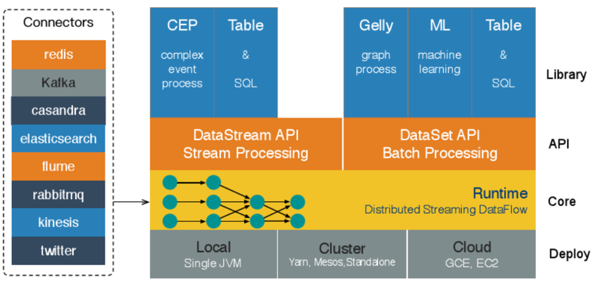

- **Deployment层**

  该层主要涉及了Flink的部署模式，Flink支持多种部署模式：本地、集群（Standalone/YARN），（GCE/EC2）。

- **Runtime层**

  Runtime层提供了支持Flink计算的全部核心实现，比如：支持分布式Stream处理、JobGraph到ExecutionGraph的映射、调度等等，为上层API层提供基础服务。

- **API层**

  主要实现了面向无界Stream的流处理和面向Batch的批处理API，其中面向流处理对应DataStream API，面向批处理对应DataSet API。

- **Libraries层**

  该层也可以称为Flink应用框架层，根据API层的划分，在API层之上构建的满足特定应用的实现计算框架，也分别对应于面向流处理和面向批处理两类。面向流处理支持：CEP（复杂事件处理）、基于SQL-like的操作（基于Table的关系操作）；面向批处理支持：FlinkML（机器学习库）、Gelly（图处理）

## Flink抽象层次

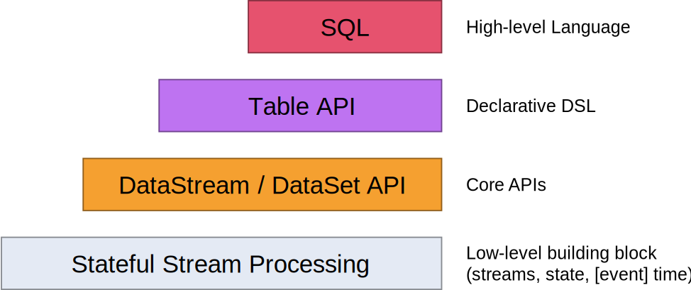

- **Stateful Streaming Processing**

  最底层。它通过Process Function嵌入到DataStream API中。它允许用户从一个或多个流自由处理事件，并使用一致的容错状态。此外，用户可以注册事件时间和处理时间回调，允许程序实现复杂的计算。

- **Core APIs**

  实际上，大多数应用程序不需要上述的低级别抽象，而是针对Core API（如DataStream API（有界/无界流））和DataSet API（有界数据集）进行编程。这些流畅的API为数据处理提供了常见的构建模块，如用户指定的各种转换形式，连接，聚合，窗口，状态等。在这些API中处理的数据类型以各自的编程语言表示为classes。底层的Process Function和DataStream API的整合，使得针对一些特定的操作可以实现更低层次的抽象。DataSet API为有界数据集提供了额外的原函数，如循环/迭代。

- **Table API**

  Table API是以表为中心的声明式DSL，可能是动态更改表（表示流时）。Table API遵循（扩展）关系模型：Table 具有附加schema（与关系数据库中的表相似），API提供操作，例如select，project，join，group-by，aggregate等。Table API代表的是应该做什么逻辑操作，而不是直接指定如何编写操作的源代码。虽然Table API可以通过各种类型的用户定义的函数进行扩展，但它不如Core API那么具有表达力，但使用起来更加简洁（少写很多代码）。

  此外，Table API程序还可以通过在执行之前应用优化规则的优化器。

  可以在表和DataStream / DataSet之间无缝转换，允许程序将Table API和DataStream和DataSet API混合使用。

- **SQL**

  ​		最高层次的抽象就是SQL。无论是语法还是表达，该层次的抽象都很像Table API。SQL抽象与Table API紧密交互，SQL查询可以在Table API中定义的表上执行。
  
  ​		SQL对复杂逻辑的语义表达不如DataStream API，但是SQL也带来了不少好处：
  
  - **缩短上线周期**
  
    传统的实现流计算的方式是通过流计算平台提供的API进行编程，确定需求、进行实现的设计、编写代码、本地单元测试、集成测试，没有问题部署上线。整个开发过程中，开发人员不光要满足业务，还需要关注技术实现的细节，而使用SQL的方式，开发人员只要关注业务需求即可，技术实现的细节交给SQL引擎去解析、编译、优化。
  
    最终相比传统的通过编码实现流计算的方式，上线周期从数天缩短为小时。
  
  - **更好地支持流计算需求的演变**
  
    业务需求持续不断的变化，编码方式的开发、测试、部署上线的周期不能很快的响应业务需求的变化，本方案的技术实现能够极大的降低过程。
  
  - **自动调优**
  
    自动调优。查询优化器可以为用户的 SQL 生成最有的执行计划。用户不需要了解它，就能自动享受优化器带来的性能提升。
  
  - **语言稳定**
  
    SQL 是一个拥有几十年历史的语言，是一个非常稳定的语言，很少有变动。所以当我们升级引擎的版本时，甚至替换成另一个引擎，都可以做到兼容地、平滑地升级。
  
  - **易于理解**
  
    很多不同行业不同领域的人都懂 SQL，SQL 的学习门槛很低，用 SQL 作为跨团队的开发语言可以很大地提高效率。

## Flink运行架构

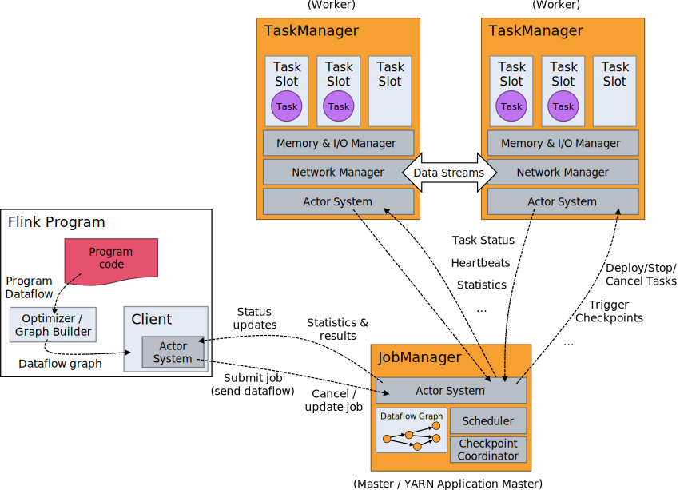

## 从代码到运行

Flink程序的基本构建块是流和转换。在概念上，stream 是data records的（潜在的永无止境的）flow，并且变换是将一个或多个流作为输入的操作，并且作为结果产生一个或多个输出流。

执行时，Flink程序被映射成streaming dataflows，由streams 和转换操作符组成。每个dataflow 从一个或多个sources开始，并以一个或多个sinks结束。dataflows 像任意的有向无环图(DAG)。虽然通过迭代构造允许特殊形式的循环，但是为了简单起见，大部分都会任务是DAG。

**Flink每个程序由相同的基本部分组成**

​	1)	获取执行环境

​	2)	加载/创建初始数据

​	3)	指定对此数据的转换**

​	4)	指定计算结果的位置

​	5)	触发程序执行

**示例说明**

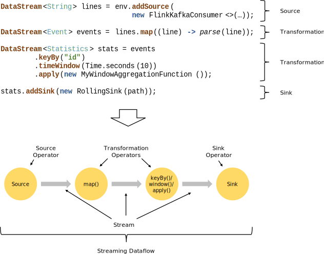

如上图所示，使用Flink DataStream API编写了一段代码，从Kafka中读取记录，逐行解析，按照id字段进行分组，然后以10秒为一个窗口统计自定义的统计逻辑，最后将每个窗口的输出结果输出到滚动循环的1个文件中。

Flink首先将DataStream API的调用转换为StreamGraph和JobGraph，将JobGraph提交给Flink集群。


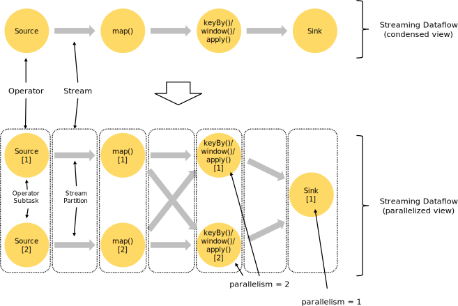

Flink集群收到客户端提交的JobGraph，将JobGraph转换为ExecutionGraph，根据并行度，创建ExecutionGraph中的执行单元，最终调度到TaskManager真正的执行。

# Flink类型与序列化系统

## Flink类型系统

### Flink类型分类

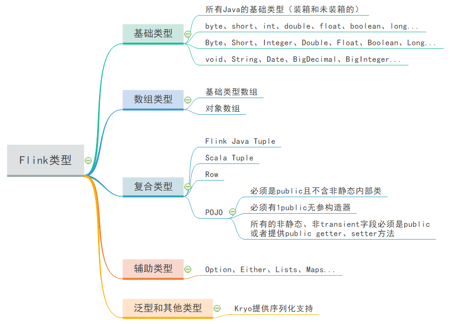


### Flink类型Class

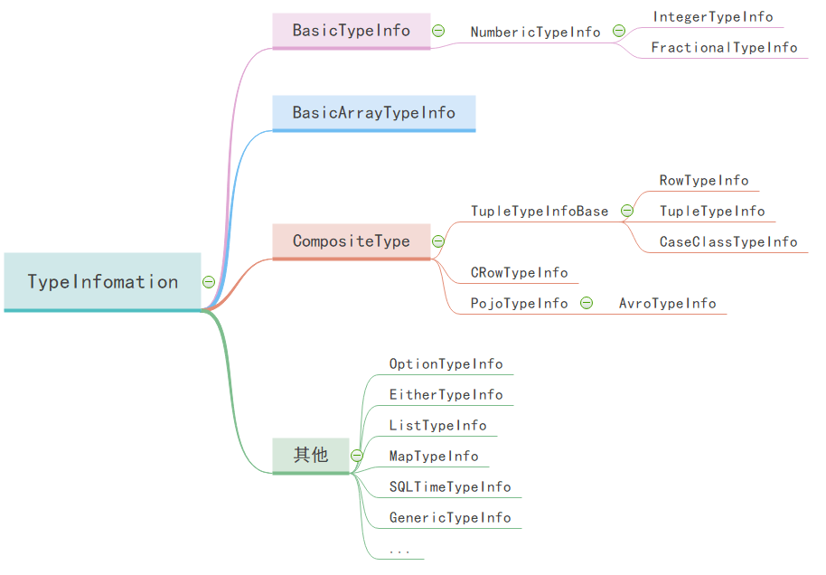

​		TypeInformation 类是描述一切类型的公共基类，它和它的所有子类必须可序列化（Serializable），因为类型信息将会伴随 Flink 的作业提交，被传递给每个执行节点。

​		由于 Flink 自己管理内存，采用了一种非常紧凑的存储格式，因而类型信息在整个数据处理流程中属于至关重要的元数据。

### 类型提取

#### 类型提取机制

​		Flink 内部实现了名为 **TypeExtractror** 的类，可以利用方法签名、子类信息等蛛丝马迹，自动提取和恢复类型信息（当然也可以显式声明）。

​		然而由于 Java 的类型擦除，自动提取并不是总是有效。因而一些情况下（例如通过 URLClassLoader 动态加载的类），仍需手动处理；例如下图中对 DataSet 变换时，使用 .returns() 方法声明返回类型。

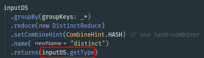

​		**returns()** 接受三种类型的参数：**TypeInformation**（例如 "**String**"）、returns() 接受三种类型的参数：**TypeInformation**（例如 "String"）、**TypeHint**（接下来会讲到，用于泛型类型参数）、Java 原生 Class（例如 String.class) 。（接下来会讲到，用于泛型类型参数）、Java 原生 Class（例如 **String**.class) 。

#### Java中的类型擦除

​        [Java](http://lib.csdn.net/base/17) 泛型（Generic）的引入加强了参数类型的安全性，减少了类型的转换，但有一点需要注意：Java的泛型机制是在编译级别实现的。编译器生成的字节码在运行期间并不包含泛型的类型信息。也就是说所有泛型参数类型在编译后都会被清除掉，看下面一个列子，代码如下：

```java
public class Foo {  
    public void listMethod(List<String> stringList){  
    }  
    public void listMethod(List<Integer> intList) {  
    }  
}  
```

​		代码很简单，看起来没什么问题，但是编译器却报出如下错误信息：

```java 
Method listMethod(List<String>) has the same erasure listMethod(List<E>) as another method in type Foo
```

​        此错误的意思是说listMethod(List<String>) 方法在编译时擦除类型后的方法是listMethod(List<E>)，它与另外一个方法重复，也就是方法签名重复。反编译之后的方法代码如下：

```java
public void listMethod(List list)  
{  
}
```

**类型擦除的一些示例**

```java
List<String>、List<T> 擦除后的类型为 List。
List<String>[]、List<T>[] 擦除后的类型为 List[]。
List<? extends E>、List<? super E> 擦除后的类型为 List<E>。
List<T extends Serialzable & Cloneable> 擦除后类型为 List<Serializable>。
```

**Java类型擦除的原因**

```
1. 避免 JVM 的大换血。如果 JVM 将泛型类型延续到运行期，那么到运行期时 JVM 就需要进行大量的重构工作了，提高了运行期的效率。
2. 版本兼容。 在编译期擦除可以更好地支持原生类型（Raw Type）。
```

### 类型声明

#### 类型声明的快捷方式1

​		例如 BasicTypeInfo，这个类定义了一系列常用类型的快捷方式，对于String、Boolean、Byte、ShortInteger、Long、Float、Double、Char等基本类型的类型声明，可以直接使用。

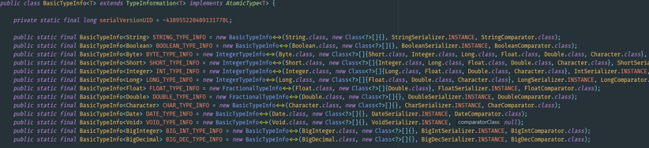

例如下面是对Row 类型各字段的类型声明，使用方法非常简明，不再需要 new XxxTypeInfo<>(很多很多参数)

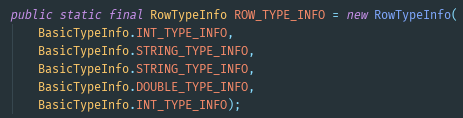

#### 类型声明的快捷方式2

​	如果觉得 BasicTypeInfo 还是太长，Flink 还提供了完全等价的Types类(org.apache.flink.api.common.typeinfo.Types)

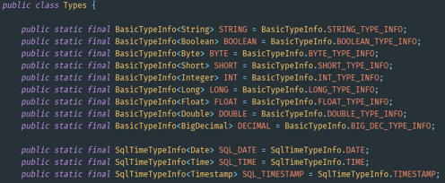

特别需要注意的是，flink-table模块也有一个Types类（org.apache.flink.table.api.Types），用于
table模块内部的类型定义信息，用法稍有不同.

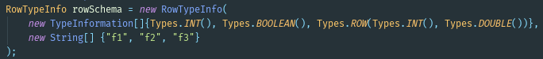

## Flink 序列化

### 从数据类型到二进制数组

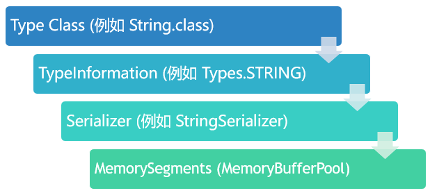

### Flink 序列化的结构示例

如下图所示，一个内嵌型的Tuple3对象的序列化过程。

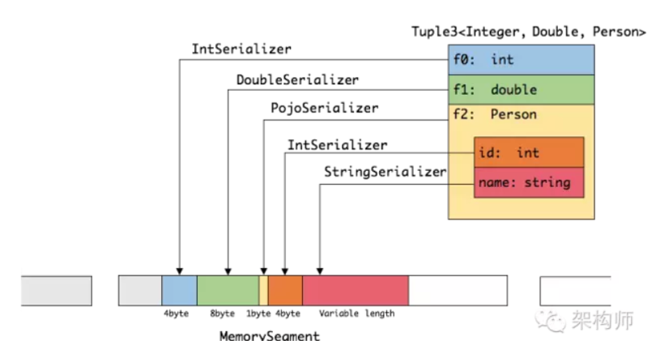

### String类型序列过程示例

​		**StringSerializer.class**其中实现了serialize和deserialize方法，调用StringValue.class实现了数据的序列化和反序列化。

```java
@Override
	public void serialize(String record, DataOutputView target) throws IOException {
		StringValue.writeString(record, target);
	}
```

​		最终的实际序列化的动作交给**StringValue.class**执行，写入String的长度和String的值到java.io.DataOutput，实际上就是MemorySegment中。Flink中的序列化的类实际上都继承了DataOutputView接口，DataOutputView接口继承了DataOutput接口。

**序列化**

```java
public static final void writeString(CharSequence cs, DataOutput out) throws IOException {
		if (cs != null) {
			// the length we write is offset by one, because a length of zero indicates a null value
			int lenToWrite = cs.length()+1;
			if (lenToWrite < 0) {
				throw new IllegalArgumentException("CharSequence is too long.");
			}
	
			// write the length, variable-length encoded
			while (lenToWrite >= HIGH_BIT) {
				out.write(lenToWrite | HIGH_BIT);
				lenToWrite >>>= 7;
			}
			out.write(lenToWrite);
	
			// write the char data, variable length encoded
			for (int i = 0; i < cs.length(); i++) {
				int c = cs.charAt(i);
	
				while (c >= HIGH_BIT) {
					out.write(c | HIGH_BIT);
					c >>>= 7;
				}
				out.write(c);
			}
		} else {
			out.write(0);
		}
	}
```

**反序列化**

反序列化的逻辑是相反的。

```java
public static String readString(DataInput in) throws IOException {
		// the length we read is offset by one, because a length of zero indicates a null value
		int len = in.readUnsignedByte();
		
		if (len == 0) {
			return null;
		}

		if (len >= HIGH_BIT) {
			int shift = 7;
			int curr;
			len = len & 0x7f;
			while ((curr = in.readUnsignedByte()) >= HIGH_BIT) {
				len |= (curr & 0x7f) << shift;
				shift += 7;
			}
			len |= curr << shift;
		}
		
		// subtract one for the null length
		len -= 1;
		
		final char[] data = new char[len];

		for (int i = 0; i < len; i++) {
			int c = in.readUnsignedByte();
			if (c < HIGH_BIT) {
				data[i] = (char) c;
			} else {
				int shift = 7;
				int curr;
				c = c & 0x7f;
				while ((curr = in.readUnsignedByte()) >= HIGH_BIT) {
					c |= (curr & 0x7f) << shift;
					shift += 7;
				}
				c |= curr << shift;
				data[i] = (char) c;
			}
		}
		
		return new String(data, 0, len);
	}
```


## 类型系统的不足和问题

​		Flink 内置的类型系统虽然强大而灵活，但仍然有一些需要注意的点：

**1. Lambda** **函数的类型提取**

​		由于 Flink 类型提取依赖于继承等机制，而 lambda 函数比较特殊，它是匿名的，也没有与之相关的类，所以其类型信息较难获取。

​		Eclipse 的 JDT 编译器会把 lambda 函数的泛型签名等信息写入编译后的字节码中，而对于 javac 等常见的其他编译器，则不会这样做，因而 Flink 就无法获取具体类型信息了。

**2.** **Kryo** **的** **JavaSerializer** **在** **Flink** **下存在** **Bug**

​		推荐使用 org.apache.flink.api.java.typeutils.runtime.kryo.JavaSerializer 而非 com.esotericsoftware.kryo.serializers.JavaSerializer 以防止与 Flink 不兼容。

# Flink中常见的数据流的类型

## 数据流（DataStream）是什么

​		DataStream 是 Flink 流处理 API中最核心的数据结构。它代表了一个运行在多个分区上的并行流。一个 DataStream 可以从 StreamExecutionEnvironment 通过env.addSource(SourceFunction) 获得 。

​		DataStream 上的转换操作都是逐条的，比如map()，flatMap()，filter()。DataStream 也可以执行 rebalance（再平衡，用来减轻数据倾斜）和 broadcaseted（广播）等分区转换。 


​		如上图的执行图所示，DataStream 各个算子会并行运行，算子之间是数据流分区。如 Source 的第一个并行实例（S1）和 flatMap() 的第一个并行实例（m1）之间就是一个数据流分区。而在 flatMap() 和 map() 之间由于加了 rebalance()，它们之间的数据流分区就有3个子分区（m1的数据流向3个map()实例）。

##  常用数据流

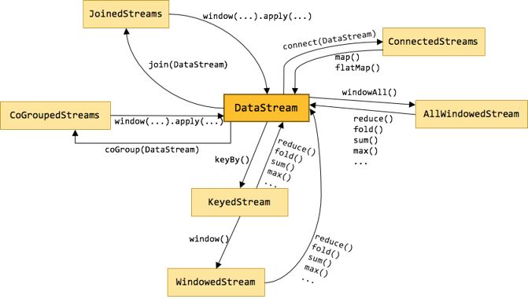

### KeyedStream

​		KeyedStream用来表示根据指定的key进行分组的数据流。一个KeyedStream可以通过调用DataStream.keyBy()来获得。而在KeyedStream上进行任何transformation都将转变回DataStream。在实现中，KeyedStream是把key的信息写入到了transformation中。每条记录只能访问所属key的状态，其上的聚合函数可以方便地操作和保存对应key的状态。 

### WindowedStream **&** AllWindowedStream

​		WindowedStream代表了根据key分组，并且基于WindowAssigner切分窗口的数据流。所以WindowedStream都是从KeyedStream衍生而来的。而在WindowedStream上进行任何transformation也都将转变回DataStream。

```scala
val stream: DataStream[MyType] = env.addSource(new FlinkKafkaConsumer08[String](...))
val str1: DataStream[(String, MyType)] = stream.flatMap { ... }
val str2: DataStream[(String, MyType)] = stream.rebalance()
val str3: DataStream[AnotherType] = stream.map { ... }
```

上述 WindowedStream 的样例代码在运行时会转换成如下的执行图：


​		Flink 的窗口实现中会将到达的数据缓存在对应的窗口buffer中（一个数据可能会对应多个窗口）。当到达窗口发送的条件时（由Trigger控制），Flink 会对整个窗口中的数据进行处理。Flink 在聚合类窗口有一定的优化，即不会保存窗口中的所有值，而是每到一个元素执行一次聚合函数，最终只保存一份数据即可。

​		在key分组的流上进行窗口切分是比较常用的场景，也能够很好地并行化（不同的key上的窗口聚合可以分配到不同的task去处理）。不过有时候我们也需要在普通流上进行窗口的操作，这就是 `AllWindowedStream`。`AllWindowedStream`是直接在DataStream上进行`windowAll(...)`操作。`AllWindowedStream` 的实现是基于 `WindowedStream` 的（Flink 1.1.x 开始）。Flink 不推荐使用`AllWindowedStream`，因为在普通流上进行窗口操作，就势必需要将所有分区的流都汇集到单个的Task中，而这个单个的Task很显然就会成为整个Job的瓶颈。

**<font color='red'>注意</font>**

> 不推荐使用AllWindowedStream，因为AllWindowedStream在执行时并发度为1.

### JoinedStreams **&** CoGroupedStreams

​		双流 Join 也是一个非常常见的应用场景。深入源码你可以发现，JoinedStreams 和 CoGroupedStreams 的代码实现有80%是一模一样的，JoinedStreams 在底层又调用了 CoGroupedStreams 来实现 Join 功能。除了名字不一样，一开始很难将它们区分开来，而且为什么要提供两个功能类似的接口呢？？

​		实际上这两者还是很点区别的。首先 co-group 侧重的是group，是对同一个key上的两组集合进行操作，而 join 侧重的是pair，是对同一个key上的每对元素进行操作。co-group 比 join 更通用一些，因为 join 只是 co-group 的一个特例，所以 join 是可以基于 co-group 来实现的（当然有优化的空间）。而在 co-group 之外又提供了 join 接口是因为用户更熟悉 join（源于数据库吧），而且能够跟 DataSet API 保持一致，降低用户的学习成本。

​		JoinedStreams 和 CoGroupedStreams 是基于 Window 上实现的，所以 CoGroupedStreams 最终又调用了 WindowedStream 来实现。

```scala
val firstInput: DataStream[MyType] = ...
val secondInput: DataStream[AnotherType] = ...

val result: DataStream[(MyType, AnotherType)] = firstInput.join(secondInput)
    .where("userId").equalTo("id")
    .window(TumblingEventTimeWindows.of(Time.seconds(3)))
    .apply (new JoinFunction () {...})
```
上述 JoinedStreams 的样例代码在运行时会转换成如下的执行图：


​		双流上的数据在同一个key的会被分别分配到同一个window窗口的左右两个篮子里，当window结束的时候，会对左右篮子进行笛卡尔积从而得到每一对pair，对每一对pair应用 JoinFunction。不过目前（Flink 1.1.x）JoinedStreams 只是简单地实现了流上的join操作而已，距离真正的生产使用还是有些距离。因为目前 join 窗口的双流数据都是被缓存在内存中的，也就是说如果某个key上的窗口数据太多就会导致 JVM OOM（然而数据倾斜是常态）。双流join的难点也正是在这里，这也是社区后面对 join 操作的优化方向，例如可以借鉴Flink在批处理join中的优化方案，也可以用ManagedMemory来管理窗口中的数据，并当**数据超过阈值时能spill到硬盘**。

### ConnectedStreams

​		在 DataStream 上有一个 union 的转换 dataStream.union(otherStream1, otherStream2, …)，用来合并多个流，新的流会包含所有流中的数据。union 有一个限制，就是所有合并的流的类型必须是一致的。ConnectedStreams 提供了和 union 类似的功能，用来连接两个流，但是与 union 转换有以下几个区别：

- ConnectedStreams 只能连接两个流，而 union 可以连接多于两个流。
- ConnectedStreams 连接的两个流类型可以不一致，而 union 连接的流的类型必须一致。
- ConnectedStreams 会对两个流的数据应用不同的处理方法，并且双流之间可以共享状态。这在第一个流的输入会影响第二个流时, 会非常有用。

​		如下 ConnectedStreams 的样例，连接 input 和 other 流，并在input流上应用map1方法，在other上应用map2方法，双流可以共享状态（比如计数）。

```scala
val input: DataStream[MyType] = ...
val other: DataStream[AnotherType] = ...

val connected: ConnectedStreams[MyType, AnotherType] = input.connect(other)

val result: DataStream[ResultType] = 
        connected.map(new CoMapFunction[MyType, AnotherType, ResultType]() {
            override def map1(value: MyType): ResultType = { ... }
            override def map2(value: AnotherType): ResultType = { ... }
        })
```

当并行度为2时，其执行图如下所示：


# Flink中的时间

​		与批处理相比，流处理中的时间的是不光是计算上的意义，更重要的是对计算行为的影响。

## Flink 中时间相关概念

 ### 时间类型

 **Event Time**

​		事件时间，事件发生时的时间。

  **Ingestion Time**

​		摄取时间，事件进入流处理系统的时间。

  **Processing Time**

​		处理时间，消息被计算引擎处理的时间，以各个计算节点的本地时间为准。


### 时间窗口

​		1.按分割标准划分：**TimeWindow、CountWindow**

​		2.按窗口行为划分：**Tumbling Window、Sliding Window、Session Window**

​	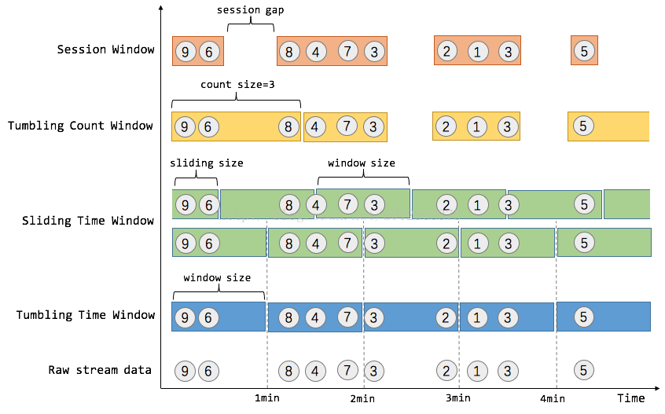

## Window原理与机制

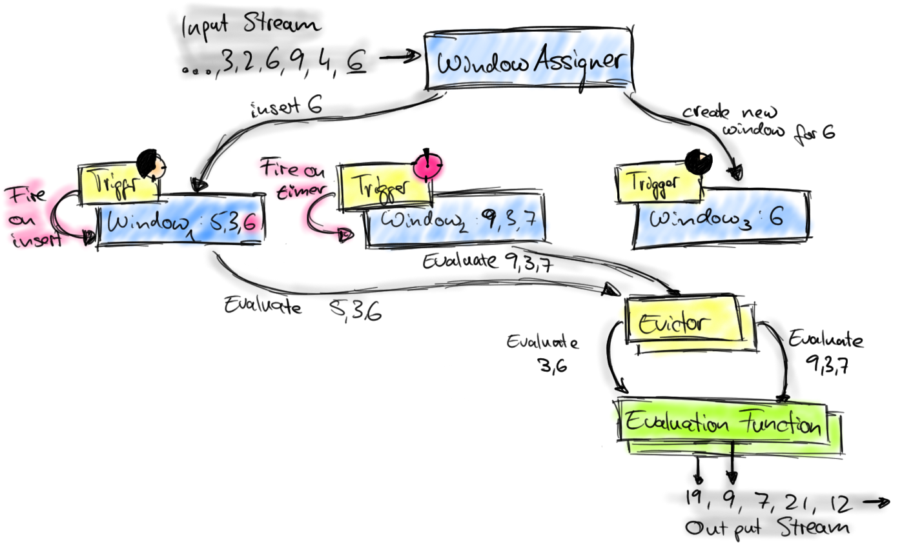

​		1、首先上图中的组件都位于一个算子（window operator）中，数据流源源不断地进入算子，每一个到达的元素都会被交给 WindowAssigner。WindowAssigner 会决定元素被放到哪个或哪些窗口（window），可能会创建新窗口。因为一个元素可以被放入多个窗口中，所以同时存在多个窗口是可能的。注意，Window本身只是一个ID标识符，其内部可能存储了一些元数据，如TimeWindow中有开始和结束时间，但是并不会存储窗口中的元素。窗口中的元素实际存储在 Key/Value State 中，key为Window，value为元素集合（或聚合值）。为了保证窗口的容错性，该实现依赖了 Flink 的 State 机制（参见 [state ](https://ci.apache.org/projects/flink/flink-docs-master/apis/streaming/state.html)[文档](https://ci.apache.org/projects/flink/flink-docs-master/apis/streaming/state.html)）。

​		2、每一个窗口都拥有一个属于自己的 Trigger，Trigger上会有定时器，用来决定一个窗口何时能够被计算或清除。每当有元素加入到该窗口，或者之前注册的定时器超时了，那么Trigger都会被调用。Trigger的返回结果可以是 continue（不做任何操作），fire（处理窗口数据），purge（移除窗口和窗口中的数据），或者 fire + purge。一个Trigger的调用结果只是fire的话，那么会计算窗口并保留窗口原样，也就是说窗口中的数据仍然保留不变，等待下次Trigger fire的时候再次执行计算。一个窗口可以被重复计算多次知道它被 purge 了。在purge之前，窗口会一直占用着内存。

​		3、当Trigger fire了，窗口中的元素集合就会交给Evictor（如果指定了的话）。Evictor 主要用来遍历窗口中的元素列表，并决定最先进入窗口的多少个元素需要被移除。剩余的元素会交给用户指定的函数进行窗口的计算。如果没有 Evictor 的话，窗口中的所有元素会一起交给函数进行计算。

​		4、计算函数收到了窗口的元素（可能经过了 Evictor 的过滤），并计算出窗口的结果值，并发送给下游。窗口的结果值可以是一个也可以是多个。DataStream API 上可以接收不同类型的计算函数，包括预定义的sum(),min(),max()，还有 ReduceFunction，FoldFunction，还有WindowFunction。WindowFunction 是最通用的计算函数，其他的预定义的函数基本都是基于该函数实现的。

​		5、Flink 对于一些聚合类的窗口计算（如sum,min）做了优化，因为聚合类的计算不需要将窗口中的所有数据都保存下来，只需要保存一个result值就可以了。每个进入窗口的元素都会执行一次聚合函数并修改result值。这样可以大大降低内存的消耗并提升性能。但是如果用户定义了 Evictor，则不会启用对聚合窗口的优化，因为 Evictor 需要遍历窗口中的所有元素，必须要将窗口中所有元素都存下来。

### Window Assigner

**Window Assigner**用来决定某个元素被分配到哪个/哪些窗口中去。

**Session WindowAssigner**比较特殊，因为**Session Window**无法事先确定窗口的范围，是动态改变的。

### 触发器 Window Trigger

​		Trigger触发器。决定了一个窗口何时能够被计算或清除，每一个窗口都拥有一个属于自己的Trigger，Trigger上会有定时器，用来决定一个窗口何时能够被计算或清除。每当有元素加入到该窗口，或者之前注册的定时器超时了，那么Trigger都会被调用。

**Trigger触发的结果**

- Continue(不做任何操作)
- Fire(处理窗口数据)
- Purge(移除窗口和窗口中的数据) 
- fire + purge

​        一个Trigger的调用结果只是fire的话，那么会计算窗口并保留窗口原样，也就是说窗口中的数据仍然保留不变，等待下次Trigger fire的时候再次执行计算。一个窗口可以被重复计算多次直到它被purge了。在**purge**之前，窗口会一直占用着内存。

**Trigger fire的流程**

1. 当Trigger fire了，窗口中的元素集合就会交给Evictor（如果指定了的话）。Evictor 主要用来遍历窗口中的元素列表，并决定最先进入窗口的多少个元素需要被移除。剩余的元素会交给用户指定的函数进行窗口的计算。如果没有Evictor 的话，窗口中的所有元素会一起交给函数进行计算。
2. 计算函数收到了窗口的元素（可能经过了 Evictor 的过滤），并计算出窗口的结果值，并发送给下游。窗口的结果值可以是一个也可以是多个。DataStream API 上可以接收不同类型的计算函数，包括预定义的sum(),min(),max()，还有 ReduceFunction，FoldFunction，还有WindowFunction。WindowFunction 是最通用的计算函数，其他的预定义的函数基本都是基于该函数实现的。
3. Flink 对于一些聚合类的窗口计算（如sum,min）做了优化，因为聚合类的计算不需要将窗口中的所有数据都保存下来，只需要保存一个result值就可以了。每个进入窗口的元素都会执行一次聚合函数并修改result值。这样可以大大降低内存的消耗并提升性能。但是如果用户定义了 Evictor，则不会启用对聚合窗口的优化，因为 **Evictor** 需要遍历窗口中的所有元素，必须要将窗口中所有元素都存下来。

### 窗口过滤器Evictor

​		**Evictor****直译为“驱逐者”。在Trigger触发之后，在窗口被处理之前，Evictor（如果有Evictor的话）会用来剔除窗口中不需要的元素，相当于一个filter。

> **<font color='red'>注意：</font>**Flink 对于一些聚合类的窗口计算（如sum,min）做了优化，因为聚合类的计算不需要将窗口中的所有数据都保存下来，只需要保存一个result值就可以了。每个进入窗口的元素都会执行一次聚合函数并修改result值。这样可以大大降低内存的消耗并提升性能。但是如果用户定义了Evictor，则不会启用对聚合窗口的优化，因为Evictor需要遍历窗口中的所有元素，必须要将窗口中所有元素都存下来。

### Count Window实现

​	Count Window 是使用三组件的典范，我们可以在 `KeyedStream` 上创建 Count Window，其源码如下所示：

​	在**KeyedStream** 上创建 **CountWindow**，其源码如下所示：

```java
// tumbling count window 翻滚计数窗口
public WindowedStream<T, KEY, GlobalWindow> countWindow(long size) {
  return window(GlobalWindows.create())  // create window stream using GlobalWindows
      .trigger(PurgingTrigger.of(CountTrigger.of(size))); // trigger is window size
}
// sliding count window 滑动计数窗口
public WindowedStream<T, KEY, GlobalWindow> countWindow(long size, long slide) {
  return window(GlobalWindows.create())
    .evictor(CountEvictor.of(size))  // evictor is window size
    .trigger(CountTrigger.of(slide)); // trigger is slide size
```

​		第一个函数是申请翻滚计数窗口，参数为窗口大小。第二个函数是申请滑动计数窗口，参数分别为窗口大小和滑动大小。它们都是基于 `GlobalWindows` 这个 WindowAssigner 来创建的窗口，该assigner会将所有元素都分配到同一个global window中，所有`GlobalWindows`的返回值一直是 `GlobalWindow` 单例。基本上自定义的窗口都会基于该assigner实现。

​		翻滚计数窗口并不带evictor，只注册了一个trigger。该trigger是带purge功能的 CountTrigger。也就是说每当窗口中的元素数量达到了 window-size，trigger就会返回fire+purge，窗口就会执行计算并清空窗口中的所有元素，再接着储备新的元素。从而实现了tumbling的窗口之间无重叠。

> 翻滚计数窗口之间无重叠，所以可以安全的清理已触发窗口的数据

​		滑动计数窗口的各窗口之间是有重叠的，但我们用的 GlobalWindows assinger 从始至终只有一个窗口，不像 sliding time assigner 可以同时存在多个窗口。所以trigger结果不能带purge，也就是说计算完窗口后窗口中的数据要保留下来（供下个滑窗使用）。另外，trigger的间隔是slide-size，evictor的保留的元素个数是window-size。也就是说，每个滑动间隔就触发一次窗口计算，并保留下最新进入窗口的window-size个元素，剔除旧元素。

​		**滑动计数窗口示例**

假设有一个滑动计数窗口，每2个元素计算一次最近4个元素的总和，那么窗口工作示意图如下所示：


​		图中所示的各个窗口逻辑上是不同的窗口，但在物理上是同一个窗口。该滑动计数窗口，trigger的触发条件是元素个数达到2个（每进入2个元素就会触发一次），evictor保留的元素个数是4个，每次计算完窗口总和后会保留剩余的元素。所以第一次触发trigger是当元素5进入，第三次触发trigger是当元素2进入，并驱逐5和2，计算剩余的4个元素的总和（22）并发送出去，保留下2,4,9,7元素供下个逻辑窗口使用。

### Time Window实现

同样的，我们也可以在 `KeyedStream` 上申请 Time Window，其源码如下所示：

```java
// tumbling time window 滚动时间窗口
public WindowedStream<T, KEY, TimeWindow> timeWindow(Time size) {
  if (environment.getStreamTimeCharacteristic() == TimeCharacteristic.ProcessingTime) {
    return window(TumblingProcessingTimeWindows.of(size));
  } else {
    return window(TumblingEventTimeWindows.of(size));
  }
}
// sliding time window 滑动时间窗口
public WindowedStream<T, KEY, TimeWindow> timeWindow(Time size, Time slide) {
  if (environment.getStreamTimeCharacteristic() == TimeCharacteristic.ProcessingTime) {
    return window(SlidingProcessingTimeWindows.of(size, slide));
  } else {
    return window(SlidingEventTimeWindows.of(size, slide));
  }
}
```

这里我们主要分析sliding process time window，如下是相关源码：

```java
public class SlidingProcessingTimeWindows extends WindowAssigner<Object, TimeWindow> {
  private static final long serialVersionUID = 1L;

  private final long size;
  private final long slide;

  private SlidingProcessingTimeWindows(long size, long slide) {
    this.size = size;
    this.slide = slide;
  }

  @Override
  public Collection<TimeWindow> assignWindows(Object element, long timestamp) {
    timestamp = System.currentTimeMillis();
    List<TimeWindow> windows = new ArrayList<>((int) (size / slide));
    // 对齐时间戳
    long lastStart = timestamp - timestamp % slide;
    for (long start = lastStart;
      start > timestamp - size;
      start -= slide) {
      // 当前时间戳对应了多个window
      windows.add(new TimeWindow(start, start + size));
    }
    return windows;
  }
  ...
}
public class ProcessingTimeTrigger extends Trigger<Object, TimeWindow> {
  @Override
  // 每个元素进入窗口都会调用该方法
  public TriggerResult onElement(Object element, long timestamp, TimeWindow window, TriggerContext ctx) {
    // 注册定时器，当系统时间到达window end timestamp时会回调该trigger的onProcessingTime方法
    ctx.registerProcessingTimeTimer(window.getEnd());
    return TriggerResult.CONTINUE;
  }

  @Override
  // 返回结果表示执行窗口计算并清空窗口
  public TriggerResult onProcessingTime(long time, TimeWindow window, TriggerContext ctx{
    return TriggerResult.FIRE_AND_PURGE;
  }
  ...
}
```

​		首先，`SlidingProcessingTimeWindows`会对每个进入窗口的元素根据系统时间分配到`(size / slide)`个不同的窗口，并会在每个窗口上根据窗口结束时间注册一个定时器（相同窗口只会注册一份），当定时器超时时意味着该窗口完成了，这时会回调对应窗口的Trigger的`onProcessingTime`方法，返回FIRE_AND_PURGE，也就是会执行窗口计算并清空窗口。整个过程示意图如下：


​		如上图所示横轴代表时间戳（为简化问题，时间戳从0开始），第一条record会被分配到[-5,5)和[0,10)两个窗口中，当系统时间到5时，就会计算[-5,5)窗口中的数据，并将结果发送出去，最后清空窗口中的数据，释放该窗口资源。

### Session Window实现

​	假设有这么个场景，用户点开手机淘宝后会进行一系列的操作（点击、浏览、搜索、购买、切换tab等），这些操作以及对应发生的时间都会发送到服务器上进行用户行为分析。那么用户的操作行为流的样例可能会长下面这样：


​		通过上图，我们可以很直观地观察到，用户的行为是一段一段的，每一段内的行为都是连续紧凑的，段内行为的关联度要远大于段之间行为的关联度。我们把每一段用户行为称之为“session”，段之间的空档我们称之为“session gap”。所以，理所当然地，我们应该按照 session window 对用户的行为流进行切分，并计算每个session的结果。如下图所示：

​	

为了定义上述的窗口切分规则，我们可以使用 Flink 提供的 SessionWindows这个 widnow assigner API。如果你用过SlidingEventTimeWindows、TumlingProcessingTimeWindows等，你会对这个很熟悉。

```java
DataStream input = …
DataStream result = input
  .keyBy(<key selector>)
  .window(SessionWindows.withGap(Time.seconds(<seconds>))
  .apply(<window function>) // or reduce() or fold()
```

这样，Flink 就会基于元素的时间戳，自动地将元素放到不同的session window中。如果两个元素的时间戳间隔小于 session gap，则会在同一个session中。如果两个元素之间的间隔大于session gap，且没有元素能够填补上这个gap，那么它们会被放到不同的session中。

Session窗口是动态窗口，无法实现定义好，所以可能会出现窗口大小改变、两个Session窗口合并的情况。

#### Session Winow合并

例如处理过程中到了两个元素，它们被分配到两个独立的窗口中，两个窗口目前不相交，如下图：


当第三个元素进入时，分配到的窗口与现有的两个窗口发生了叠加，情况变成了这样：


​		由于我们支持了窗口的合并，`WindowAssigner`可以合并这些窗口。它会遍历现有的窗口，并告诉系统哪些窗口需要合并成新的窗口。Flink 会将这些窗口进行合并，合并的主要内容有两部分：

1. 需要合并的窗口的底层状态的合并（也就是窗口中缓存的数据，或者对于聚合窗口来说是一个聚合值）

2. 需要合并的窗口的Trigger的合并（比如对于EventTime来说，会删除旧窗口注册的定时器，并注册新窗口的定时器）

   最终的结果是三个元素现在在同一个窗口中了：


​		需要注意的是，对于每一个新进入的元素，都会分配一个属于该元素的窗口，都会检查并合并现有的窗口。在触发窗口计算之前，每一次都会检查该窗口是否可以和其他窗口合并，直到trigger触发后，会将该窗口从窗口列表中移除。对于 event time 来说，窗口的触发是要等到大于窗口结束时间的 watermark 到达，当watermark没有到，窗口会一直缓存着。所以基于这种机制，可以做到对乱序消息的支持。

​		这里有一个优化点可以做，因为每一个新进入的元素都会创建属于该元素的窗口，然后合并。如果新元素连续不断地进来，并且新元素的窗口一直都是可以和之前的窗口重叠合并的，那么其实这里多了很多不必要的创建窗口、合并窗口的操作，我们可以直接将新元素放到那个已存在的窗口，然后扩展该窗口的大小，看起来就像和新元素的窗口合并了一样

除了合并窗口之外还需要合并**State**和**Trigger**：

1. 需要合并的窗口的底层状态的合并（也就是窗口中缓存的数据，或者对于聚合窗口来说是一个聚合值）。
2. 需要合并的窗口的Trigger的合并（比如对于EventTime来说，会删除旧窗口注册的定时器，并注册新窗口的定时器）。

#### Session Window State、Trigger合并

​		例如A、B、C三个窗口需要合并，合并后的窗口为D窗口。每个窗口有自己的State，State和Trigger同时也会被合并。

​		State合并时，会选择A、B、C中一个的State作为新的State。比如选择B作为状态窗口，那么A和C窗口中的数据需要合并到B窗口中去。这样就没有新状态产生了，但是我们需要额外维护窗口与状态窗口之间的映射关系（D>B），这就是MergingWindowSet负责的工作。这个映射关系需要在失败重启后能够恢复，所以MergingWindowSet内部也是对该映射关系做了容错。状态合并的工作示意图如下所示：

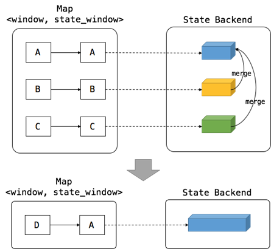


​		旧的Trigger需要被清除掉，为新的窗口创建新的Trigger。

### 窗口函数

Flink中窗口提供如下4类函数

- **ReduceFunction**
- **AggregateFunction**
- **FoldFunction**
- **ProcessWindowFunction** 

ReduceFunction、AggregateFunction、FoldFunction属于增量聚合类的函数，执行效率高。ProcessWindowFunction通过增量缓存，实现灵活，计算效率相比增量聚合稍低，毕竟要占用更多的内存。

#### Reduce Function


#### Aggregation Function


#### Fold Function 


#### ProcessFunction

## Watermark

### Watermark的作用

watermark是用于处理乱序事件的，而正确的处理乱序事件，通常用watermark机制结合window来实现。

流处理从事件产生，到流经source，再到operator，中间是有一个过程和时间的。虽然大部分情况下，流到operator的数据都是按照事件产生的时间顺序来的，但是也不排除由于网络、背压等原因，导致乱序的产生（out-of-order或者说late element）。

但是对于late element，我们又不能无限期的等下去，必须要有个机制来保证一个特定的时间后，必须触发window去进行计算了。这个特别的机制，就是watermark。

### Watermark的生成

通常Watermark在Source中生成，但是Flink提供了额外的机制，允许在调用map、filter类的操作之后生成。

Watermark的生成机制分为如下两类：

- **With Periodic Watermarks**

  周期性的(一定时间间隔或者达到一定的记录条数)产生一个Watermark。在实际的生产中Periodic的方式必须结合时间和积累条数两个维度继续周期性产生Watermark，否则在极端情况下会有很大的延时。

- **With Punctuated Watermarks**

  数据流中每一个递增的EventTime都会产生一个Watermark。在实际的生产中Punctuated方式在TPS很高的场景下会产生大量的Watermark在一定程度上对下游算子造成压力，所以只有在实时性要求非常高的场景才会选择Punctuated的方式进行Watermark的生成。

### Watermark在Flink内部的处理逻辑


### 多流的Watermark处理

在实际的流计算中往往一个job中会处理多个Source的数据，对Source的数据进行GroupBy分组，那么来自不同Source的相同key值会shuffle到同一个处理节点，并携带各自的Watermark，Apache Flink内部要保证Watermark要保持单调递增，多个Source的Watermark汇聚到一起时候可能不是单调自增的，这样的情况ApacheFlink内部是如何处理的呢?如图所示


Apache Flink内部实现每一个边上只能有一个递增的Watermark，当出现多流携带Eventtime汇聚到一起(GroupBy orUnion)时候，Apache Flink会选择所有流入的Eventtime中最小的一个向下游流出。从而保证watermark的单调递增和保证数据的完整性。


# Flink 容错

## 流处理保证语义

Flink**提供了吐下流处理保证语义。

| **语义**                                         | **说明**                                                     |
| :----------------------------------------------- | :----------------------------------------------------------- |
| **At-Most-Once**   **最多一次**                  | 不开启checkpoint即最多一次                                   |
| **At-Least-Once**   **最少一次**                 | 开启checkpoint不进行barrier对齐                              |
| **Exactly-Once**   **引擎内严格一次**            | 开启checkpoint，且对barrier进行对齐                          |
| **End-to-end Exactly-Once**   **端到端严格一次** | 端到端Exactly Once语义需要Source的实现能够从失败的位置重新读取，Sink的实现需要外部数据存储提供RollBack机制，flink提供了Two Phase Commit模式实现端到端的Exactly Once |

## Exactly Once语义

### Fault Tolerant的演进之路

对于7×24小时不间断运行的流程序来说，要保证fault tolerant是很难的，这不像是离线任务，如果失败了只需要清空已有结果，重新跑一次就可以了。对于流任务，如果要保证能够重新处理已处理过的数据，就要把数据保存下来；而这就面临着几个问题：比如一是保存多久的数据？二是重复计算的数据应该怎么处理，怎么保证幂等性？

**基本要求**

- 最好能做到exactly-once
- 处理延迟越低越好
- 吞吐量越高越好
- 计算模型应当足够简单易用，又具有足够的表达力
- 从错误恢复的开销越低越好
- 足够的流控制能力（背压能力）

#### Storm的Record acknowlement模式


Tuple的完全处理需要Spout、Bolt以及Acker（Storm中用来记录某颗Tuple树是否被完全处理的节点）协调完成，如图所示。从Spout发送Tuple到下游，并把相应信息通知给Acker，整颗Tuple树中某个Tuple被成功处理了都会通知Acker,待整颗Tuple树都被完全处理完成之后，Acker将成功处理信息返回给Spout；如果某个Tuple处理失败，或者超时，Acker将会给Spout发送一个处理失败的消息，Spout根据Acker的返回信息以及用户对消息保证机制的选择判断是否需要进行消息重传。

#### Google Dataflow的事务日志模式

##### 执行模型


##### Exectly Once --Shuffle

Exactly Once语义的保证主要是在跨节点交互的时候需要。本地JVM内部并不会有Exactly Once的问题。

Dataflow通过为每一条记录提供全局唯一uid的方式提供Exactly Once语义。每收到1个Record，都要验证是否重复，并且每1个Step的output都要checkpoint到可靠存储中。每一个Step都进行checkpoint的设计计算成本相当高，后边会介绍Google Dataflow的优化策略。

**上游备份 upstream backup，防止丢失**

​        为了防止数据丢失，Dataflow引入了上游备份的概念。发送者如果收不到下游的确认则会尝试重发。

​        同时保证上游发送者崩溃恢复之后仍然会重发。这样就提供了至少一次（at least once）的的保证。

​        在分布式系统的RPC调用中，只有对方明确的确认收到消息了才是可靠的，其他的失败情况如超时、对端处理完但是确认消息没有发出来等等，RPC调用失败，数据可能被对方成功处理，也可能没有，是一种不确定的状态，在shuffle中的潜在风险是数据可能被重复传输。

**下游去重，防止重复计算**

​       为每一个record消息赋予唯一标识符uid，接受者维护一个catalog目录，目录里记录接收和处理的数据。每收到一条数据，就在catalog中查询是否有重复记录，如果有则丢弃，反之没有重复记录，则在处理完成后记录在catalog中。Dataflow基于谷歌云，使用BigTable(Hbase）作为Catalog的存储。


##### 分布式计算中的不确定性

**什么是非确定性？**即对同一条数据的两次计算输出结果可能是不同的。

非确定性是不可避免，并且是数据处理过程中必要的。例如：

​      1）维表join，通过查询外部表补充字段，维表可能会被修改（插入、删除、更细），两次维表Join的执行中间，维表的数据改变了，结果可能会不一样。

​     2）再比如依赖于当前时间的计算大概率是非确定性计算。

​     3）即便代码是确定性的，但是允许数据延迟的基于事件时间的聚合，也很有可能在Worker失败之后恢复之后，在上次计算中迟到的数据到来了，迟到数据变成了非迟到数据，这也可能导致窗口两次执行的聚合结果是不同的。

在Dataflow中，一条数据因为work节点失败、rpc传输失败等情况被重复计算是很常见的，但是要保证Exactly Once语义，也就是说重复计算多次，但有且只有1次计算结果被采纳。

Dataflow中采用了Checkpoint日志机制，每一次要交给下游Stage的输出，（uid，output）都会被持久化到可靠存储中（此处需要特别注意性能问题）。无论重复执行多少次，其本质是重放checkpoint日志，确保Exactly Once。

##### Dataflow中的优化

###### Graph Optimization

**Fusion**

类似于flink中的Operator Chain，把多个step组合在一起，执行的时候会调度在同1个机器的同一个线程中执行，Operator chain内部的step之前不需要checkpoint进行Exactly Once的语义的保证。


**聚合优化**

先执行本地的局部聚合，向下游发送聚合后的结果，下游再进行全局的结合类运算。Blink中已经实现了此类优化（LocalAggregation）。


###### BloomFilter

Dataflow中依赖于一个Catalog进行去重，使用bloom filter可以提高查重效率。Bloom Filter查询没有，则没有重复数据。Bloom Filter查询有重复的，则可能存在重复，此时再去Catalog中进行查询。

**使用BloomFilter的基本假设**

正常情况下，重复的数据很少！

但是随着时间推移，BloomFilter越来越大，需要进行二次查询的概率逐渐增大。二次查询的成本很高。

DataFlow中按照时间范围对BloomFilter进行分桶（划分bucket），接收数据的时候，根据数据的时间戳选择使用的Bloom Filter所在的Bucket。每个分桶内的数据量不多，可以保证二次查询的概率特别低。


###### GC垃圾回收

Dataflow的状态和一致性模型是基于Key的，在实现中，每个key会存储一个catalog记录该key下，收到的record。此时就涉及一个问题，这些状态不能一直保存下去，如何清理？何时清理？

垃圾回收策略一般有如下两种：

- **GC watermark**（Dataflow选择的实现方式）

类似于计算数据WaterMark一样，Dataflow会计算一个GC Watermark，Watermark之前的Catalog中的数据会被清理掉。

GC Watermark基于当前的系统时间，不依赖于事件时间。

GC Watermark可以体现在每一个State中数据处理的延迟。

- **严格有序递增序列号**

上游的发送者为每一条记录赋予一个严格递增的序号，跟踪序号，就知道序号为n之前的数据是否完全达到了，如果完全到达了，则n之前的0 … n-1的记录的catalog中记录的记录的uid可以被安全的清理掉。

#### Flink的分布式快照模式

##### Flink分布式快照的基本假设

- Job异常和失败极少发生，因为一旦发生异常，Job回滚到上一个状态的成本很高。
- 为了低延迟，快照需要很快就能完成。
- Task与Worker之间的关系是静态的，即分配完成之后，在Job运行过程中不会改变（至少是一个快照周期内），除非手动改变并行度。恢复的时候也会恢复到原先的拓扑结构。

##### 分布式系统的Global State

​	分布式系统由空间上分立的process和连接这些process的channel组成。空间上分立的含义是,这些process不共享memory,而是通过在communication channel上进行的message pass来异步交流。分布式系统的global state就是所有process,channel的local state的集合process的local state取决于the state of local memory and the history of its activity。channel的local state是上游process发送进channel的message集减去下游process从channel接收的message的差集。

**一致性Global State**


假设有两个银行账户A,B.A中初始有600美元,B中初始有200美元. SA, SB, CAB, CBA由A和B分别记录,组成了global state.

在t0时刻,A向B转账50美元;在t1时刻,B向A转账80美元.

如果SA, SB记录于(t0, t1), CAB, CBA记录于(t1, t2),那么global state = 550+200+50+80 = 880,比真实值多了$80. 这就是**不一致**性global state.

如果 SA, SB, CAB, CBA同属于一个时间区间,那么得到的global state就是**一致性**的.

**Snapshot算法获得一致性state的难点**

分布式系统没有共享内存(globally shared memory)和全局时钟(global clock)。

如果分布式系统有共享内存,那么可以从共享内存中直接获取整个分布式系统的snapshot,无需分别获得各个process,channel的local state再组合成global state。

如果分布式系统有global clock,那么所有的process能在同一时刻各自记录local state,这样就保证了state的一致性。

**获得一致性global state的算法----Chandy-Lamport算法**

**精髓**:该算法在普通message中插入了control message – marker

**前提**:

1. message的传输可能有delay,但一定会到达

   2.每两个process之间都有一条communication path(可能由多条channel组成)

3. Channel是单向的FIFO

**描述**:

```java
Marker sending rule for process Pi`

	(1)Process Pi 记录自身state`

	(2)Pi在记录自身state后,发送下一条message前,Pi向自己所有的outgoing channel发送marker

	Marker receiving rule for process Pj on receiving a marker along channel C

	如果Pj第一次接收到marker,那么

		把channel C的state记为空集

		执行marker sending rule

	否则(并非第一次接收到marker)

		把记录自身state(或最近一次记录另一个channel的state)后,收到这个marker前的message集记为C的state

	每个process会记录自身的state和它的incoming channel的state
```

**Chandy-Lamport算法示例**

**1**.Process A启动snapshot算法,A执行marker sending rule(记录自身state,然后发送marker):


**2**. Process B接收到marker,执行marker receiving rule:将channel AB的state记为空集,然后记录自身state并向下发送marker:


**3.**Process C接收到marker,执行markerreceiving rule:将channel AC的state记为空集,然后记录自身state并向下发送marker:


**4.** Process D接收到来自于process B的marker, 执行marker receiving rule:将channel BD的state记为空集,然后记录自身state并向下发送marker:


**5**.Process D接收到来自于processC的marker,执行marker receiving rule:这是process D第二次接收到marker,将channel CD的state记为{5},不会向下发送marker:


**6.** 到此process A,B,C,D的local state和所有Channel的state都记录完毕. 将这些local state组合,所得到的就是global state。

##### Flink的Aysnchronous Barrier Snapshotting算法

为了消去记录channel state这一步骤,process在接收到第一个barrier后不会马上做snapshot,而是等待接受其他上游channel的barrier.在等待期间,process会把barrier已到的channel的record放入input buffer。当所有上游channel的barrier到齐后,process才记录自身state,之后向所有下游channel发送barrier。因为先到的barrier会等待后到的barrier,所有barrier相当于同时到达process,因此,该process的上游channel的state都是空集.这就避免了去记录channel的state。

**异步分布式快照示例-exactly once**

1.JobManager发起一次snapshot:向所有source发送barrier。


2.每个Barrier先后到达各自的source.Source在收到barrier后记录自身state,然后向下游节点发送barrier


3.Barrier (from)B 到达process D,但不会进行snapshot


4.Barrier (from)B已经到达process D,所以当来自于channel BD的record 6 7到达后,process D不会处理它们,而是将它们放入input buffer。而Barrier (from)C尚未到达process D,所以当来自于channel CD的record 4到达后,process D会处理它。


5.Barrier C也到达process D.这样,process D已经接收到了所有上游process的barrier。process D记录自身state,然后向下游节点发送barrier。


6.最终状态


异步分布式快照示例-At Least once

不进行barrier对齐，则实现了At least once语义，过程如下图所示

1.


2.


3.


​		Record 6本不属于这次checkpoint,却包含在process D的local state中。在recovery时,source认为record 6还没有被处理过,所以重发record 6. 这就导致stream中出现了两个record 6,造成了at least once。

​		这里的问题在于,当第二个barrier到达时,节点D再次对自身做了snapshot。而在Chandy-Lamport的算法中,第二个barrier到达时,节点D应该对barrier来源的channel做snapshot。

​		对单一input channel的算子来说,没有Alignment这个概念.这些算子在at least once模式下也是呈现exactly once的行为。


### End-to-End Exactly Once

Flink通过**两阶段提交协议**实现了Source->计算->Sink整个过程的端到端Exactly Once，无论是什么原因导致的Job失败，都保证数据严格读取、处理、写入一次。

**计算引擎内Exactly Once**


**端到端Exactly Once**


#### 两阶段提交协议


## Flink State原理

### State的类型和作用

Flink中包含两种基础的状态：Keyed State和Operator State。

**Keyed State**

- ​	基于KeyedStream上的状态。这个状态是跟特定的key绑定的，对KeyedStream流上的每一个key，可能都对应一个state。KeyedState可以使用所有的State。

**Operator State**

- ​	与Keyed State不同，Operator State跟一个特定operator的一个并发实例绑定，整个operator只对应一个state。相比较而言，在一个operator上，可能会有很多个key，从而对应多个keyed state。
- ​	Operator States的数据结构不像Keyed States丰富，现在只支持List。

### 原始和托管State

Keyed State和Operator State，可以以两种形式存在：原始状态和托管状态。

托管Managed State是由Flink框架管理的状态，如ValueState, ListState, MapState等。

原始Raw state即原始状态，由用户自行管理状态具体的数据结构，框架在做checkpoint的时候，使用byte[]来读写状态内容，对其内部数据结构一无所知。

> 通常在DataStream上的状态推荐使用托管的状态，当实现一个用户自定义的operator时，会使用到原始状态。

### State类继承关系


### State过期

#### 使用API控制State过期

Flink SQL是高层的抽象所以并没有提供对State清理精细控制，对于复杂的DataStrea程序而言，有时需要精细的控制，此时可以通过API来进行精细的控制。如下代码所示，对每一个State可以设置清理的策略StateTtlConfig。

**过期时间：**超过多久未访问则视为过期，类似于缓存

**过期时间更新策略：**创建和写时更新、读取和写时更新

**State的可见性：** 未清理则可用，超期即不可用


#### Flink Sql中State过期

Flink SQL是数据分析的高层抽象，在SQL的世界里并无State的概念，而在流join、聚合类的场景中，使用了State，如果State不定时清理，则可能会导致State过多，内存溢出。为了稳妥起见，最好为每个Flink SQL Job提供State清理的策略。


> ​	**阿里经验**
>
> TTL一般为1.5天左右

### State过期清理

默认情况下，只有在明确读出过期值时才会删除过期值，例如 通过调用ValueState.value（）。

**做完整快照时清理**
在获取完整状态快照时激活清理，减小其大小。
在当前实现下不清除本地状态，但在从上一个快照恢复的情况下，它不会包括已删除的过期状态。 可以在StateTtlConfig中配置：


> <font color='red'>注意：此选项不适用于RocksDB StateBackend中的增量Checkpoint。</font>

**增量清理**

通过增量触发器渐进清理State。一种设计是当进行状态访问或者在处理Event的进行回调，在回调函数中进行处理。当每次增量清理触发时，遍历StateBackend中的状态，清理掉过期的。


### Flink容错信息存储

Flink支持三种容错信息的存储(StateBackend)

**纯内存**

MemoryStateBackend，适用于验证、测试，不推荐生产环境。

**内存+文件**

FsStateBackend，适用于长周期大规模的数据。

**RocksDB**

RocksDBStateBackend，适用于长周期大规模的数据。


存储机制示意图如下：


#### MemoryStateBackend&FsStateBackend


##### MemoryStateBackend

MemoryStateBackend的State数据保存在java堆内存中，执行checkpoint的时候，会把state的快照数据保存到jobmanager的内存中。基于内存的statebackend在<font color='red'>生产环境下不建议使用</font>。

**适用场景**

- 本地开发调试测试。

**注意点**

- State存储在JobManager的内存中
- 每个State默认5M，可通过MemoryStateBackend构造函数调整
- 每个State的不能超过Akka Frame大小

##### FsStateBackend

State数据保存在taskmanager的内存中，执行checkpoint的时候，会把state的快照数据保存到配置的文件系统中，可以使用hdfs等分布式文件系统。

**适用场景**

- 适用于处理大状态，长窗口，或大键值状态的有状态处理任务。
- FsStateBackend 非常适合用于高可用方案。

**注意点**

- State数据首先会被存在TaskManager的内存
- State大小不能超过TM内存
- TM异步将State数据写入外部存储

##### 存储结构


#### RocksDBBackend

RocksDBStateBackendRocksDB跟上面的都略有不同，它会在本地文件系统中维护状态，state会直接写入本地rocksdb中。同时RocksDB需要配置一个远端的filesystem。uri（一般是HDFS），在做checkpoint的时候，会把本地的数据直接复制到filesystem中。Fail over的时候从filesystem中恢复到本地。RocksDB克服了state受内存限制的缺点，同时又能够持久化到远端文件系统中，比较适合在生产中使用。


**基于RocksDB的增量Checkpoint**


**适用场景**

- 最适合用于处理大状态，长窗口，或大键值状态的有状态处理任务。
- RocksDBStateBackend 非常适合用于高可用方案。
- RocksDBStateBackend 是目前唯一支持增量 checkpoint 的后端。增量 checkpoint 非常使用于超大状态的场景。

**注意点**

- 总State大小仅限于磁盘大小，不受内存限制
- RockDBStateBackend也需要配置外部文件系统，集中保存State
- RocksDB的JNI API基于byte[]，单key和单Value的大小不能超过2^31
- 对于使用具有合并操作的状态的应用程序，例如 ListState，随着时间可能会累积到超过 2^31 字节大小，这将会导致在接下来的查询中失败。

### State动态扩展

#### OperatorState扩展


**ListState**

并发度在改变的时候，会将并发上的每个List都取出，然后把这些List合并到一个新的List,然后根据元素的个数在均匀分配给新的Task;

如下图所示，如果刚开始operator的并行度为3，那么在重新分区之后 ，会将所有的元素平均分配给每一个state。


**UnionListState**

比于ListState更加灵活，把划分的方式交给用户去做，当改变并发的时候，会将原来的List拼接起来。然后不做划分，直接交给用户；

如下图中，并行度为3，当重新分区后会将之前的所有的state的元素分配给每一个分区后的state。


**BroadcastState**

如大表和小表做Join时，小表可以直接广播给大表的分区，在每个并发上的数据都是完全一致的。做的更新也相同，当改变并发的时候，把这些数据COPY到新的Task即可


#### KeyedState扩展

基于Key-Group，每个Key隶属于唯一Key-Group

Key-Group分配给Task实例，每个Task至少有1个Key-Group

Key-Group数量取决于最大并行度(MaxParallism)

KeyedStream并发的上限是Key-Group的数量，等于MaxParallism

**KeyGroup分配算法**

numberOfKeyGroups = maxParallelism

hash = hash(key)

KG = hash%numberOfKerGroups //key所属的KeyGroup是确定的

Subtask = KG*parallelism/numberOfKeyGroups

## Flink Checkpoint与Savepoint

### **Checkpoint的作用**

Checkpoint是Flink实现容错机制最核心的功能，它能够根据配置周期性地基于Stream中各个Operator的状态来生成Snapshot，从而将这些状态数据定期持久化存储下来，当Flink程序一旦意外崩溃时，重新运行程序时可以有选择地从这些Snapshot进行恢复，从而修正因为故障带来的程序数据状态中断。

### **Savepoint的作用**

#### 应用场景

应用升级（Application Evolution）

集群迁移（Cluster Migration）

Flink 版本更新（Flink Version Updates）

A/B测试以及假定场景（A/B Test And What-If Scenarios）

暂停和重启（Pause and Resume）

归档（Archiving）

### **Checkpoint与Savepoint的异同**


### Checkpoint

#### 配置

默认情况下，如果设置了Checkpoint选项，则Flink只保留最近成功生成的1个Checkpoint，而当Flink程序失败时，可以从最近的这个Checkpoint来进行恢复。但是，如果我们希望保留多个Checkpoint，并能够根据实际需要选择其中一个进行恢复，这样会更加灵活，比如，我们发现最近4个小时数据记录处理有问题，希望将整个状态还原到4小时之前。

**配置文件**


**使用API**


#### 保留策略

**默认情况下，checkpoint 不会被保留**，取消程序时即会删除他们，但是可以通过配置保留定期检查点，根据配置
当作业失败或者取消的时候 ，不会自动清除这些保留的检查点 。

**通过API配置**

```java
CheckpointConfig config = env.getCheckpointConfig(); config.enableExternalizedCheckpoints(ExternalizedCheckpointCleanup.RETAIN_ON_CANCELLATION);
```

**ExternalizedCheckpointCleanup 可选项如下**

- ​	**ExternalizedCheckpointCleanup.RETAIN_ON_CANCELLATION：** 取消作业时保留检查点。请注意，在这种情况下，您必须在取消后手动清理检查点状态。
- ​	**ExternalizedCheckpointCleanup.DELETE_ON_CANCELLATION：** 取消作业时删除检查点。**只有在作业失败时，检查点状态才可用**。

#### 存储结构


其中倒数第二层目录是JobID，最后一层目录是CheckpointID。

#### 可视化

**Checkpoint总体视图**


**Checkpoint清单**


### Savepoint

#### 存储结构

Savepoint可以视为一个 Operator ID -> State的Map，对于每一个有状态的Operator，Key是Operator
ID，Value是Operator的State，如下图所示：


**物理目录存储结构**


如上面列出的HDFS路径中，11bbc5是Flink Job ID字符串前6个字符，后面bd967f90709b是随机生成的字符串，然后savepoint-11bbc5-bd967f90709b作为存储此次Savepoint数据的根目录，最后savepoint-11bbc5-bd967f90709b目录下面_metadata文件包含了Savepoint的元数据信息，其中序列化包含了savepoint-11bbc5-bd967f90709b目录下面其它文件的路径，这些文件内容都是序列化的状态信息。


### 作业恢复

**恢复方式**

- **Externalized Checkpoint** 

  Checkpoint完成时，在用户给定的外部持久化存储保存。

  当作业Failed（或者Cancled）时，外部存储的Checkpoint会保留下来。

  用户在恢复时需要提供用于恢复的作业状态的Checkpoint路径。

- **Savepoint**

  用户通过命令触发，由用户管理其创建于删除。

  标准化格式存储，允许作业升级或者配置变更

  用户在恢复时需要提供用于恢复作业状态的savepoint路径

#### 从Checkpoint恢复

**自动****Checkpoint****恢复**

| **重启策略**     | **重启策略值**   | **说明**                                                     |
| --------------------- | --------------------- | ------------------------------------------------------------ |
| **Fixed delay**  | **fixed-delay**  | 固定延迟重启策略会尝试一个给定的次数来重启Job，如果超过了最大的重启次数，Job最终将失败。在连续的两次重启尝试之间，重启策略会等待一个固定的时间。默认**Integer.MAX_VALUE**次。 |
| **Failure rate** | **failure-rate** | 失败率重启策略在Job失败后会重启，但是超过失败率后，Job会最终被认定失败。在两个连续的重启尝试之间，重启策略会等待一个固定的时间。 |
| **No restart**   | **None**         | 失败不重启                                                   |

**手动Checkpoint恢复**

因为 flink checkpoint 目录 分别对应的是 jobId ， 每通过 flink run 方式 / 页面提交方式 都会重新生成 jobId ，那么如何通过checkpoint 恢复 失败任务或者重新执行保留时间点的 任务？

flink 提供了 在启动 之时 通过设置 -s 参数指定checkpoint 目录 , 让新的jobId 读取该checkpoint 元文件信息和状态信息 ，从而达到指定时间节点启动 job 。

启动方式如下 :

```powershell
./bin/flink -s /flink/checkpoints/0171897fa809692093b4a9b223cb35e4/chk-50/_metadata -p @Parallelism -c @Mainclass @jar 
```

#### **从Savepoint恢复**

##### 从Savepoint恢复需要考虑的点

1.**Operator的顺序改变**

如果对应的UID没变，则可以恢复，如果对应的UID变了则恢复失败。

2.**Job中添加了新的Operator**

如果是无状态Operator，没有影响，可以正常恢复，如果是有状态的Operator，跟无状态的Operator一样处理。

3.**从Job中删除了一个有状态的Operator**

默认需要恢复Savepoint中所记录的所有的Operator的状态，删除了一个有状态的Operator，从Savepoint恢复的时候被删除的OperatorID找不到，所以会报错，可以通过在命令中添加--allowNonRestoredState (short: -n)跳过无法恢复的Operator。

4.**添加和删除无状态的Operator**

如果手动设置了UID，则可以恢复，Savepoint中不记录无状态的Operator，如果是自动分配的UID，那么有状态Operator的UID可能会变（flink使用一个单调递增的计数器生成UID，DAG改版，计数器极有可能会变），很有可能恢复失败。

5.**恢复的时候调整并行度**

Flink1.2.0及以上版本,如果没有使用作废的API，则没问题，1.2.0以下版本需要首先升级到1.2.0，才可以。

#### 恢复时的时间问题

例如从kafka中消费数据，每1分钟统计一次结果，进行job或者flink升级的时候，停了3个小时，使用Savepoint进行恢复的时候，可能kafka中已经累积了3个小时的数据，使用事件时间可以保证最终的处理结果是正确的一致的。如果使用的是处理时间，在这三个小时内的积压的数据，可能会在10分钟之内处理完毕，这3个小时内的统计结果是0，10分钟之内的统计结果暴涨了几十几百倍。

<font color='red'>**所以如果需要进行恢复、升级，最好使用事件时间，而不是处理时间。**</font>

#### 恢复时修改并行度

如下图所示并行度从 3 -> 4，利用KeyGroup修改并发。


## Checkpoint源码解读

### Checkpoint生命周期

#### 触发Checkpoint

**CheckpointCoordinator**负责协调Checkpoint，如左侧所示在提交Job的时候会调用startCheckpointScheduler方法。

启动之后，就会以设定好的频率调用triggerCheckPoint()方法。

Checkpoint是从SourceOperator触发，然后依次向下游触发。


#### 触发Checkpoint过程

•检查符合触发checkpoint的条件，例如如果禁止了周期性的checkpoint，尚未达到触发checkpoint的最小间隔等等，就直接return

•检查是否所有需要checkpoint和需要响应checkpoint的ACK（ack涉及到checkpoint的两阶段提交，后面会讲）的task都处于running状态，否则return

•如果都符合，那么执行checkpointID = checkpointIdCounter.getAndIncrement();以生成一个新的id，然后生成一个PendingCheckpoint。PendingCheckpoint是一个启动了的checkpoint，但是还没有被确认。等到所有的task都确认了本次checkpoint，那么这个checkpoint对象将转化为一个CompletedCheckpoint。

•定义一个超时callback，如果checkpoint执行了很久还没完成，就把它取消

•触发MasterHooks，用户可以定义一些额外的操作，用以增强checkpoint的功能（如准备和清理外部资源）

**核心触发逻辑：**

```java
@VisibleForTesting
public PendingCheckpoint triggerCheckpoint(
			long timestamp,
			CheckpointProperties props,
			@Nullable String externalSavepointLocation,
			boolean isPeriodic,
			boolean advanceToEndOfTime) throws CheckpointException {
    // 向Task发送消息触发Checkpoint
    for (Execution execution: executions) {
       if (props.isSynchronous()) {
           //触发Savepoint
          execution.triggerSynchronousSavepoint(checkpointID, timestamp, 		                       checkpointOptions, advanceToEndOfTime);
       } else {
           //触发Checkpoint
          execution.triggerCheckpoint(checkpointID, timestamp, checkpointOptions);
       }
    }
}
```

**JobManager向Task发送Checkpoint消息**

Execution的triggerCheckpoint方法，一个execution就是一个executionVertex的实际执行者。我们看一下这个方法：

```java
public void triggerCheckpoint(long checkpointId, long timestamp, CheckpointOptions checkpointOptions) {
   triggerCheckpointHelper(checkpointId, timestamp, checkpointOptions, false);
}

private void triggerCheckpointHelper(long checkpointId, long timestamp, CheckpointOptions checkpointOptions, boolean advanceToEndOfEventTime) {

		final CheckpointType checkpointType = checkpointOptions.getCheckpointType();
		if (advanceToEndOfEventTime && !(checkpointType.isSynchronous() && checkpointType.isSavepoint())) {
			throw new IllegalArgumentException("Only synchronous savepoints are allowed to advance the watermark to MAX.");
		}

		final LogicalSlot slot = assignedResource;

		if (slot != null) {
            //TaskManagerGateway是用来跟远程的TaskManager通讯的组件
			final TaskManagerGateway taskManagerGateway = slot.getTaskManagerGateway();
			//向TaskManager发送消息触发Checkpoint，TaskManager收到消息进行相应的处理，
            //触发Task的checkpoint操作
			taskManagerGateway.triggerCheckpoint(attemptId, getVertex().getJobId(), checkpointId, timestamp, checkpointOptions, advanceToEndOfEventTime);
		} else {
			LOG.debug("The execution has no slot assigned. This indicates that the execution is no longer running.");
		}
	}

```

**Task层面的Checkpoint准备**

Task类中的部分，该类创建了一个CheckpointMetaData的对象，并且生成了一个Runable匿名类用于执行checkpoint，然后以异步的方式触发了该Runable。

代码如下：

```java
public void triggerCheckpointBarrier(
			final long checkpointID,
			final long checkpointTimestamp,
			final CheckpointOptions checkpointOptions,
			final boolean advanceToEndOfEventTime) {
        
		final AbstractInvokable invokable = this.invokable;
		final CheckpointMetaData checkpointMetaData = new CheckpointMetaData(checkpointID, checkpointTimestamp);
        //检查状态是否为Running
		if (executionState == ExecutionState.RUNNING && invokable != null) {

			// build a local closure
			final String taskName = taskNameWithSubtask;
			final SafetyNetCloseableRegistry safetyNetCloseableRegistry =
				FileSystemSafetyNet.getSafetyNetCloseableRegistryForThread();

			Runnable runnable = new Runnable() {
				@Override
				public void run() {
					// set safety net from the task's context for checkpointing thread
					LOG.debug("Creating FileSystem stream leak safety net for {}", Thread.currentThread().getName());
					FileSystemSafetyNet.setSafetyNetCloseableRegistryForThread(safetyNetCloseableRegistry);

					try {
						boolean success = invokable.triggerCheckpoint(checkpointMetaData, checkpointOptions, advanceToEndOfEventTime);
						if (!success) {
							checkpointResponder.declineCheckpoint(
									getJobID(), getExecutionId(), checkpointID,
									new CheckpointDeclineTaskNotReadyException(taskName));
						}
					}
					catch (Throwable t) {
						if (getExecutionState() == ExecutionState.RUNNING) {
							failExternally(new Exception(
								"Error while triggering checkpoint " + checkpointID + " for " +
									taskNameWithSubtask, t));
						} else {
							LOG.debug("Encountered error while triggering checkpoint {} for " +
								"{} ({}) while being not in state running.", checkpointID,
								taskNameWithSubtask, executionId, t);
						}
					} finally {
						FileSystemSafetyNet.setSafetyNetCloseableRegistryForThread(null);
					}
				}
			};
			executeAsyncCallRunnable(
					runnable,
					String.format("Checkpoint Trigger for %s (%s).", taskNameWithSubtask, executionId),
					checkpointOptions.getCheckpointType().isSynchronous());
		}
		else {
			LOG.debug("Declining checkpoint request for non-running task {} ({}).", taskNameWithSubtask, executionId);

			// send back a message that we did not do the checkpoint
			checkpointResponder.declineCheckpoint(jobId, executionId, checkpointID,
					new CheckpointDeclineTaskNotReadyException(taskNameWithSubtask));
		}
	}
```

代码里的invokable事实上就是我们的StreamTask了。Task类实际上是将checkpoint委托给了更具体的类去执行，而StreamTask也将委托给更具体的类，直到业务代码。 

**StreamTask类中的CheckPoint的过程**

StreamTask的概要逻辑：

- 如果task还在运行，那就可以进行checkpoint。方法是先向下游所有出口广播一个Barrier，然后触发本task的State保存。
- 如果task结束了，那我们就要通知下游取消本次checkpoint，方法是发送一个CancelCheckpointMarker，这是类似于Barrier的另一种消息。

> 注意，从这里开始，整个执行链路上开始出现Barrier，可以和前面讲Fault Tolerant原理的地方结合看一下。 


```java
private boolean performCheckpoint(
			CheckpointMetaData checkpointMetaData,
			CheckpointOptions checkpointOptions,
			CheckpointMetrics checkpointMetrics,
			boolean advanceToEndOfTime) throws Exception {
		...
		synchronized (lock) {
			if (isRunning) {			
			...
			//下边三个步骤，看起来像是个原子操作实际上在实现的时候，
			//checkpoint barrier会尽可能的快速向下发送，避免下游等待checkpoint对齐消耗太多的时间,
			//影响数据流吞吐

			// 步骤1: Checkpoint前准备，实现中尽量的减少此处的处理
			operatorChain.prepareSnapshotPreBarrier(checkpointId);

			// 步骤2: 向下游发送Checkpoint barrier
			operatorChain.broadcastCheckpointBarrier(
					checkpointId,
					checkpointMetaData.getTimestamp(),
					checkpointOptions);

			// 步骤3: 生成状态快照，尽量采用异步模式，避免影响数据流处理
			checkpointState(checkpointMetaData, checkpointOptions, checkpointMetrics);

			result = true;
		}
		else {
			//告诉下游取消Checkpoint
			final CancelCheckpointMarker message = 
			new CancelCheckpointMarker(checkpointMetaData.getCheckpointId());
			Exception exception = null;

			for (RecordWriter<SerializationDelegate<StreamRecord<OUT>>> recordWriter : recordWriters) {
				...
				recordWriter.broadcastEvent(message);
				...
			}
		}
	}
	...
}
```
**checkpointState**生成快照

​		调用checkpointStreamOperator ，触发StreamOperator执行具体checkpoint的动作。

​		注册回调，当执行完checkpoint后，之后向JobManager发出CompletedCheckPoint消息，这也是fault tolerant两阶段提交的一部分 。

```java
private static final class CheckpointingOperation {

	public void executeCheckpointing() throws Exception {
		...
		try {
			//调用StreamOperator进行snapshot的入口
			for (StreamOperator<?> op : allOperators) {
				checkpointStreamOperator(op);
			}

			// we are transferring ownership over snapshotInProgressList for cleanup to the thread, active on submit
			AsyncCheckpointRunnable asyncCheckpointRunnable = new AsyncCheckpointRunnable(
				owner,
				operatorSnapshotsInProgress,
				checkpointMetaData,
				checkpointMetrics,
				startAsyncPartNano);

			owner.cancelables.registerCloseable(asyncCheckpointRunnable);
			//注册runnable，执行完checkpoint之后，向JM发出CompletedCheckpoint
			owner.asyncOperationsThreadPool.submit(asyncCheckpointRunnable);

		} catch (Exception ex) {
			// 清理释放资源
			for (OperatorSnapshotFutures operatorSnapshotResult : operatorSnapshotsInProgress.values()) {
				...
				 operatorSnapshotResult.cancel();
				...	
				}
			}
		
		}
	}
	...
}
```

​	

**StreamOperator中保存State和Barrier传递**

接着上一节的checkpointStreamOperator(op)方法往下讲。 顺便，前面也提到了，在进行checkpoint之前，operator初始化时，会执行一个initializeState方法，在该方法中，如果task是从失败中恢复的话，其保存的state也会被restore进来。

传递barrier是在进行本operator的statesnapshot之前完成的，我们先来看看其逻辑，其实和传递一条数据是类似的，就是生成一个CheckpointBarrier对象，然后向每个streamOutput写进去：

```java
public void broadcastCheckpointBarrier(long id, long timestamp, CheckpointOptions checkpointOptions) throws IOException {
   CheckpointBarrier barrier = new CheckpointBarrier(id, timestamp, checkpointOptions);
   for (RecordWriterOutput<?> streamOutput : streamOutputs) {
      streamOutput.broadcastEvent(barrier);
   }
}
```

**Operator捕获Barrier的过程**

在flink的流中，barrier流过时会触发checkpoint。捕获barrier的过程其实就是处理input数据的过程，对应着StreamInputProcessor.processInput()方法。处理barrier的过程在这段代码里没有体现，因为被包含在了StreamTaskInput.pollNextNullable()方法中。

```java
@Internal
public final class StreamTaskNetworkInput implements StreamTaskInput {
	@Override
	@Nullable
	public StreamElement pollNextNullable() throws Exception {

		while (true) {
			// get the stream element from the deserializer
			if (currentRecordDeserializer != null) {
				DeserializationResult result = currentRecordDeserializer.getNextRecord(deserializationDelegate);
				if (result.isBufferConsumed()) {
					currentRecordDeserializer.getCurrentBuffer().recycleBuffer();
					currentRecordDeserializer = null;
				}
				
				if (result.isFullRecord()) {
					return deserializationDelegate.getInstance();
				}
			}

			Optional<BufferOrEvent> bufferOrEvent = barrierHandler.pollNext();
			if (bufferOrEvent.isPresent()) {
				processBufferOrEvent(bufferOrEvent.get());
			} else {
				if (barrierHandler.isFinished()) {
					isFinished = true;
					checkState(barrierHandler.isAvailable().isDone(), "Finished BarrierHandler should be available");
					if (!barrierHandler.isEmpty()) {
						throw new IllegalStateException("Trailing data in checkpoint barrier handler.");
					}
				}
				return null;
			}
		}
	}
}
```

**Barrier具体的处理BarrierBuffer.pullNext()**

处理barrier也是个麻烦事，回想之前barrier的原理图，一个opertor必须收到从每个inputchannel发过来的同一序号的barrier之后才能发起本节点的checkpoint，如果有的channel的数据处理的快了，那该barrier后的数据还需要缓存起来，如果有的inputchannel被关闭了，那它就不会再发送barrier过来了。

当收到全部的barrier之后，就会触发notifyCheckpoint()，该方法又会调用StreamTask的triggerCheckpoint。

```java
@Override
public Optional<BufferOrEvent> pollNext() throws Exception {
   while (true) {
    ...
      else if (bufferOrEvent.getEvent().getClass() == CheckpointBarrier.class) {
         if (!endOfStream) {
            // process barriers only if there is a chance of the checkpoint completing
            processBarrier((CheckpointBarrier) bufferOrEvent.getEvent(), bufferOrEvent.getChannelIndex());
         }
      }
      else if (bufferOrEvent.getEvent().getClass() == CancelCheckpointMarker.class) {
         processCancellationBarrier((CancelCheckpointMarker) bufferOrEvent.getEvent());
      }
      else {
         if (bufferOrEvent.getEvent().getClass() == EndOfPartitionEvent.class) {
            processEndOfPartition();
         }
         return next;
      }
     ...
   }
}
```

#### Checkpoint保存State

1.Checkpoint的过程从Source算子开始，首先向下游发送barrier，然后自己进行checkpoint。

2.下游算子收到Barrier，触发本Operator的checkpoint，并继续想下游发送barrier。

**注意：**Operator只是将state保存到了StateBackend中，并没有进行持久化的操作。持久化的操作在AbstractStreamOperator中，由flink统一负责持久化。 

```java
//AbstractStreamOperator.java中的snapshotState负责将State持久化到外部存储中
...
//operator State保存
if (null != operatorStateBackend) {
				snapshotInProgress.setOperatorStateManagedFuture(
					operatorStateBackend.snapshot(checkpointId, timestamp, factory, checkpointOptions));
}
//keyed State保存
if (null != keyedStateBackend) {
	snapshotInProgress.setKeyedStateManagedFuture(
		keyedStateBackend.snapshot(checkpointId, timestamp, factory, checkpointOptions));
}
...

```

operatorStateBackend是怎么保存状态的呢？

•首先把各个算子的state做了一份深拷贝；

•然后以异步的方式执行了一个内部类的runnable，该内部类的run方法实现了一个模版方法，首先打开stream，然后写入数据，然后再关闭stream。

#### TM报告Checkpointpoint完成

当一个operator保存完checkpoint数据后，就会启动一个异步对象AsyncCheckpointRunnable，用以报告该检查点已完成，其具体逻辑在reportCompletedSnapshotStates中。这个方法把任务又最终委托给了RpcCheckpointResponder这个类：

```java

//RpcCheckpointResponder
@Override
public void acknowledgeCheckpoint(
      JobID jobID,
      ExecutionAttemptID executionAttemptID,
      long checkpointId,
      CheckpointMetrics checkpointMetrics,
      TaskStateSnapshot subtaskState) {
   //向CheckpointCoordinator发送消息报告Checkpoint完成
   checkpointCoordinatorGateway.acknowledgeCheckpoint(
      jobID,
      executionAttemptID,
      checkpointId,
      checkpointMetrics,
      subtaskState);
}
```

RpcCheckpointResponder逻辑是通过rpc的方式远程调JobManager的相关方法完成报告事件，底层通过akka实现的。

#### JobMaster响应完成Checkpoint事件

JobMaster转身就把任务又rpc给了CheckpointCoordinator.receiveAcknowledgeMessage()方法。

```java
//JobMaster.java,将事件转交给CheckpointCoordinator
@Override
public void acknowledgeCheckpoint(
    final JobID jobID,
    final ExecutionAttemptID executionAttemptID,
    final long checkpointId,
    final CheckpointMetrics checkpointMetrics,
    final TaskStateSnapshot checkpointState) {

    schedulerNG.acknowledgeCheckpoint(jobID, executionAttemptID, checkpointId, checkpointMetrics, checkpointState);
}
```

##### CheckpointCoordinator响应完成Checkpoint事件

1.之前提到，coordinator在触发checkpoint时，生成了一个PendingCheckpoint，保存了所有operator的id。

2.当PendingCheckpoint收到一个operator的完成checkpoint的消息时，它就把这个operator从未完成checkpoint的节点集合移动到已完成的集合。当所有的operator都报告完成了checkpoint时，CheckpointCoordinator会触发completePendingCheckpoint()方法，该方法做了以下事情：

- 把pendinCgCheckpoint转换为CompletedCheckpoint
- 把CompletedCheckpoint加入已完成的检查点集合，并从未完成检查点集合删除该检查点
- 再度向各个operator发出rpc，通知该检查点已完成

```java
//响应消息，判断checkpoint是否完成或者丢弃
public boolean receiveAcknowledgeMessage(AcknowledgeCheckpoint message, String taskManagerLocationInfo) throws CheckpointException {
    ...
    switch (checkpoint.acknowledgeTask(message.getTaskExecutionId(), message.getSubtaskState(), message.getCheckpointMetrics())) {
        case SUCCESS:

            if (checkpoint.isFullyAcknowledged()) {
                completePendingCheckpoint(checkpoint);
            }
            break;
     ...
    }
}

//向Task发送checkpoint完成消息
private void completePendingCheckpoint(PendingCheckpoint pendingCheckpoint) throws CheckpointException {
	...
	for (ExecutionVertex ev : tasksToCommitTo) {
		Execution ee = ev.getCurrentExecutionAttempt();
		if (ee != null) {
			ee.notifyCheckpointComplete(checkpointId, timestamp);
		}
	}
}

```

# Flink生成Graph

## Flink图总览


JobGraph 之上除了 StreamGraph 还有 OptimizedPlan。OptimizedPlan 是由 BatchAPI 转换而来的。StreamGraph 是由 StreamAPI 转换而来的。

**为什么API不直接转换成JobGraph**？

因为，Batch和Stream的图结构和优化方法有很大的区别，比如 Batch有很多执行前的预分析用来优化图的执行，而这种优化并不普适于Stream，所以通过OptimizedPlan 来做 Batch的优化会更方便和清晰，也不会影响Stream。

### FlinkStreaming 4层图结构

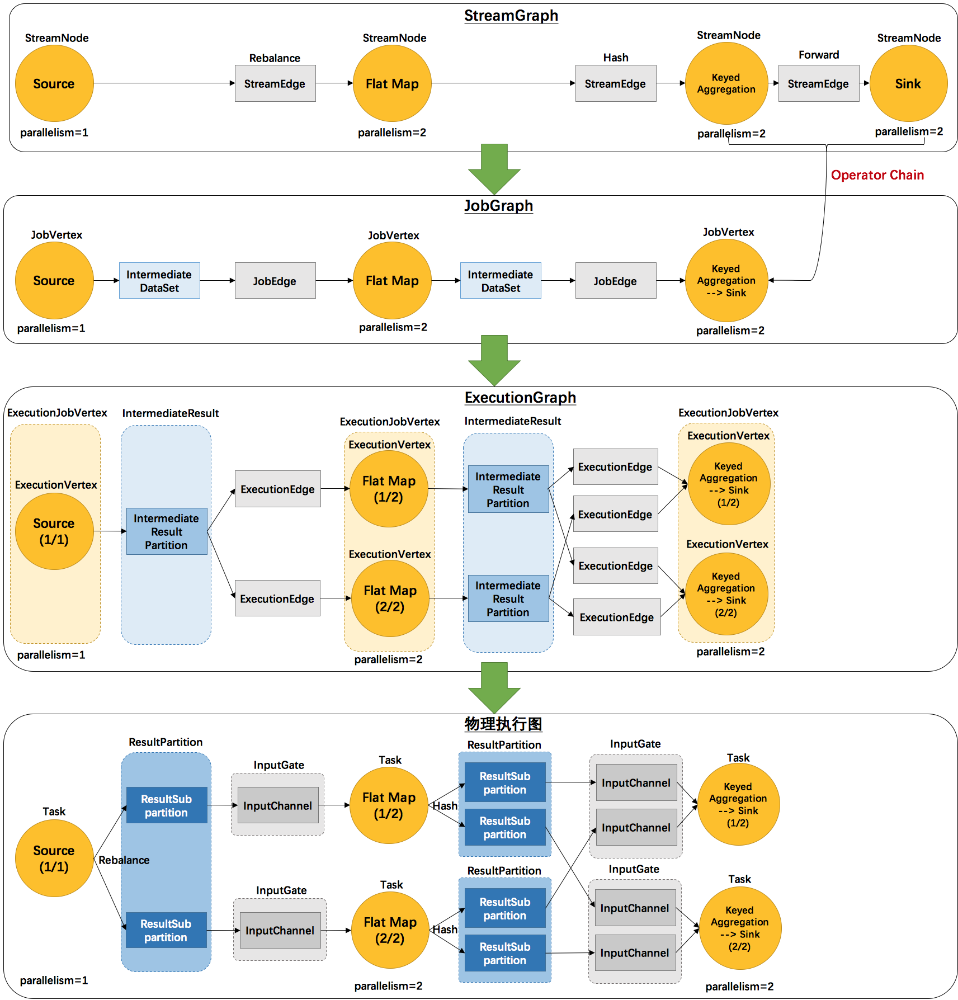

- **StreamGraph**

  对用户逻辑的映射，从DataStream API生成的最初的图。

  **其核心对象如下**

  1. **StreamNode**：用来代表 operator 的类，并具有所有相关的属性，如并发度、入边和出边等。

  2. **StreamEdge**：表示连接两个StreamNode的边。

- **JobGraph**

  在StreamGraph的基础上进行了一些优化，比如把一部分操作串成chain以提高效率。流和批的统一是JobGraph层面上实现的。

  **其核心对象如下**

  1. **JobVertex**：经过优化后符合条件的多个StreamNode可能会chain在一起生成一个JobVertex，即一个
      JobVertex包含一个或多个operator，JobVertex的输入是JobEdge，输出是IntermediateDataSet。

  2. **IntermediateDataSet**：表示JobVertex的输出，即经过operator处理产生的数据集。producer是
      JobVertex，consumer是JobEdge。

  3. **JobEdge**：代表了job graph中的一条数据传输通道。source 是 IntermediateDataSet，target 是 JobVertex。即数据通过JobEdge由IntermediateDataSet传递给目标JobVertex。

- **ExecutionGraph**

  为了调度存在的，加入了并行处理的概念。而在此基础上真正执行的是Task及其相关结构。

  JobManager 根据 JobGraph 生成ExecutionGraph。ExecutionGraph是JobGraph的并行化版本，是调度层最核心的数据结构。

  **其核心对象如下**

  1. **ExecutionJobVertex**：和JobGraph中的JobVertex一一对应。每一个ExecutionJobVertex都有和并发度一样多的 ExecutionVertex。

  2. **ExecutionVertex**：**表示****ExecutionJobVertex****的其中一个并发子任务**，输入是ExecutionEdge，输出是IntermediateResultPartition。

  3. **IntermediateResult**：和JobGraph中的IntermediateDataSet一一对应。**一个****IntermediateResult****包含多个****IntermediateResultPartition****，其个数等于该****operator****的并发度。** 

  4. **IntermediateResultPartition**：**表示****ExecutionVertex****的一个输出分区**，producer是ExecutionVertex，consumer是若干个ExecutionEdge。

  5. **ExecutionEdge**：表示ExecutionVertex的输入，source是IntermediateResultPartition，target是ExecutionVertex。**source****和****target****都只能是一个。** 

  6. **Execution**：是执行一个 ExecutionVertex 的一次尝试。当发生故障或者数据需要重算的情况下 ExecutionVertex 可能会有多个 ExecutionAttemptID。一个 Execution 通过 ExecutionAttemptID 来唯一标识。JM和TM之间关于 task 的部署和 task status 的更新都是通过 ExecutionAttemptID 来确定消息接受者。

- **物理执行图**

  并非flink的数据结构，而是程序开始执行后，各个task分布在不同的节点上，所形成的物理上的关系表示。JobManager 根据 ExecutionGraph 对 Job 进行调度后，在各个TaskManager 上部署 Task 后形成的“图”，并不是一个具体的数据结构。

  **其核心对象如下**

  1. **Task**：Execution被调度后在分配的 TaskManager 中启动对应的 Task。Task 包裹了具有用户执行逻辑的 operator。

  2. **ResultPartition**：代表由一个Task的生成的数据，和ExecutionGraph中的IntermediateResultPartition一一对应。

  3. **ResultSubpartition**：是ResultPartition的一个子分区。每个ResultPartition包含多个ResultSubpartition，**其数目要由下游消费** **Task** **数和** **DistributionPattern** **来决定。** 

  4. **InputGate**：代表Task的输入封装，和JobGraph中JobEdge一一对应。每个InputGate消费了一个或多个的ResultPartition。

  5. **InputChannel**：每个InputGate会包含一个以上的InputChannel，和ExecutionGraph中的ExecutionEdge一一对应，也和ResultSubpartition一对一地相连，即一个InputChannel接收一个ResultSubpartition的输出。

​	从JobGraph的图里可以看到，数据从上一个operator流到下一个operator的过程中，上游作为生产者提供了IntermediateDataSet，而下游作为消费者需要JobEdge。事实上，JobEdge是一个通信管道，连接了上游生产的dataset和下游的JobVertex节点。

​		在JobGraph转换到ExecutionGraph的过程中，主要发生了以下转变： 

- 加入了并行度的概念，成为真正可调度的图结构
- 生成了与JobVertex对应的ExecutionJobVertex，ExecutionVertex，与IntermediateDataSet对应的IntermediateResult和IntermediateResultPartition等，并行将通过这些类实现。

​	ExecutionGraph已经可以用于调度任务。我们可以看到，flink根据该图生成了一一对应的Task，每个task对应一个ExecutionGraph的一个Execution。Task用InputGate、InputChannel和ResultPartition对应了上面图中的IntermediateResult和ExecutionEdge。

## 生成StreamGraph


### 过程

在调用StreamExecutionEnvirment.execute()的时候开始触发StreamGraph的构建。

**入口**

```java
//StreamExecutionEnvironment.java

@Internal
public StreamGraph getStreamGraph() {
   if (transformations.size() <= 0) {
      throw new IllegalStateException("No operators defined in streaming topology. Cannot execute.");
   }
   return StreamGraphGenerator.generate(this, transformations);
}

```

**真正的构建过程**

```java
//StreamGraphGenerator.java中负责具体的StreamGraph的生成

public static StreamGraph generate(StreamExecutionEnvironment env, List<StreamTransformation<?>> transformations) {
	return new StreamGraphGenerator(env).generateInternal(transformations);
}

//实际执行StreamGraph的生成
private StreamGraph generateInternal(List<StreamTransformation<?>> transformations) {
	for (StreamTransformation<?> transformation: transformations) {
		transform(transformation);
	}
	return streamGraph;
}
```

遍历`transformations`集合，并对其每一个`StreamTransformation`调用`transform()`方法。

```java
Collection<Integer> transformedIds;
if (transform instanceof OneInputTransformation<?, ?>) {
   transformedIds = transformOneInputTransform((OneInputTransformation<?, ?>) transform);
} else if (transform instanceof TwoInputTransformation<?, ?, ?>) {
   transformedIds = transformTwoInputTransform((TwoInputTransformation<?, ?, ?>) transform);
} else if (transform instanceof SourceTransformation<?>) {
   transformedIds = transformSource((SourceTransformation<?>) transform);
} else if (transform instanceof SinkTransformation<?>) {
   transformedIds = transformSink((SinkTransformation<?>) transform);
} else if (transform instanceof UnionTransformation<?>) {
   transformedIds = transformUnion((UnionTransformation<?>) transform);
} else if (transform instanceof SplitTransformation<?>) {
   transformedIds = transformSplit((SplitTransformation<?>) transform);
} else if (transform instanceof SelectTransformation<?>) {
   transformedIds = transformSelect((SelectTransformation<?>) transform);
} else if (transform instanceof FeedbackTransformation<?>) {
   transformedIds = transformFeedback((FeedbackTransformation<?>) transform);
} else if (transform instanceof CoFeedbackTransformation<?>) {
   transformedIds = transformCoFeedback((CoFeedbackTransformation<?>) transform);
} else if (transform instanceof PartitionTransformation<?>) {
   transformedIds = transformPartition((PartitionTransformation<?>) transform);
} else if (transform instanceof SideOutputTransformation<?>) {
   transformedIds = transformSideOutput((SideOutputTransformation<?>) transform);
} else {
   throw new IllegalStateException("Unknown transformation: " + transform);
}
```

从上述代码可以看出，针对具体的某一种类型的`StreamTransformation`，会调用其相应的`transformXXX()`函数进行转换。`transformXXX()`首先会对`transform`的上游`transform`进行递归转换，确保上游的都已经完成了转化。然后通过`addOperator()`方法构造出`StreamNode`，通过`addEdge()`方法与上游的`transform`进行连接，构造出`StreamEdge`。

**单输入实体StreamTransformation的转换示例**

```java
private <IN, OUT> Collection<Integer> transformOneInputTransform(OneInputTransformation<IN, OUT> transform) {

	Collection<Integer> inputIds = transform(transform.getInput());

	// 防止重复转换，如果已经转换过了则直接返回转换的结果
	if (alreadyTransformed.containsKey(transform)) {
		return alreadyTransformed.get(transform);
	}
	//确定共享slot组
	String slotSharingGroup = determineSlotSharingGroup(transform.getSlotSharingGroup(), inputIds);
	//添加StreamNode到StreamGraph中
	streamGraph.addOperator(transform.getId(),
			slotSharingGroup,
			transform.getCoLocationGroupKey(),
			transform.getOperatorFactory(),
			transform.getInputType(),
			transform.getOutputType(),
			transform.getName());
	
	if (transform.getStateKeySelector() != null) {
		TypeSerializer<?> keySerializer = transform.getStateKeyType().createSerializer(env.getConfig());
		streamGraph.setOneInputStateKey(transform.getId(), transform.getStateKeySelector(), keySerializer);
	}
	//设定并行度
	streamGraph.setParallelism(transform.getId(), transform.getParallelism());
	streamGraph.setMaxParallelism(transform.getId(), transform.getMaxParallelism());
	//添加StreamEdge，建立StreamNode之间的关联关系
	for (Integer inputId: inputIds) {
		streamGraph.addEdge(inputId, transform.getId(), 0);
	}

	return Collections.singleton(transform.getId());
}
```

1. 存储这个OneInputTransformation的上游Transformation的id,方便构造边，在这里递归，确保所有的上游Transformation都已经转化。

2. 确定共享的Slot组。

3. 添加Operator到StreamGraph中。

4. 设置StateKeySelector。

5. 设置并行度、最大并行度。

6. 构造StreamGrap的边。

**虚拟SteamTranform的生成示例**

如下DataStream.keyBy（），虚拟的StreamTransformation生成的时候不会转换为StreamNode，而是添加为虚拟节点。

```java
private <T> Collection<Integer> transformPartition(PartitionTransformation<T> partition) {
    StreamTransformation<T> input = partition.getInput();
    List<Integer> resultIds = new ArrayList<>();
    // 递归对该transformation的直接上游transformation进行转换，获得直接上游id集合
    Collection<Integer> transformedIds = transform(input);
    for (Integer transformedId: transformedIds) {
        int virtualId = StreamTransformation.getNewNodeId();
        // 添加一个虚拟分区节点VirtualPartitionNode，不会生成StreamNode
        streamGraph.addVirtualPartitionNode(transformedId, virtualId, partition.getPartitioner());
        resultIds.add(virtualId);
    }
  return resultIds;
}
```

从`transformPartition`函数的实现可以看出，对`transformPartition`的转换没有生成具体的`StreamNode`和`StreamEdge`，而是通过`streamGraph.addVirtualPartitionNode()`方法添加了一个虚拟节点。当`partition`的下游`transform`添加`edge`时（调用`streamGraph.addEdge()`），会把`partition`信息写入到`StreamEdge`中。

```java
private void addEdgeInternal(Integer upStreamVertexID, Integer downStreamVertexID, int typeNumber, StreamPartitioner<?> partitioner, List<String> outputNames, OutputTag outputTag) {
    // 当上游是sideOutput时，递归调用，并传入sideOutput信息
    if (virtualSideOutputNodes.containsKey(upStreamVertexID)) {
        int virtualId = upStreamVertexID;
        upStreamVertexID = virtualSideOutputNodes.get(virtualId).f0;
        if (outputTag == null) {
            outputTag = virtualSideOutputNodes.get(virtualId).f1;
        }
        addEdgeInternal(upStreamVertexID, downStreamVertexID, typeNumber, partitioner, null, outputTag);
    }
    // 当上游是select时，递归调用，并传入select信息 
    else if (virtualSelectNodes.containsKey(upStreamVertexID)) {
        int virtualId = upStreamVertexID;
        upStreamVertexID = virtualSelectNodes.get(virtualId).f0;
        if (outputNames.isEmpty()) {
            outputNames = virtualSelectNodes.get(virtualId).f1;
        }
        addEdgeInternal(upStreamVertexID, downStreamVertexID, typeNumber, partitioner, outputNames, outputTag);
    }
    // 当上游是partition时，递归调用，并传入partitioner信息 
    else if (virtualPartitionNodes.containsKey(upStreamVertexID)) {
        int virtualId = upStreamVertexID;
        upStreamVertexID = virtualPartitionNodes.get(virtualId).f0;
        if (partitioner == null) {
            partitioner = virtualPartitionNodes.get(virtualId).f1;
        }
        addEdgeInternal(upStreamVertexID, downStreamVertexID, typeNumber, partitioner, outputNames, outputTag);
    }
    // 不是以上逻辑转换的情况，真正构建StreamEdge 
    else {
        StreamNode upstreamNode = getStreamNode(upStreamVertexID);
        StreamNode downstreamNode = getStreamNode(downStreamVertexID);
        // 没有指定partitioner时，会为其选择forward或者rebalance分区
        if (partitioner == null && upstreamNode.getParallelism() == downstreamNode.getParallelism()) {
            partitioner = new ForwardPartitioner<Object>();
        } else if (partitioner == null) {
            partitioner = new RebalancePartitioner<Object>();
        }
        // 创建StreamEdge，并将该StreamEdge添加到上游的输出，下游的输入
        StreamEdge edge = new StreamEdge(upstreamNode, downstreamNode, typeNumber, outputNames, partitioner, outputTag);
        getStreamNode(edge.getSourceId()).addOutEdge(edge);
        getStreamNode(edge.getTargetId()).addInEdge(edge);
    }
}
```

### 关键设计

#### 关键对象

**StreamTransformation**


**StreamOperator**


#### DataStream API到 StreamTransformation

```java
//DataStream.java

//编写代码是调用的map API
public <R> SingleOutputStreamOperator<R> map(MapFunction<T, R> mapper) {

	TypeInformation<R> outType = TypeExtractor.getMapReturnTypes(clean(mapper), getType(),
			Utils.getCallLocationName(), true);

	return transform("Map", outType, new StreamMap<>(clean(mapper)));
}

@PublicEvolving
public <R> SingleOutputStreamOperator<R> transform(String operatorName, TypeInformation<R> outTypeInfo, OneInputStreamOperator<T, R> operator) {

	// read the output type of the input Transform to coax out errors about MissingTypeInfo
	transformation.getOutputType();
    //封装成StreamTransformation
	OneInputTransformation<T, R> resultTransform = new OneInputTransformation<>(
			this.transformation,
			operatorName,
			operator,
			outTypeInfo,
			environment.getParallelism());
    //封装成StreamOperator
	@SuppressWarnings({ "unchecked", "rawtypes" })
	SingleOutputStreamOperator<R> returnStream = new 	                        SingleOutputStreamOperator(environment, resultTransform);
    //注册到StreamExectionEnvirment中，后边生成StreamGraph会用到
	getExecutionEnvironment().addOperator(resultTransform);

	return returnStream;
}

```

> 其他的API调用的转换过程是类似的。

1. 首先，用户代码里定义的UDF会被当作其基类对待，然后交给StreamMap这个operator做进一步包装。事实上，每一个Transformation都对应了一个StreamOperator。
2. 由于map这个操作只接受一个输入，所以再被进一步包装为OneInputTransformation。
3. 最后，将该transformation注册到执行环境中，当执行上文提到的generate方法时，生成StreamGraph图结构。
4. StreamTransformation是个虚拟的概念，不会体现在运行时。在真正的运行时，是由StreamTask（OneInputStreamTask、TwoInputStreamTask、StreamIterationHead、StreamIterationTail）调用StreamOneInputProcessor和StreamTwoInputProcessor执行。

StreamInputProcessor.processInput()从InputGate读取数据，然后调用StreamOperator.processElement处理数据。

#### StreamFormation、StreamOperator、UDF的关系


#### 实体StreamNode和虚拟StreamNode

并不是每一个 StreamTransformation 都会转换成runtime层中的物理操作。有一些只是逻辑概念，比如union、split/select、partition等。

虚拟的StreamNode不会变成实体的StreamNode，实体的StreamNode往往表达是用户实现的逻辑，此处的功能是不确定的，因业务而异，很可能会生成不同结构的StreamRecord的输出交给下游。而Split、union、partition这些逻辑是很明确的，不会改变StreamRecord，在执行的时候封装到StreamEdge。

如下图所示的转换树所示


### 总结

 首先，根据用户通过Stream API自定义UDF编写的程序，即在DataStream上做的一系列转换（map、shuffle、window等），我们可以得到StreamTransformation集合。然后通过调用streamGraphGenerator.generate(env, transformations)，遍历transformations集合，并对其每一个StreamTransformation调用transform()方法，构造出StreamNode，并通过StreamEdge与上游的transformation进行连接，此处需要特别注意对逻辑转换（partition等）的处理，最后构造出StreamGraph。

## 生成JobGraph

JobGraph 的责任就是统一Batch和Stream的图，用来描述清楚一个拓扑图的结构，并且做了chaining的优化，chaining普适于Batch和Stream。

### 过程

**入口**

```java
//StreamGraph.java
@Override
public JobGraph getJobGraph(@Nullable JobID jobID) {
	// 迭代job暂时禁用Checkpoint
	return StreamingJobGraphGenerator.createJobGraph(this, jobID);
}
```

```java
//StreamGraphGenerator.java
@Override
public JobGraph getJobGraph(@Nullable JobID jobID) {
	// 迭代job暂时禁用Checkpoint
	return StreamingJobGraphGenerator.createJobGraph(this, jobID);
}

public static JobGraph createJobGraph(StreamGraph streamGraph, @Nullable JobID jobID) {
    return new StreamingJobGraphGenerator(streamGraph, jobID).createJobGraph();
}

```


```java
private JobGraph createJobGraph() {

	// 设置调度模式为Eager，Eager是Stream的调度模式，不同于Batch，
	//即一次性申请所有需要的资源
	jobGraph.setScheduleMode(ScheduleMode.EAGER);

	// Generate deterministic hashes for the nodes in order to identify them across
	// submission iff they didn't change.
	//为每个节点生成确定的hash id作为唯一标识
	Map<Integer, byte[]> hashes = defaultStreamGraphHasher.traverseStreamGraphAndGenerateHashes(streamGraph);

	// 为了向后保持兼容为每个节点生成老版本的Hash id
	List<Map<Integer, byte[]>> legacyHashes = new ArrayList<>(legacyStreamGraphHashers.size());
	for (StreamGraphHasher hasher : legacyStreamGraphHashers) {
		legacyHashes.add(hasher.traverseStreamGraphAndGenerateHashes(streamGraph));
	}

	Map<Integer, List<Tuple2<byte[], byte[]>>> chainedOperatorHashes = new HashMap<>();
	//真正对StreamGrap进行转换，生成JobGraph图
	setChaining(hashes, legacyHashes, chainedOperatorHashes);

	setPhysicalEdges();
	//设置共享slotGroup
	setSlotSharingAndCoLocation();
	//配置checkpoint
	configureCheckpointing();
	//如果有之前的缓存的文件的配置，则重新读入
	JobGraphGenerator.addUserArtifactEntries(streamGraph.getEnvironment().getCachedFiles(), jobGraph);

	//设置执行环境配置
	jobGraph.setExecutionConfig(streamGraph.getExecutionConfig());

	return jobGraph;
}
```

**JobGraph生成的具体逻辑**

从Source节点开始，遍历Source节点，创建OperatorChain

```java
//StreamGraphGenerator.java
private void setChaining(Map<Integer, byte[]> hashes, List<Map<Integer, byte[]>> legacyHashes, Map<Integer, List<Tuple2<byte[], byte[]>>> chainedOperatorHashes) {
    //从所有的Source节点开始生成OperatorChain
    for (Integer sourceNodeId : streamGraph.getSourceIDs()) {
        createChain(sourceNodeId, sourceNodeId, hashes, legacyHashes, 0, chainedOperatorHashes);
    }
}
```


执行具体的Chain和JobVertex生成、JobEdge的关联、IntermediateResultSet。

```java
private List<StreamEdge> createChain(
		Integer startNodeId,
		Integer currentNodeId,
		Map<Integer, byte[]> hashes,
		List<Map<Integer, byte[]>> legacyHashes,
		int chainIndex,
		Map<Integer, List<Tuple2<byte[], byte[]>>> chainedOperatorHashes) {

	if (!builtVertices.contains(startNodeId)) {

		List<StreamEdge> transitiveOutEdges = new ArrayList<StreamEdge>();

		List<StreamEdge> chainableOutputs = new ArrayList<StreamEdge>();
		List<StreamEdge> nonChainableOutputs = new ArrayList<StreamEdge>();
		//获取当前节点的出边，判断边是否符合operatorchain的条件，
		//分为两类：chainableOutputs,nonChainableOutputs
		for (StreamEdge outEdge : streamGraph.getStreamNode(currentNodeId).getOutEdges()) {
			if (isChainable(outEdge, streamGraph)) {
				chainableOutputs.add(outEdge);
			} else {
				nonChainableOutputs.add(outEdge);
			}
		}
		//对于chainable的边，递归调用createChain
		//返回值添加到transitiveOutEdges中
		for (StreamEdge chainable : chainableOutputs) {
			transitiveOutEdges.addAll(
					createChain(startNodeId, chainable.getTargetId(), hashes, legacyHashes, chainIndex + 1, chainedOperatorHashes));
		}
		//对于无法chain在一起的边，边的下游节点作为OperatorChain的Head节点，
		//进行递归调用，返回值添加到transitiveOutEdges中
		for (StreamEdge nonChainable : nonChainableOutputs) {
			transitiveOutEdges.add(nonChainable);
			createChain(nonChainable.getTargetId(), nonChainable.getTargetId(), hashes, legacyHashes, 0, chainedOperatorHashes);
		}

		List<Tuple2<byte[], byte[]>> operatorHashes =
			chainedOperatorHashes.computeIfAbsent(startNodeId, k -> new ArrayList<>());

		byte[] primaryHashBytes = hashes.get(currentNodeId);

		for (Map<Integer, byte[]> legacyHash : legacyHashes) {
			operatorHashes.add(new Tuple2<>(primaryHashBytes, legacyHash.get(currentNodeId)));
		}

		chainedNames.put(currentNodeId, createChainedName(currentNodeId, chainableOutputs));
		chainedMinResources.put(currentNodeId, createChainedMinResources(currentNodeId, chainableOutputs));
		chainedPreferredResources.put(currentNodeId, createChainedPreferredResources(currentNodeId, chainableOutputs));
		
		// 如果当前节点是起始节点，则直接创建JobVertex，否则返回一个空的SteamConfig
		StreamConfig config = currentNodeId.equals(startNodeId)
				? createJobVertex(startNodeId, hashes, legacyHashes, chainedOperatorHashes)
				: new StreamConfig(new Configuration());	
		// 将StreamNode中的配置信息序列化到StreamConfig中
		setVertexConfig(currentNodeId, config, chainableOutputs, nonChainableOutputs);
		// 再次判断，如果是chain的起始节点，执行connect()方法，创建JobEdge和IntermediateDataSet；
		//否则将当前节点的StreamConfig添加到chainedConfig中

		if (currentNodeId.equals(startNodeId)) {

			config.setChainStart();
			config.setChainIndex(0);
			config.setOperatorName(streamGraph.getStreamNode(currentNodeId).getOperatorName());
			config.setOutEdgesInOrder(transitiveOutEdges);
			config.setOutEdges(streamGraph.getStreamNode(currentNodeId).getOutEdges());

			for (StreamEdge edge : transitiveOutEdges) {
				connect(startNodeId, edge);
			}

			config.setTransitiveChainedTaskConfigs(chainedConfigs.get(startNodeId));

		} else {
			chainedConfigs.computeIfAbsent(startNodeId, k -> new HashMap<Integer, StreamConfig>());

			config.setChainIndex(chainIndex);
			StreamNode node = streamGraph.getStreamNode(currentNodeId);
			config.setOperatorName(node.getOperatorName());
			chainedConfigs.get(startNodeId).put(currentNodeId, config);
		}

		config.setOperatorID(new OperatorID(primaryHashBytes));
		
		if (chainableOutputs.isEmpty()) {
			config.setChainEnd();
		}
		return transitiveOutEdges;

	} else {
		return new ArrayList<>();
	}
}
```

`setChaining()`会依次对`source`调用`createChain()`方法，该方法会递归调用其下游节点，从而构建出`node chains`。`createChain()`会分析当前节点的出边，根据`Operator Chains`中的条件进行判断`isChainable()`，并将出边分成两类：`chainalbeOutputs`和`noChainableOutputs`，接着分别递归调用自身方法。之后会将`StreamNode`中的配置信息序列化到`StreamConfig`中。如果当前不是`chain`中的子节点，则会构建`JobVertex`和`JobEdge`相连。如果是`chain`中的子节点，则会将`StreamConfig`添加到该`chain`的`chainedConfigs`集合中。

### JobGraph生成示例

**以SocketWindowCount为例**

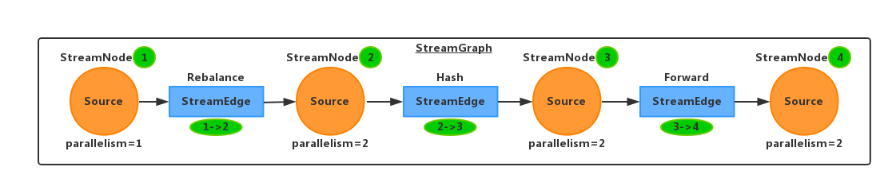

上图是StreamGraph

如上图所示，我们先给`4`个`StreamNode`节点进行编号，`Source`用`1`表示，`Flat Map`用`2`表示，`Trigger Window`用`3`表示，`Sink`用`4`表示；相应地，`3`条`StreamEdge`则分别用`1->2`，`2->3`，`3->4`表示。

**递归调用过程如下**：

- 递归始于`Source`，调用`createChain(1, 1)`，当前节点`1`的出边为`1->2`，不可`chain`，将边`1->2`直接加入`transitiveOutEdges`；
- 然后递归调用`createChain(2, 2)`，当前节点`2`的出边为`2->3`，同样的，不可`chain`，将边`2->3`直接加入`transitiveOutEdges`；
- 继续递归调用`createChain(3, 3)`，当前节点`3`的出边为`3->4`，要注意了，可`chain`，等着将下游`createChain()`的返回值加入`transitiveOutEdges`；
- 此处递归调用`createChain(3, 4)`，当前节点`4`没有出边，递归终止。

**递归结束条件：**

- 当前节点不再有出边集合，即`streamGraph.getStreamNode(currentId).getOutEdges()`为空
- 当前节点已经转换完成，即`builtVertices.contains(startNodeId)`为`false` 

递归调用过程中各种操作以及变量情况一览表如下：

| `creatChain()` | `getOutEdges()` | `chainable` | `nonChainAble` | `transitiveOutEdges` | `JobVertex`    | `connect()` |
| -------------- | --------------- | ----------- | -------------- | -------------------- | -------------- | ----------- |
| `(1, 1)`       | `1->2`          | 无          | `1->2`         | `1->2`               | `JobVertex`    | `Y`         |
| `(2, 2)`       | `2->3`          | 无          | `2->3`         | `2->3`               | `JobVertex`    | `Y`         |
| `(3, 3)`       | `3->4`          | `3->4`      | 无             | 无                   | `JobVertex`    | `Y`         |
| `(3, 4)`       | 无              | 无          | 无             | 无                   | `StreamConfig` | `N`         |


### 关键设计

#### 关键对象

#####  OperatorChain

为了更高效地分布式执行，Flink会尽可能地将operator的subtask链接（chain）在一起形成task。每个task在一个线程中执行。将operators链接成task是非常有效的优化：它能减少线程之间的切换，减少消息的序列化/反序列化，减少数据在缓冲区的交换，减少了延迟的同时提高整体的吞吐量。

如下图所示


**可以Chain的条件**

isChainable()`，用来判断`是否可以将StreamOperator chain`在一起，一共有`9`个条件：

- 下游节点的入边为`1` 
-  `StreamEdge`的下游节点对应的算子不为`null` 
-  `StreamEdge`的上游节点对应的算子不为`null` 
-  `StreamEdge`的上下游节点拥有相同的`slotSharingGroup`，默认都是`default` 
- 下游算子的连接策略为`ALWAYS` 
- 上游算子的连接策略为`ALWAYS`或者`HEAD` 
-  `StreamEdge`的分区类型为`ForwardPartitioner` 
- 上下游节点的并行度一致
- 当前`StreamGraph`允许`chain`

**OperatorChain的结构**

```Java
//OperatorChain包含的所有StreamOperator
private final StreamOperator<?>[] allOperators;
//Operator之间传递数据Output
private final RecordWriterOutput<?>[] streamOutputs;
//监控统计
private final WatermarkGaugeExposingOutput<StreamRecord<OUT>> chainEntryPoint;
//OperatorChain的第一个Operator，数据数据从第一个Operator开始，依次执行
private final OP headOperator;
```

**OperatorChain的头和尾**

在OperatorChain中的第一个Operator被称为HeadOperator。

<span id="op-chain-call-link-example">**调用链示例**</span>

代码

```java
// ...
DataStream<String> text = env.fromElements(WordCountData.WORDS);
DataStream<Tuple2<String, Integer>> counts =
	// split up the lines in pairs (2-tuples) containing: (word,1)
	text.flatMap(new Tokenizer())
		// group by the tuple field "0" and sum up tuple field "1"
		.keyBy(0).sum(1).filter(new FilterFunction<Tuple2<String, Integer>>() {
	@Override
	public boolean filter(Tuple2<String, Integer> value) throws Exception {
		return value.f1 > 1;
	}
});
env.execute("Streaming WordCount");
```

生成的调用链

```java
StreamGroupedReduce.processElement
--> CountingOutput.collect
--> CopyChainingOutput.collect
    --> StreamFilter.processElement
    --> CountingOutput.collect
    --> CopyChainingOutput.collect
        --> StreamSink.processElement
        --> CountingOutput.collect
        --> BroadcastingOutputCollector.collect
```

后边在数据传递的部分会详细解释这个调用链。

### 总结

首先，通过`streamGraph.getSourceIDs()`拿到`source`节点集合，紧接着依次从`source`节点开始遍历，判断`StreamNode Chain`，递归创建`JobVertex`，所以，其真正的处理顺序其实是从`sink`开始的。然后通过`connect()`遍历当前节点的物理出边`transitiveOutEdges`集合，创建`JobEdge`，建立当前节点与下游节点的联系，即`JobVertex`与`IntermediateDataSet`之间。

## 生成ExecutionGraph

与StreamGraph和JobGraph不同，ExecutionGraph并不是在我们的客户端程序生成，而是在服务端（JobManager处）生成的，顺便flink只维护一个JobManager。其入口代码是ExecutionGraphBuilder.buildGraph（...）。

### 过程

```java
//ExecutionGraphBuilder.java

public static ExecutionGraph buildGraph(){
    ...
    //对JobGraph中的JobVertex节点进行拓扑排序，得到List<JobVertex>
    List<JobVertex> sortedTopology = jobGraph.getVerticesSortedTopologicallyFromSources();
    executionGraph.attachJobGraph(sortedTopology);  //构建ExecutionGraph的核心方法
    ...
}
```


由上可知，`attachJobGraph()`方法是构建`ExecutionGraph`图结构的核心方法。

```java
public void attachJobGraph(List<JobVertex> topologiallySorted){
    ...
    //遍历排好序的Job Vertex
    for (JobVertex jobVertex : topologiallySorted) {
        ...
        // 创建ExecutionJobVertex，并添加到ExecutionGraph中
        ExecutionJobVertex ejv = new ExecutionJobVertex(this, jobVertex, 1, rpcCallTimeout, globalModVersion, createTimestamp);
        //将创建的ExecutionJobVertex与前置的IntermediateResult连接起来
        ejv.connectToPredecessors(this.intermediateResults);
        ...
    }
    ...
}
```

`attachJobGraph()`方法主要完成的两件事情：

- 将`JobVertex`封装成`ExecutionJobVertex`
- 把节点通过`ExecutionEdge`连接

### 关键设计

#### 关键对象

- **ExecutionJobVertex**

ExecutionJobVertex方法，用来将一个个JobVertex封装成ExecutionJobVertex，并依次创建ExecutionVertex、Execution、IntermediateResult、IntermediateResultPartition，用于丰富ExecutionGraph。

在ExecutionJobVertex的构造函数中，首先是依据对应的JobVertex的并发度，生成对应个数的ExecutionVertex。其中，一个ExecutionVertex代表着一个ExecutionJobVertex的并发子task。然后是将原来JobVertex的中间结果IntermediateDataSet转化为ExecutionGraph中的IntermediateResult。

**核心的逻辑在ExecutionJobVertex的构造方法中**

1. 是并行度相关的设置    

2. 序列化后的TaskInformation，这个信息很重要，后面deploy的时候会将TaskInformation分发到具体的Task中。 

3. ExecutionVertex列表，按照JobVertex并行度设置      

4. slots创建intermediate results，这是由当前operator的出度确定的，如果当前operator只向下游一个operator输出，则为1。注意一个IntermediateResult包含多个IntermediateResultPartition。

5. Slot sharing和coLocation相关代码     

6. 根据job vertex的并行度，创建对应的ExecutionVertex列表。即，一个JobVertex/ExecutionJobVertex代表的是一个operator，而具体的ExecutionVertex则代表了每一个Task

7. sanity check,检查intermediate result partition和Execution Vertices之间有没有重复的引用

- **ExecutionVertex**

`ExecutionVertex`的构造函数中，首先会创建`IntermediateResultPartition`，并通过`IntermediateResult.setPartition( )`建立`IntermediateResult`和`IntermediateResultPartition`之间的关系；然后生成`Execution`，并配置资源相关。

#### 上下游连接

新创建的`ExecutionJobVertex`调用`ejv.connectToPredecessor()`方法，按照不同的分发策略连接上游，其参数为上游生成的`IntermediateResult`集合。其中，根据`JobEdge`中两种不同的`DistributionPattern`属性，分别调用`connectPointWise()`或者`connectAllToAll( )`方法，创建`ExecutionEdge`，将`ExecutionVertex`和上游的`IntermediateResultPartition`连接起来。

**连接策略**

`DistributionPattern.POINTWISE`策略，该策略用来连接当前`ExecutionVertex`与上游的`IntermediateResultPartition`。首先，获取上游`IntermediateResult`的`partition`数，用`numSources`表示，以及此`ExecutionJobVertex`的并发度，用`parallelism`表示；然后，根据其并行度的不同，分别创建`ExecutionEdge`。共分`3`种情况：

(1)  如果并发数等于`partition`数，则一对一进行连接。如下图所示：
 即`numSources == parallelism`


(2)  如果并发数大于`partition`数，则一对多进行连接。如下图所示：
即`numSources < parallelism`，且`parallelism % numSources == 0`


 即`numSources < parallelism`，且`parallelism % numSources != 0`


(3) 如果并发数小于`partition`数，则多对一进行连接。如下图所示：
即`numSources > parallelism`，且`numSources % parallelism == 0`


即`numSources > parallelism`，且`numSources % parallelism != 0`


### 总结

将`JobGraph`按照拓扑排序后得到一个`JobVertex`集合，遍历该`JobVertex`集合，即从`source`开始，将`JobVertex`封装成`ExecutionJobVertex`，并依次创建`ExecutionVertex`、`Execution`、`IntermediateResult`和`IntermediateResultPartition`。然后通过`ejv.connectToPredecessor()`方法，创建`ExecutionEdge`，建立当前节点与其上游节点之间的联系，即连接`ExecutionVertex`和`IntermediateResultPartition`。

# Flink调度

## 调度模式

Apache Flink内部提供了两种调度模式，分别为：**LAZY_FROM_SOURCES**(批处理）,**EAGER**（流计算）。

```java
public enum ScheduleMode {

	/** 批的lazy模式，从Source开始，下游的Task的输入数据准备好之后，调度下游的Task开始执行*/
	LAZY_FROM_SOURCES,

	/** 流的全量模式，一次性申请所有的资源 */
	EAGER;
}
```

### LAZY_FROM_SOURCES模式

**ExecutionJobVertex**代表某个**operation**，如**map**。在这里根据**ExecutionGraph**中**ExecutionJobVertex**的顺序来依次初始化。当使用到当前**task**时，再去调度。

**LAZY_FROM_SOURCES**理解为，一个一个**operator**逐个完成，比较适合批处理模式，这种模式使得每一种**operator**都能最大限度的利用集群资源。

```java
//ExecutionGraph.java
private CompletableFuture<Void> scheduleLazy(SlotProvider slotProvider) {

		final ArrayList<CompletableFuture<Void>> schedulingFutures = new ArrayList<>(numVerticesTotal);
		// simply take the vertices without inputs.
		for (ExecutionJobVertex ejv : verticesInCreationOrder) {
			if (ejv.getJobVertex().isInputVertex()) {
				final CompletableFuture<Void> schedulingJobVertexFuture = ejv.scheduleAll(
					slotProvider,
					allowQueuedScheduling,
					LocationPreferenceConstraint.ALL, // since it is an input vertex, the input based location preferences should be empty
					Collections.emptySet());

				schedulingFutures.add(schedulingJobVertexFuture);
			}
		}

		return FutureUtils.waitForAll(schedulingFutures);
	}
```


### EAGER模式

如果采用**EAGER**方式的话，是先调用**allocateResourcesForAll**来分配所需的所有资源，然后才是把所有的**task**部署到对应的TaskManager上。

```java
//ExecutionGraph.java

private CompletableFuture<Void> scheduleEager(SlotProvider slotProvider, final Time timeout) {
	assertRunningInJobMasterMainThread();
	checkState(state == JobStatus.RUNNING, "job is not running currently");

	// Important: reserve all the space we need up front.
	// that way we do not have any operation that can fail between allocating the slots
	// and adding them to the list. If we had a failure in between there, that would
	// cause the slots to get lost
	final boolean queued = allowQueuedScheduling;

	// collecting all the slots may resize and fail in that operation without slots getting lost
	final ArrayList<CompletableFuture<Execution>> allAllocationFutures = new ArrayList<>(getNumberOfExecutionJobVertices());

	final Set<AllocationID> allPreviousAllocationIds =
		Collections.unmodifiableSet(computeAllPriorAllocationIdsIfRequiredByScheduling());

	// allocate the slots (obtain all their futures
	for (ExecutionJobVertex ejv : getVerticesTopologically()) {
		// these calls are not blocking, they only return futures
		Collection<CompletableFuture<Execution>> allocationFutures = ejv.allocateResourcesForAll(
			slotProvider,
			queued,
			LocationPreferenceConstraint.ALL,
			allPreviousAllocationIds,
			timeout);

		allAllocationFutures.addAll(allocationFutures);
	}

	// this future is complete once all slot futures are complete.
	// the future fails once one slot future fails.
	final ConjunctFuture<Collection<Execution>> allAllocationsFuture = FutureUtils.combineAll(allAllocationFutures);

	return allAllocationsFuture.thenAccept(
		(Collection<Execution> executionsToDeploy) -> {
			for (Execution execution : executionsToDeploy) {
				try {
					execution.deploy();
				} catch (Throwable t) {
					throw new CompletionException(
						new FlinkException(
							String.format("Could not deploy execution %s.", execution),
							t));
				}
			}
		})
		// Generate a more specific failure message for the eager scheduling
		.exceptionally(
			(Throwable throwable) -> {
				final Throwable strippedThrowable = ExceptionUtils.stripCompletionException(throwable);
				final Throwable resultThrowable;
				if (strippedThrowable instanceof TimeoutException) {
					int numTotal = allAllocationsFuture.getNumFuturesTotal();
					int numComplete = allAllocationsFuture.getNumFuturesCompleted();

					String message = "Could not allocate all requires slots within timeout of " +
						timeout + ". Slots required: " + numTotal + ", slots allocated: " + numComplete +
							", previous allocation IDs: " + allPreviousAllocationIds;

					StringBuilder executionMessageBuilder = new StringBuilder();

					for (int i = 0; i < allAllocationFutures.size(); i++) {
						CompletableFuture<Execution> executionFuture = allAllocationFutures.get(i);

						try {
							Execution execution = executionFuture.getNow(null);
							if (execution != null) {
								executionMessageBuilder.append("completed: " + execution);
							} else {
								executionMessageBuilder.append("incomplete: " + executionFuture);
							}
						} catch (CompletionException completionException) {
							executionMessageBuilder.append("completed exceptionally: " + completionException + "/" + executionFuture);
						}

						if (i < allAllocationFutures.size() - 1) {
							executionMessageBuilder.append(", ");
						}
					}

					message += ", execution status: " + executionMessageBuilder.toString();

					resultThrowable = new NoResourceAvailableException(message);
				} else {
					resultThrowable = strippedThrowable;
				}

				throw new CompletionException(resultThrowable);
			});
}
```


# Flink执行Task

## 状态迁移

### Job的状态迁移


### Task的状态迁移


## 生命周期

### Task生命周期

```java
//状态初始化
TASK::setInitialState
//开始执行
TASK::invoke
	    //初始化
	    create basic utils (config, etc) and load the chain of operators
	    setup-operators
	    task-specific-init
	    initialize-operator-states
   	    open-operators
	    //循环处理数据
	    run
	    //销毁阶段
	    close-operators
	    dispose-operators
	    task-specific-cleanup
	    common-cleanup
	    
```

### Operator生命周期

```java
   //初始化阶段
    OPERATOR::setup
        UDF::setRuntimeContext
    OPERATOR::initializeState
    OPERATOR::open
        UDF::open
    // 处理阶段(called on every element/watermark)
    OPERATOR::processElement
        UDF::run
    OPERATOR::processWatermark
    // 检查点阶段(called asynchronously on every checkpoint)
    OPERATOR::snapshotState      
    // 销毁阶段
    OPERATOR::close
        UDF::close
    OPERATOR::dispose
```

## Job的启动

### JobManager启动Task


### TaskManager启动Task

#### StreamTask的执行逻辑

在真正的运行时，是由

```java
StreamTask（OneInputStreamTask、TwoInputStreamTask、StreamIterationHead、StreamIterationTail）

-> StreamOneInputProcessor或StreamTwoInputProcessor

-> StreamInputProcessor.processInput()从InputGate读取数据

-> OneInputStreamOperator.processElement（）、processWatermark（）处理数据
```

> TowInputStreamOperator同理，额外需要判断调用processElement1还是processElement2


## 关键对象

### TaskManager

TaskManager是flink中资源管理的基本组件，是所有执行任务的基本容器，提供了内存管理、IO管理、通信管理等一系列功能。

- **MemoryManager**

​       JVM普遍存在着存储对象密度低、大内存时GC对系统影响大等问题。所以flink自己抽象了一套内存管理机制，将所有对象序列化后放在自己的MemorySegment上进行管理。

- **IOManager**

​       flink通过IOManager管理磁盘IO的过程，提供了同步和异步两种写模式，又进一步区分了block、buffer和bulk三种读写方式。

- **NettyShuffleManager**（以前叫**NetworkEnvironment**）

​        TaskManager的网络 IO 组件，包含了追踪中间结果和数据交换的数据结构。它的构造器会统一将配置的内存先分配出来，抽象成 NetworkBufferPool 统一管理内存的申请和释放。意思是说，在输入和输出数据时，不管是保留在本地内存，等待chain在一起的下个操作符进行处理，还是通过网络把本操作符的计算结果发送出去，都被抽象成了NetworkBufferPool。

### StreamTask


# Flink的数据抽象和数据交换过程

## Flink内存

### 大数据平台面临的内存管理的问题

基于 JVM 的数据分析引擎都需要面对将大量数据存到内存中，这就不得不面对 JVM 存在的几个问题：

1. Java 对象存储密度低。一个只包含 boolean 属性的对象占用了16个字节内存：对象头占了8个，boolean 属性占了1个，对齐填充占了7个。而实际上只需要一个bit（1/8字节）就够了。
2. Full GC 会极大地影响性能，尤其是为了处理更大数据而开了很大内存空间的JVM来说，GC 会达到秒级甚至分钟级。
3. OOM 问题影响稳定性。OutOfMemoryError是分布式计算框架经常会遇到的问题，当JVM中所有对象大小超过分配给JVM的内存大小时，就会发生OutOfMemoryError错误，导致JVM崩溃，分布式框架的健壮性和性能都会受到影响。

所以目前，越来越多的大数据项目开始自己管理JVM内存了，像 Spark、Flink、HBase，为的就是获得像 C 一样的性能以及避免 OOM 的发生。本文将会讨论 Flink 是如何解决上面的问题的，主要内容包括内存管理、定制的序列化工具、缓存友好的数据结构和算法、堆外内存、JIT编译优化等。

Flink 并不是将大量对象存在堆上，而是将对象都序列化到一个预分配的内存块上，这个内存块叫做 `MemorySegment`，它代表了一段固定长度的内存（默认大小为 32KB），也是 Flink 中最小的内存分配单元，并且提供了非常高效的读写方法。你可以把 MemorySegment 想象成是为 Flink 定制的 `java.nio.ByteBuffer`。它的底层可以是一个普通的 Java 字节数组（`byte[]`），也可以是一个申请在堆外的 `ByteBuffer`。每条记录都会以序列化的形式存储在一个或多个`MemorySegment`中。

### Flink内存布局

Flink 中的 Worker 名叫 TaskManager，是用来运行用户代码的 JVM 进程。TaskManager 的堆内存主要被分成了三个部分：


- **Network Buffers:** 一定数量的32KB大小的 buffer，主要用于数据的网络传输。在 TaskManager 启动的时候就会分配。默认数量是 2048 个，可以通过 `taskmanager.network.numberOfBuffers` 来配置。
- **Memory Manager Pool:** 这是一个由 `MemoryManager` 管理的，由众多`MemorySegment`组成的超大集合。Flink 中的算法（如 sort/shuffle/join）会向这个内存池申请 MemorySegment，将序列化后的数据存于其中，使用完后释放回内存池。默认情况下，池子占了堆内存的 70% 的大小。
- **Remaining (Free) Heap:** 这部分的内存是留给用户代码以及 TaskManager 的数据结构使用的。因为这些数据结构一般都很小，所以基本上这些内存都是给用户代码使用的。从GC的角度来看，可以把这里看成的新生代，也就是说这里主要都是由用户代码生成的短期对象。

**注意**

> Memory Manager Pool 主要在Batch模式下使用。在Steaming模式下，该池子不会预分配内存，也不会向该池子请求内存块。也就是说该部分的内存都是可以给用户代码使用的。不过社区是打算在 Streaming 模式下也能将该池子利用起来。

### 堆内内存管理

Flink 采用类似 DBMS 的 sort 和 join 算法，直接操作二进制数据，从而使序列化/反序列化带来的开销达到最小。所以 Flink 的内部实现更像 C/C++ 而非 Java。如果需要处理的数据超出了内存限制，则会将部分数据存储到硬盘上。如果要操作多块MemorySegment就像操作一块大的连续内存一样，Flink会使用逻辑视图（`AbstractPagedInputView`）来方便操作。下图描述了 Flink 如何存储序列化后的数据到内存块中，以及在需要的时候如何将数据存储到磁盘上。

从上面我们能够得出 Flink 积极的内存管理以及直接操作二进制数据有以下几点好处：

1. **减少GC压力。**显而易见，因为所有常驻型数据都以二进制的形式存在 Flink 的`MemoryManager`中，这些`MemorySegment`一直呆在老年代而不会被GC回收。其他的数据对象基本上是由用户代码生成的短生命周期对象，这部分对象可以被 Minor GC 快速回收。只要用户不去创建大量类似缓存的常驻型对象，那么老年代的大小是不会变的，Major GC也就永远不会发生。从而有效地降低了垃圾回收的压力。另外，这里的内存块还可以是堆外内存，这可以使得 JVM 内存更小，从而加速垃圾回收。
2. **避免了OOM。**所有的运行时数据结构和算法只能通过内存池申请内存，保证了其使用的内存大小是固定的，不会因为运行时数据结构和算法而发生OOM。在内存吃紧的情况下，算法（sort/join等）会高效地将一大批内存块写到磁盘，之后再读回来。因此，`OutOfMemoryErrors`可以有效地被避免。
3. **节省内存空间。**Java 对象在存储上有很多额外的消耗（如上一节所谈）。如果只存储实际数据的二进制内容，就可以避免这部分消耗。
4. **高效的二进制操作 & 缓存友好的计算。**二进制数据以定义好的格式存储，可以高效地比较与操作。另外，该二进制形式可以把相关的值，以及hash值，键值和指针等相邻地放进内存中。这使得数据结构可以对高速缓存更友好，可以从 L1/L2/L3 缓存获得性能的提升）。

### 走向堆外内存

Flink 基于堆内存的内存管理机制已经可以解决很多JVM现存问题了，为什么还要引入堆外内存？

1. 启动超大内存（上百GB）的JVM需要很长时间，GC停留时间也会很长（分钟级）。使用堆外内存的话，可以极大地减小堆内存（只需要分配Remaining Heap那一块），使得 TaskManager 扩展到上百GB内存不是问题。
2. 高效的 IO 操作。堆外内存在写磁盘或网络传输时是 zero-copy，而堆内存的话，至少需要 copy 一次。
3. 堆外内存是进程间共享的。也就是说，即使JVM进程崩溃也不会丢失数据。这可以用来做故障恢复（Flink暂时没有利用起这个，不过未来很可能会去做）。

但是强大的东西总是会有其负面的一面，不然为何大家不都用堆外内存呢。

1. 堆内存的使用、监控、调试都要简单很多。堆外内存意味着更复杂更麻烦。
2. Flink 有时需要分配短生命周期的 `MemorySegment`，这个申请在堆上会更廉价。
3. 有些操作在堆内存上会快一点点。

Flink用通过`ByteBuffer.allocateDirect(numBytes)`来申请堆外内存，用 `sun.misc.Unsafe` 来操作堆外内存。

基于 Flink 优秀的设计，实现堆外内存是很方便的。Flink 将原来的 `MemorySegment` 变成了抽象类，并生成了两个子类。`HeapMemorySegment` 和 `HybridMemorySegment`。从字面意思上也很容易理解，前者是用来分配堆内存的，后者是用来分配堆外内存**和堆内存**的。是的，你没有看错，后者既可以分配堆外内存又可以分配堆内存。为什么要这样设计呢？

首先假设`HybridMemorySegment`只提供分配堆外内存。在上述堆外内存的不足中的第二点谈到，Flink 有时需要分配短生命周期的 buffer，这些buffer用`HeapMemorySegment`会更高效。那么当使用堆外内存时，为了也满足堆内存的需求，我们需要同时加载两个子类。这就涉及到了 JIT 编译优化的问题。因为以前 `MemorySegment` 是一个单独的 final 类，没有子类。JIT 编译时，所有要调用的方法都是确定的，所有的方法调用都可以被去虚化（de-virtualized）和内联（inlined），这可以极大地提高性能（MemroySegment的使用相当频繁）。然而如果同时加载两个子类，那么 JIT 编译器就只能在真正运行到的时候才知道是哪个子类，这样就无法提前做优化。实际测试的性能差距在 2.7 被左右。

**Flink 使用了两种方案**

1. **方案1：只能有一种 MemorySegment 实现被加载**

   代码中所有的短生命周期和长生命周期的MemorySegment都实例化其中一个子类，另一个子类根本没有实例化过（使用工厂模式来控制）。那么运行一段时间后，JIT 会意识到所有调用的方法都是确定的，然后会做优化。

2. **方案2：提供一种实现能同时处理堆内存和堆外内存**

   这就是 `HybridMemorySegment` 了，能同时处理堆与堆外内存，这样就不需要子类了。这里 Flink 优雅地实现了一份代码能同时操作堆和堆外内存。这主要归功于 `sun.misc.Unsafe`提供的一系列方法，如getLong方法：

```java
sun.misc.Unsafe.getLong(Object reference, long offset)
```

- 如果reference不为空，则会取该对象的地址，加上后面的offset，从相对地址处取出8字节并得到 long。这对应了堆内存的场景。
- 如果reference为空，则offset就是要操作的绝对地址，从该地址处取出数据。这对应了堆外内存的场景。

**为什么只使用HybridMemorySegment**

​	Flink为MemorySegment提供了两个实现类：

- **HeapMemorySegment**

- **HybridMemorySegment**

  区别在于前者只能分配堆内存，而后者能用来分配堆内和堆外内存。事实上，Flink框架里，只使用了后者。

​		如果HybridMemorySegment只能用于分配堆外内存的话，似乎更合常理。但是在JVM的世界中，如果一个方法是一个虚方法，那么每次调用时，JVM都要花时间去确定调用的到底是哪个子类实现的该虚方法（方法重写机制，不明白的去看JVM的invokeVirtual指令），也就意味着每次都要去翻方法表；而如果该方法虽然是个虚方法，但实际上整个JVM里只有一个实现（就是说只加载了一个子类进来），那么JVM在运行一段时间后会感知到，进行去虚化处理，省略掉查询方法表的步骤，能够大大提升性能。但是只分配堆内或者堆外内存不能满足我们的需要，所以就出现了HybridMemorySegment同时可以分配两种内存的设计。

​		byte[]数组和directmemory是最底层的存储，那么memorysegment就是在其上覆盖的一层统一抽象。它定义了一系列抽象方法，用于控制和底层内存的交互。

## 数据抽象

### MemorySegment

​		MemorySegment**就是Flink的内存抽象。默认情况下，一个MemorySegment可以被看做是一个32KB大的内存块的抽象。这块内存既可以是堆内内存(Java的byte[] 数组)，也可以是堆外内存（基于Netty的DirectByteBuffer）。

**MemorySegment关键属性**

```java
UNSAFE : 用来对堆/非堆内存进行操作，是JVM的非安全的API
BYTE_ARRAY_BASE_OFFSET : 二进制字节数组的起始索引，相对于字节数组对象
LITTLE_ENDIAN ： 布尔值，是否为小端对齐（涉及到字节序的问题）
heapMemory : 如果为堆内存，则指向访问的内存的引用，否则若内存为非堆内存，则为null
address : 字节数组对应的相对地址（若heapMemory为null，即可能为off-heap内存的绝对地址，后续会详解）
addressLimit : 标识地址结束位置（address+size）
size : 内存段的字节数
```


> **Big endian与Little endian**
>
> 字节序的问题来自于PowerPC系列CPU和Intel的x86系列CPU。PowerPC系列采用big endian方式存储数据，而x86系列则采用little endian方式存储数据。Big endian是指低地址存放最高有效字节（MSB），而Little endian则是低地址存放最低有效字节（LSB）。
>
> 如下例所示：
>
> Big Endian
>
>    低地址                                            高地址
>
>  ----------------------------------------------------------------------------->
>
>    |     12     |      34    |     56      |     78    |
>
> Little Endian 
>
>    低地址                                            高地址
>
>    ----------------------------------------------------------------------------->
>
>    |     78     |      56    |     34      |     12    |


### ByteBuffer

​        Flink在数据从operator内的数据对象在向TaskManager上转移，预备被发给下个节点的过程中，使用的抽象或者说内存对象是Buffer 。

​       Flink的这个Buffer接口主要是一种flink层面用于传输数据和事件的统一抽象，其实现类是NetworkBuffer，是对MemorySegment的包装。Flink在各个TaskManager之间传递数据时，使用的是这一层的抽象。

​       Buffer的底层是MemorySegment，这可能不是JVM所管理的，所以为了知道什么时候一个Buffer用完了可以回收，Flink引入了引用计数的概念，当确认这个buffer没有人引用，就可以回收这一片MemorySegment。

### NetworkBufferPool

​       在每个**TaskManager**上只有一个，负责所有子task的内存管理。其实例化时就会尝试获取所有可由它管理的内存（对于堆内存来说，直接获取所有内存并放入老年代，并令用户对象只在新生代存活，可以极大程度的减少Full GC）。

​       **NetworkBufferPool**只是个工厂，实际的内存池是**LocalBufferPool** 。每个task有一个和其他task隔离的**LocalBufferPool**池。

NetworkBufferPool会计算自己所拥有的所有内存分片数，在分配新的内存池时对每个内存池应该占有的内存分片数重分配，步骤是：

1.  首先，从整个工厂管理的内存片中拿出所有的内存池所需要的最少Buffer数目总和
2.  如果正好分配完，就结束
3.  其次，把所有的剩下的没分配的内存片，按照每个LocalBufferPool内存池的剩余想要容量大小进行按比例分配
4.  剩余想要容量大小是这么个东西：如果该内存池至少需要3个buffer，最大需要10个buffer，那么它的剩余想要容量就是7

**LocalBufferPool**


## 关键对象

### Record&RecordWriter

​		RecordWriter面向的是记录。ResultPatitionWriter面向的是Buffer。RecordWriter比ResultPartitionWriter的层级要高，底层依赖于ResultPartitionWriter。

​		最底层内存抽象是**MemorySegment**，用于数据传输的是**Buffer**，那么，承上启下对接从Java对象转为Buffer的中间对象是什么呢？是**StreamRecord** 。

​		**StreamRecord<T>**是个Warp类，里面保存了原始的Java对象。另外，还保存了一个**timestamp**。 

​		**RecordWriter**类负责将**StreamRecord**进行序列化，调用**SpaningRecordSerializer**，再调用**BufferBuilder**写入**MemorySegment**中（每个Task都有自己的LocalBufferPool，LocalBufferPool中包含了多个MemorySegment）。

​		Flink Types中的每一种类型都实现了序列化的**write**方法。


**通道选择**

​		在构建RecordWriter时，允许指定通道选择器（ChannelSelector）。

> 所谓的通道选择器允许用户自定义某个记录的要存放在哪个输出通道中，如果不指定，那么Flink将会选择简单的顺序轮转选择器（RoundRobinChannelSelector）。


在RecordWriter被初始化时，它所对应的ResultPartition的每个ResultSubpartition（输出信道）都会有对应一个独立的RecordSerializer，具体的类型是我们之前分析的SpanningRecordSerializer。

RecordWriter会接收要写入的记录然后借助于ResultPartitionWriter将序列化后的Buffer写入特定的ResultSubpartition中去。

​	**提供两种写入方式：**

- 单播

  根据ChannelSelector有选择的写入到某个通道

- 广播

  向所有的通道写入同样的数据

​	**支持两种内容的写入：**

- 记录Record

  Flink处理的一条条数据记录。

- 事件Event

  Flink内部的系统事件，例如Checkpoint Barrier事件等。

**单播写入代码实现**

```java
public void emit(T record) throws IOException, InterruptedException {
    //遍历通道选择器选择出的通道（有可能选择多个通道），所谓的通道其实就是ResultSubpartition
    for (int targetChannel : channelSelector.selectChannels(record, numChannels)) {
        //获得当前通道对应的序列化器
        RecordSerializer<T> serializer = serializers[targetChannel];

        synchronized (serializer) {
            //向序列化器中加入记录，加入的记录会被序列化并存入到序列化器内部的Buffer中
            SerializationResult result = serializer.addRecord(record);
            //如果Buffer已经存满
            while (result.isFullBuffer()) {
                //获得当前存储记录数据的Buffer
                Buffer buffer = serializer.getCurrentBuffer();

                //将Buffer写入ResultPartition中特定的ResultSubpartition
                if (buffer != null) {
                    writeBuffer(buffer, targetChannel, serializer);
                }

                //向缓冲池请求一个新的Buffer
                buffer = writer.getBufferProvider().requestBufferBlocking();
                //将新Buffer继续用来序列化记录的剩余数据，然后再次循环这段逻辑，直到数据全部被写入Buffer
                result = serializer.setNextBuffer(buffer);
            }
        }
    }
}
```

从上述代码段中我们可以看到，如果记录的数据无法被单个Buffer所容纳，将会被拆分成多个Buffer存储，直到数据写完。而如果是广播记录或者广播事件，整个过程也是类似的，只不过变成了挨个遍历写入每个ResultSubpartition，而不是像上面这样通过通道选择器来选择。

**结果Flush**

​		**RecordWriter**将**StreamRecord**序列化完成之后，会根据**flushAlways**参数决定是否立即将数据进行推送，相当于1条记录发送一次，这样做延迟最低，但是吞吐量会下降，**Flink**默认的做法是单独启动一个线程，每隔一个固定时间**flush**一次所有的**Channel**，本质上是一种mini-batch（与spark的mini-batch不同）。

当所有数据都写入完成后需要调用flush方法将可能残留在序列化器Buffer中的数据都强制输出。flush方法会遍历每个ResultSubpartition，然后依次取出该ResultSubpartition对应的序列化器，如果其中还有残留的数据，则将数据全部输出。这也是每个ResultSubpartition都对应一个序列化器的原因。

### RecordReader(只在Batch中使用)

​		写入器负责将生产者任务产生的中间结果数据写入到ResultSubpartition供消费者任务消费，而读取器则读取消费者任务所消费的数据并反序列化为记录。

读取器有着比写入器相对复杂的设计，根据可变性分类为两类：

- 不可变记录读取器（RecordReader）
- 可变记录读取器（MutableRecordReader）

继承关系如下图所示：

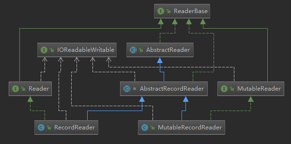

​		其中，最关键的是两个抽象类：AbstractReader和AbstractRecordReader。从类图来看，AbstractReader提供了最基础的实现。在分析写入器时，每个写入器都关联着结果分区（ResultPartition）。相应地，每个读取器也关联着对等的输入网关（InputGate）。

AbstractReader主要对读取到的事件提供处理，以下代码段是处理事件的主逻辑：

```java
protected boolean handleEvent(AbstractEvent event) throws IOException {
    final Class<?> eventType = event.getClass();

    try {
        //如果事件为消费完的特定结果子分区中的数据，则直接返回true
        if (eventType == EndOfPartitionEvent.class) {
            return true;
        }
        //如果事件是针对迭代的超步完成，则增加相应的超步完成计数 
        else if (eventType == EndOfSuperstepEvent.class) {
            return incrementEndOfSuperstepEventAndCheck();
        }
        //如果事件是TaskEvent，则直接用任务事件处理器发布
        else if (event instanceof TaskEvent) {
            taskEventHandler.publish((TaskEvent) event);

            return false;
        }
        else {
            throw new IllegalStateException("Received unexpected event of type " 
                + eventType + " at reader.");
        }
    }
    catch (Throwable t) {
        throw new IOException("Error while handling event of type " + eventType + ": " + t.getMessage(), t);
    }
}
```

> AbstractReader对迭代的超步提供了统计，它内部维护了一个超步事件计数器currentNumberOfEndOfSuperstepEvents。这一点的实现跟检查点的屏障对齐机制类似。当计数器跟InputGate所包含的InputChannel数量相等时，说明超步事件已到达每个InputChannel，则可认为超步结束。

AbstractRecordReader继承了AbstractReader，读取Record的方法，getNextRecord()，主要实现逻辑如下

```java
protected boolean getNextRecord(T target) throws IOException, InterruptedException {
	if (isFinished) {
		return false;
	}

	while (true) {
        //如果当前反序列化器已被初始化，说明它当前正在序列化一个记录
		if (currentRecordDeserializer != null) {
			DeserializationResult result = 	
                currentRecordDeserializer.getNextRecord(target);
			
            //如果获得结果是当前的Buffer已被消费（还不是记录的完整结果），获得当前的Buffer，将其回收，
            //后续会继续反序列化当前记录的剩余数据
			if (result.isBufferConsumed()) {
				final Buffer currentBuffer = 
                    currentRecordDeserializer.getCurrentBuffer();

				currentBuffer.recycleBuffer();
				currentRecordDeserializer = null;
			}
			 //如果结果表示记录已被完全消费，则返回true，跳出循环
			if (result.isFullRecord()) {
				return true;
			}
		}
		//从InputGate读取数据
		final BufferOrEvent bufferOrEvent = 
            inputGate.getNext().orElseThrow(IllegalStateException::new);
		
		//如果读取到是是Buffer，则交给反序列化起进行反序列化
		if (bufferOrEvent.isBuffer()) {
           //设置当前的反序列化器，并将当前记录对应的Buffer给反序列化器
			currentRecordDeserializer = 
                recordDeserializers[bufferOrEvent.getChannelIndex()];
			currentRecordDeserializer.setNextBuffer(bufferOrEvent.getBuffer());
		}
		//如果读取到的不是Buffer，则按照事件进行处理。
		else {
		//如果不是Buffer而是事件，则根据其对应的通道索引拿到对应的反序列化器判断其是否还有未完成的数据，
        //如果有则抛出异常，因为这是一个新的事件，在处理它之前，反序列化器中不应该存在残留数据
			if (recordDeserializers[bufferOrEvent.getChannelIndex()]
                .hasUnfinishedData()) {
				throw new IOException(...);
			}
			//调用事件处理的逻辑
			if (handleEvent(bufferOrEvent.getEvent())) {
				if (inputGate.isFinished()) {
					isFinished = true;
					return false;
				}
				else if (hasReachedEndOfSuperstep()) {
					return false;
				}
				// else: More data is coming...
			}
		}
	}
}
```


### RecordSerializer & SerializationResult

​		RecordSerializer，作为一个接口，SpanningRecordSerializer是其唯一的实现。

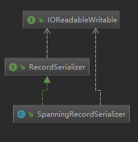

​		SpanningRecordSerializer是一种支持跨内存段的序列化器，其实现借助于中间缓冲区来缓存序列化后的数据，然后再往真正的目标Buffer里写，在写的时候会维护两个“指针”：

- 一个是表示目标Buffer内存段长度的limit
- 一个是表示其当前写入位置的position

​		因为一个Buffer对应着一个内存段，当将数据序列化并存入内存段时，其空间有可能有剩余也有可能不够。因此，RecordSerializer定义了一个表示序列化结果的SerializationResult枚举。

**序列化结果的几种类型**

- **PARTIAL_RECORD_MEMORY_SEGMENT_FULL**

  内存段已满但记录的数据只写入了部分，没有完全写完；

- **FULL_RECORD_MEMORY_SEGMENT_FULL**

  内存段写满，记录的数据已全部写入；

- **FULL_RECORD**

  记录的数据全部写入，但内存段并没有满；

​		一个记录的序列化过程通常由setNextBuffer和addRecord这两个方法共同配合完成。其中setNextBuffer方法的主要作用是重新初始化一个新的Buffer作为目标Buffer并刷出剩余数据；而addRecord方法则主要用于进行真正的序列化操作。这两个方法的调用结果都返回的是SerializationResult。那么具体的序列化结果是如何判断的呢？这个逻辑由getSerializationResult方法完成：

```java
private SerializationResult getSerializationResult() {
    //如果数据buffer中已没有更多的数据且长度buffer里也没有更多的数据，该判断可确认记录数据已全部写完
    if (!this.dataBuffer.hasRemaining() && !this.lengthBuffer.hasRemaining()) {
        //紧接着判断写入位置跟内存段的结束位置之间的关系，如果写入位置小于结束位置，则说明数据全部写入，
        //否则说明数据全部写入且内存段也写满
        return (this.position < this.limit)
            ? SerializationResult.FULL_RECORD
            : SerializationResult.FULL_RECORD_MEMORY_SEGMENT_FULL;
    }
 
    //任何一个buffer中仍存有数据，则记录只能被标记为部分写入
    return SerializationResult.PARTIAL_RECORD_MEMORY_SEGMENT_FULL;
}
```

### RecordDeserializer & DeserializationResult

​		跟RecordSerializer类似，考虑到记录的数据大小以及Buffer对应的内存段的容量大小。在反序列化时也存在不同的反序列化结果，以枚举DeserializationResult表示：

- **PARTIAL_RECORD**

  表示记录并未完全被读取，但缓冲中的数据已被消费完成；

- **INTERMEDIATE_RECORD_FROM_BUFFER**

  表示记录的数据已被完全读取，但缓冲中的数据并未被完全消费；

- **LAST_RECORD_FROM_BUFFER**

  记录被完全读取，且缓冲中的数据也正好被完全消费；

RecordDeserializer接口只有1个实现：

- **SpillingAdaptiveSpanningRecordDeserializer**

  适用于数据大小相对较大且跨段的记录的反序列化，它支持将溢出的数据写入临时文件；


### ResultPartitionWriter & ResultPartition & ResultSubPartition

**ResultPartitionWriter**是个基于Buffer的接口，其主要实现类是**ResultPartition**，

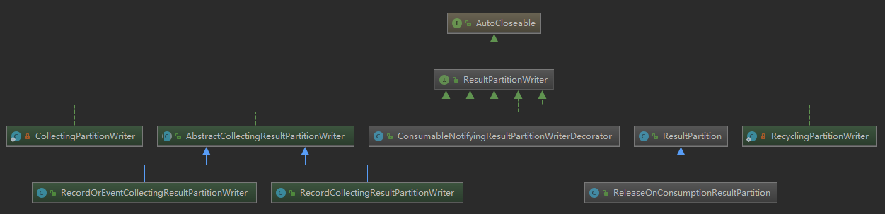


**ResultSubpartition**的主要实现类是PipelinedSubpartition , 该类提供了通知功能，当有新的数据写入buffer时，会回调BufferAvailabilityListener的notifyDataAvailable()方法。下面是BufferAvailabilityListener的几个实现类图示。

#### **ResultPartition**

**ResultSubpartition的类型**

- **BLOCKING**

  持久化、非管道、无反压；

- **BLOCKING_PERSISTENT**

  当前暂不支持

- **PIPELINED**

  非持久化、支持管道、有反压；


### InputGate 

输入网关（InputGate）是InputChannel的容器，用于消费中间结果（IntermediateResult）在并行执行时由子任务生产的一个或多个结果分区（ResultPartition）。

> 可以认为生产端的ResultPartition跟消费端的InputGate是对等的。

Flink当前提供了两个输入网关的实现

- SingleInputGate：常规输入网关；
- UnionInputGate：联合输入网关，它允许将多个输入网关联合起来；

SingleInputGate是消费ResultPartition的实体，而UnionInputGate主要充当InputGate容器的角色。

### InputChannel

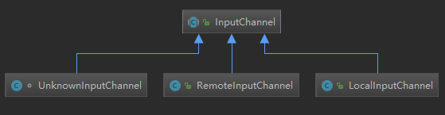

- **LocalInputChannel**

  对应于本地 subpartition的input channel，用来在本地进程内的不同线程之间的数据交换。

  LocalInputChannel实际调用SingleInputGate.notifyChannelNonEmpty(InputChannel channel) ，这个方法调用inputChannelsWithData.notifyAll , 唤醒阻塞在inputChannelsWithData对象实例的所有线程。上文提到的阻塞在CheckPointBarrierHandler.getNextNonBlocked()方法的线程也会被唤醒，返回数据。

- **RemoteInputChannel**

  对应于远程的subpartition的input channel，用来表示跨网络的数据交换。

- **UnknownInputChannel**


**InputChannel的阻塞通知机制**

ResultSubpartition的主要实现类是PipelinedSubpartition , 该类提供了通知功能，当有新的数据写入buffer时，会回调BufferAvailabilityListener的notifyDataAvailable()方法。下面是BufferAvailabilityListener的几个实现类图示。

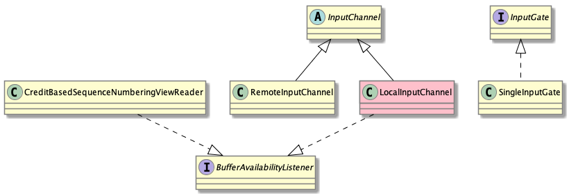


### Output

#### Output继承体系

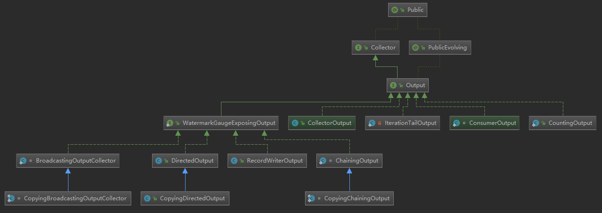


**CountingOutput**

封装类，用来在监控中统计发送的记录数量，其内部包装了一个有实际数据发送行为的的Output对象，用来进行真正的数据的emit。

[参加OperatorChain调用链示例](#op-chain-call-link-example)

**WatermarkGuageExposingOutput**

此接口只是增加了获取当前 Input Watermark和Output Watermark的的方法。

**RecordWriterOutput**

使用RecordWriter进行实际的数据发送。RecordWriter主要用来在线程间、网络间数据序列化、写入，对应的RecordReader负责读取。

**ChainingOutput & CopyingChainingOutput**

这两个类是在OperatorChain内部的Operator之间传递数据用的，并不会有序列化的过程。直接在Output中调用下游Operator的processElement（）方法。<font color=red>直接在同一个线程内的Operator直接传递数据</font>，跟普通的Java方法调用一样，这样就直接省略了线程间的数据传送、网络间的数据传送的开销。

**有选择的向下游发送**

DirectedOutput 是有选择的发送，BroadcastingOutputCollector 是广播，两者的区别在于有没有OutputSelector。

- **DirectedOutput & CopyingDirectedOutput**

包装类，基于一组**OutputSelector**选择发送给下游哪些downstream。

DirectedOutput共享对象模式， CopyingDirectedOutput非共享对象模式。

- **BroadcastingOutputCollector & CopyingBroadcastingOutputCollector**

  包装类，内部包含了一组Output。向所有的下游DownStream广播数据。

  Copying和非Copying的区别是是否重用对象。

### ChannelSelector

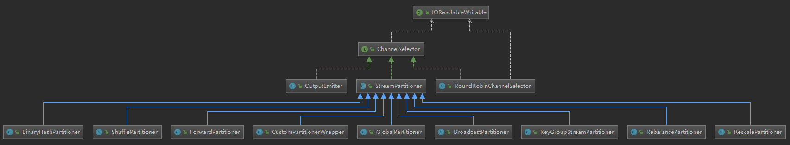

如上图ChannelSelector继承关系图所示


## 数据交换

### 数据传递

#### 数据传递的方式

- 本地线程之间的数据传递
- 跨网络的数据交换
- 同一线程的Operator之间的交换（Operator chain）

在flink中，数据处理的业务逻辑位于UDF ProcessFunction.processElement中，每一个ProcessFunction绑定与1个Operator中，Operator调用UDF处理数据完毕之后，需要将数据交给下一个Operator。那么Flink是如何衔接Operator之间的数据传递的，答案就是Collector接口。

#### 本地线程间的数据传递

Operator FlatMap 所在线程 与 下游 Operator sum() 所在线程间的通信为例。这两个task线程共享同一个Buffer pool,通过wait()/notifyAll来同步。 Buffer和Netty中的ByteBuf功能类似，可以看作是一块共享的内存。inputGate负责读取Buffer或Event。

**交互过程**

1.  当没有Buffer可以消费时，Operator sum()所在的线程阻塞(通过inputGate中的inputChannelWithData.wait()方法阻塞) 
2.  当FlatMap所在线程写入结果数据到ResultSubPartition,并flush到buffer后 
3.  会唤醒Operator sum()所在的线程（通过inputChannelWithData.notifyAll()方法唤醒）。 
4.  线程被唤醒后会从Buffer中读取数据，经反序列化后，传递给Operator中的用户代码逻辑处理。

如下图所示


#### 跨网络的数据传递

远程线程的Operator数据传递与本地线程类似。不同点在于，当没有Buffer可以消费时，会通过PartitionRequestClient向Operator FlatMap所在的进程发起RPC请求。远程的PartitionRequestServerHandler接收到请求后，读取ResultPartition管理的Buffer。并返回给Client。

如下图所示


**RPC通讯过程**

远程数据转递RPC通信基于Netty实现， 图为Client端的RPC请求发送过程。PartitionRequestClient发出请求，交由Netty写到对应的socket。Netty读取Socket数据，解析Response后交由NetworkClientHandler处理。


#### 同一线程的Operator之间的数据传递

***同一线程的Operator即OperatorChain。***

以Operator sum() 和Operator sink:Print to std 为例。 这两个Operator在同一个线程中运行，数据不需要经过序列化和写到多线程共享的buffer中， Operator sum()通过Collector发送数据后，直接调用Operator sink的processElement方法传递数据。

如下图所示


### 总体过程

**数据在task之间传递有如下几步**

1.  数据在本operator处理完后，交给RecordWriter。每条记录都要选择一个下游节点，所以要经过ChannelSelector。
2.  每个channel都有一个serializer（我认为这应该是为了避免多线程写的麻烦），把这条Record序列化为ByteBuffer

3.  接下来数据被写入ResultPartition下的各个subPartition里，此时该数据已经存入DirectBuffer（MemorySegment）

4.  单独的线程控制数据的flush速度，一旦触发flush，则通过Netty的nio通道向对端写入

5.  对端的netty client接收到数据，decode出来，把数据拷贝到buffer里，然后通知InputChannel

6. 有可用的数据时，下游算子从阻塞醒来，从InputChannel取出buffer，再解序列化成record，交给算子执行用户代码

#### RecordWriter写入数据

**StreamOperator处理完数据之后，交给RecordWriter**

```java
//RecordWriterOutput.java
@Override
public void collect(StreamRecord<OUT> record) {
	if (this.outputTag != null) {
		// we are only responsible for emitting to the main input
		return;
	}
	//这里可以看到把记录交给了recordwriter
	pushToRecordWriter(record);
}
```

**RecordWriter向通道写入数据**

选择通道

```java
//RecordWriter.java
//选择通道
public void emit(T record) throws IOException, InterruptedException {
	checkErroneous();
	emit(record, channelSelector.selectChannel(record));
}
private void emit(T record, int targetChannel) throws IOException, InterruptedException {
	serializer.serializeRecord(record);
    //根据调用的通道选择
	if (copyFromSerializerToTargetChannel(targetChannel)) {
		serializer.prune();
	}
}
```

**写入ResultPartition**

```java
private boolean copyFromSerializerToTargetChannel(int targetChannel) {
	// We should reset the initial position of the intermediate serialization buffer before
	// copying, so the serialization results can be copied to multiple target buffers.
	serializer.reset();

	boolean pruneTriggered = false;
	BufferBuilder bufferBuilder = getBufferBuilder(targetChannel);
	SerializationResult result = serializer.copyToBufferBuilder(bufferBuilder);
	while (result.isFullBuffer()) {
		numBytesOut.inc(bufferBuilder.finish());
		numBuffersOut.inc();

		// If this was a full record, we are done. Not breaking out of the loop at this point
		// will lead to another buffer request before breaking out (that would not be a
		// problem per se, but it can lead to stalls in the pipeline).
		if (result.isFullRecord()) {
			pruneTriggered = true;
			bufferBuilders[targetChannel] = Optional.empty();
			break;
		}

		bufferBuilder = requestNewBufferBuilder(targetChannel);
		result = serializer.copyToBufferBuilder(bufferBuilder);
	}
	checkState(!serializer.hasSerializedData(), "All data should be written at once");

	if (flushAlways) {
		targetPartition.flush(targetChannel);
	}
	return pruneTriggered;
}
```


### 数据的写入和读取

#### Buffer的读取和写入

##### Buffer读取（Streaming中的读取）

1.  Task线程启动后，通过while循环调用StreamInputProcessor.processInput()消费和发送数据,上文所指的“线程阻塞在inputGate中的inputChannelWithData.wait()”这段逻辑也是在StreamInputProcessor.processInput中发生的。Task启动到Buffer读取的调用栈如下图所示,图例只展示了核心内容，省略了一些逻辑。
2.  在调用栈的后部，ResultSubpartition的子类PipelinedSubPartition通过BufferConsumer来读取Buffer。


##### Buffer写入

StreamInputProcessor调用CheckPointBarrierHandler.getNextNonBlocked阻塞直到获取到StreamRecord后，会调用StreamFlatMap.processElement(),内部调用FlatMapFunction.flatMap(T value, Collector<O> out) 。该方法包含两个参数， value为反序列化后的StreamRecord ， Collecotr负责把数据发送到下游。 用户的代码逻辑获取到value后进行处理，处理结果通过Collector发送。

部分Collector的实现类如下所示


**Buffer写入涉及的类**


FlatMap和sum()是线程间通信，数据的发送最后会委托给实现了Collector接口的RecordWriterOutput。在RecordWriterOutput内部, 序列化逻辑由TypeSerializer实现,数据发送逻辑由StreamRecordWriter实现。而StreamRecordWriter的包含了ChannelSelector , ResultPartitionWriter这两个对象，其中ChannelSelector相当于NIO概念中的Selector,负责选择Channel,即选择通向数据发送的目标对象的Buffer通道。ResultPartitionWriter提供了两类方法，flush数据到buffer和添加buffer的消费者BufferConsumer, BufferConsumer用于读取ResultPartitionWriter写入的buffer,提供可消费的Buffer视图。ResultPartitionWriter的主要实现类是ResultPartition。

> <font color='red'>注意：此处需要重新编写，因为现有版本已经不同了</font>
>
> 1.StreamRecordWriter与RecordWriter在当前版本中已经何为一体。
>
> 2.ResultPartition是一个复杂的类,它代表单个task生产的结果数据块 , 一个ResultPartition是一系列Buffer实例的集合。这些buffer会被分配到一个或多个ResultSubpartition实例中。即，一个ResultPartition可能被分成多个子集，然后根据数据分发类型交由consuming task消费。ResultSubpartition的主要实现类是PipelinedSubpartition , 该类提供了通知功能，当有新的数据写入buffer时，会回调BufferAvailabilityListener的notifyDataAvailable()方法。

**Buffer可用通知**

在此例中，上下游在同一个进程中，使用的是LocalInputChannel, LocalInputChannel实际调用SingleInputGate.notifyChannelNonEmpty(InputChannel channel) ，这个方法调用inputChannelsWithData.notifyAll , 唤醒阻塞在inputChannelsWithData对象实例的所有线程。上文提到的阻塞在CheckPointBarrierHandler.getNextNonBlocked()方法的线程也会被唤醒，返回数据。


####  Netty的数据写入和读取

##### 数据写入Netty的过程

```java
-> ResultPartition.flushAll  

-> AbstractChannelHandlerContext.fireUserEventTriggered

-> PartittionRequesetQueue.enqueueAvailableReader

-> PartittionRequesetQueue.writeAndFlushNextMessageIfPossible
```

至此数据真实的写入netty channel，发送给下游。


##### 从netty读取数据


#  基于Netty网络通信

## 关键对象

### NettyShuffleEnvironment

NettyShuffleEnvironment是TaskManager进行网络通信的主对象，主要用于跟踪中间结果并负责所有的数据交换。**每个TaskManager的实例对应一个NettyShuffleEnvironment**，而不是每个Task对应一个。在TaskManager启动时创建。NettyShuffleEnvironment管理着多个协助通信的关键组件。如下

- **ResourceID**

  用来表示Flink的分布式组件，在NettyShuffleEnvironment中，用来记录Task的位置（location）。

- **NettyShuffleEnvironmentConfiguration**

  NettyShuffleEvnironment的配置参数。

- **NetworkBufferPool**

  网络缓冲池，负责申请一个TaskManager的所有的内存段用作缓冲池

- **ConnectionManager**

  连接管理器，用于管理本地（远程）通信连接；

- **ResultPartitionManager**

  结果分区管理器，用于跟踪一个TaskManager上所有生产/消费相关的ResultPartition

- **ResultPartitionFactory**

  ResultPartition的工程，用来创建ResultPartition。

-  **Map<InputGateID, SingleInputGate>**

  

- **SingleInputGateFactory**

  创建SingleInputGate的工厂。

### NettyConnectionManager

Netty连接管理器（NettyConnectionManager）是连接管理器接口（ConnectionManager）针对基于Netty的远程连接管理的实现者。它是TaskManager中负责网络通信的网络环境对象（NetworkShuffleManager）的核心组件之一。

​		NettyConnectionManager继承自ConnectionManager，ConnectionManager的继承体系如下

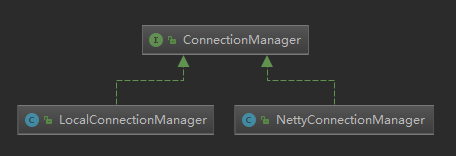

​		如上图所示，ConnectionManager定义了start、shutdown、closeOpenChannelConnections等方法用于管理physical connections；它有两个子类，一个是LocalConnectionManager，一个是NettyConnectionManager。

- LocalConnectionManager实现了ConnectionManager接口，不过它的实现基本是空操作；
- NettyConnectionManager实现了ConnectionManager接口，它的构造器使用NettyConfig创建了NettyServer、NettyClient、NettyBufferPool。

**TaskManager与NettyConnectionManager的关系**

​		一个TaskManager中可能同时运行着很多任务实例，有时某些任务需要消费某远程任务所生产的结果分区，有时某些任务可能会生产结果分区供其他任务消费。所以对一个TaskManager来说，其职责并非单一的，它既可能充当客户端的角色也可能充当服务端角色。因此，一个NettyConnectionManager会同时管理着一个Netty客户端（NettyClient）和一个Netty服务器（NettyServer）实例。当然除此之外还有一个Netty缓冲池（NettyBufferPool）以及一个分区请求客户端工厂（PartitionRequestClientFactory，用于创建分区请求客户端PartitionRequestClient），这些对象都在NettyConnectionManager构造器中被初始化。

> 每个PartitionRequestClientFactory实例都依赖一个NettyClient。也就是说所有PartitionRequestClient底层都共用一个NettyClient。


**Netty客户端和服务器的启停**

​		Netty客户端和服务器对象的启动和停止都是由NettyConnectionManager统一控制的。	

​		NettyConnectionManager启动的时机是当TaskManager跟JobManager关联上之后调用NetworkEnvironment的associateWithTaskManagerAndJobManager方法时。而当TaskManager跟JobManager解除关联时停止。

### NettyBufferPool

NettyClient和NettyServer在实例化Netty通信的核心对象时都需要配置各自的“字节缓冲分配器”用于为Netty读写数据分配内存单元。Netty自身提供了一个池化的字节缓冲分配器（PooledByteBufAllocator），但Flink又在此基础上进行了包装并提供了Netty缓冲池（NettyBufferPool）。此举的目的是严格控制所创建的分配器（Arena）的个数，转而依赖TaskManager的相关配置指定。

> **Arena**
>
> 当指定PooledByteBufAllocator来执行ByteBuf分配时，最终的内存分配工作被委托给类PoolArena。由于Netty通常用于高并发系统，所以各个线程进行内存分配时竞争不可避免，这可能会极大的影响内存分配的效率，为了缓解高并发时的线程竞争，Netty允许使用者创建多个分配器（Arena）来分离锁，提高内存分配效率。

**NettyBufferPool的改进**

​		NettyBufferPool在构造器内部以固定的参数实例化PooledByteBufAllocator并作为自己的内部分配器。对PooledByteBufAllocator做了一些限制：

- **限定为堆外内存**

  PooledByteBufAllocator本身既支持堆内存分配也支持堆外内存分配，NettyBufferPool将其限定为只在堆外内存上进行分配。

- **显式指定了pageSize大小为8192，maxOrder值为11。**

  Netty中的内存池包含页（page）和块（chunk）两种分配单位，通过PooledByteBufAllocator构造器可以设置页大小（也即pageSize参数），该参数在PooledByteBufAllocator中的默认值为8192，而参数maxOder则用于计算块的大小。

  > 计算公式为：chunkSize = pageSize << maxOrder；因此这里块大小为16MB。

- **显式关闭了堆内内存的相关的操作方法**

  NettyBufferPool通过反射还拿到了PooledByteBufAllocator中的PoolArena分配器对象集合，但此举更多的是出于调试目的。并且显式关闭了对堆内存相关的操作方法。

### NettyClient

​	NettyClient的主要职责是初始化Netty客户端的核心对象，并根据NettyProtocol配置用于客户端事件处理的ChannelPipeline。

> NettyClient并不用于发起远程结果子分区请求，该工作将由PartitionRequestClient完成。

一个Netty引导客户端的创建步骤如下：

- 创建Bootstrap对象用来引导启动客户端：

```java
bootstrap = new Bootstrap();
```

- 创建NioEventLoopGroup或EpollEventLoopGroup对象并设置到Bootstrap中，EventLoopGroup可以理解为是一个线程池，用来处理连接、接收数据、发送数据：

```java
switch (config.getTransportType()) {
    case NIO:
        initNioBootstrap();
        break;

    case EPOLL:
        initEpollBootstrap();
        break;

    case AUTO:
        if (Epoll.isAvailable()) {
            initEpollBootstrap();
            LOG.info("Transport type 'auto': using EPOLL.");
        }
        else {
            initNioBootstrap();
            LOG.info("Transport type 'auto': using NIO.");
        }
}

```

> 注意以上设置的是基于NettyPotocol获得的一个ChannelHandler数组组成的管道。

- 调用Bootstrap.connect()来连接服务器：

```java
return bootstrap.connect(serverSocketAddress);
```

以上就是一个Netty客户端从初始化到跟服务器建立连接的大致过程。但这里需要注意的是，一个TaskManager根本上只会存在一个NettyClient对象（对应的也只有一个Bootstrap实例）。但一个TaskManager中的子任务实例很有可能会跟多个不同的远程TaskManager通信，所以同一个Bootstrap实例可能会跟多个目标服务器建立连接，所以它是复用的，这一点不存在问题因为无论跟哪个目标服务器通信，Bootstrap的配置都是不变的。至于不同的RemoteChannel如何跟某个连接建立对应关系，这一点由PartitionRequestClientFactory来保证。

### NettyServer

跟NettyClient一样，NettyServer也会初始化Netty服务端的核心对象，除此之外它会启动对特定端口的侦听并准备接收客户端发起的请求。下面是NettyServer的初始化与启动步骤：

- 创建ServerBootstrap实例来引导绑定和启动服务器：

  ```java
  bootstrap = new ServerBootstrap();
  ```

- 根据配置创建NioEventLoopGroup或EpollEventLoopGroup对象来处理事件，如接收新连接、接收数据、写数据等等：

  ```java
  switch (config.getTransportType()) {
      case NIO:
          initNioBootstrap();
          break;
      case EPOLL:
      	initEpollBootstrap();
      	break;
      case AUTO:
          if (Epoll.isAvailable()) {
              initEpollBootstrap();
              LOG.info("Transport type 'auto': using EPOLL.");
          }
          else {
              initNioBootstrap();
              LOG.info("Transport type 'auto': using NIO.");
  }
  ```

  

- 指定InetSocketAddress，服务器监听此端口：

  ```java
  bootstrap.localAddress(config.getServerAddress(), config.getServerPort());
  ```

- 进行各种参数配置，设置childHandler执行所有的连接请求：

  ```java
  bootstrap.childHandler(new ChannelInitializer<SocketChannel>() {
      @Override
      public void initChannel(SocketChannel channel) throws Exception {
          channel.pipeline().addLast(protocol.getServerChannelHandlers());
      }
  });
  ```

  > 注意以上设置的是基于NettyPotocol获得的一个ChannelHandler数组组成的管道。


指定InetSocketAddress，服务器监听此端口：
bootstrap.localAddress(config.getServerAddress(), config.getServerPort());
1
进行各种参数配置，设置childHandler执行所有的连接请求：
bootstrap.childHandler(new ChannelInitializer<SocketChannel>() {
    @Override
    public void initChannel(SocketChannel channel) throws Exception {
        channel.pipeline().addLast(protocol.getServerChannelHandlers());
    }
});

注意以上设置的是基于NettyPotocol获得的一个ChannelHandler数组组成的管道。

- 都设置完毕了，最后调用ServerBootstrap.bind()方法来绑定服务器：

  ```java
  bindFuture = bootstrap.bind().syncUninterruptibly();
  ```

  

### PartitionRequestClient

​		分区请求客户端（PartitionRequestClient）用于发起远程PartitionRequest请求，它也是RemoteChannel跟Netty通信层之间进行衔接的对象。

​		对单一的TaskManager而言只存在一个NettyClient实例。但处于同一TaskManager中不同的任务实例可能会跟不同的远程TaskManager上的任务之间交换数据，不同的TaskManager实例会有不同的ConnectionID（用于标识不同的IP地址）。因此，Flink采用PartitionRequestClient来对应ConnectionID，并提供了分区请求客户端工厂（PartitionRequestClientFactory）来创建PartitionRequestClient并保存ConnectionID与之的对应关系。

```java
public ChannelFuture requestSubpartition(
        final ResultPartitionID partitionId,
        final int subpartitionIndex,
        final RemoteInputChannel inputChannel,
        int delayMs) throws IOException {
    checkNotClosed();

    //将当前请求数据的RemoteInputChannel的实例注入到NettyClient的ChannelHandler管道的
    //PartitionRequestClientHandler实例中
    partitionRequestHandler.addInputChannel(inputChannel);

    //构建PartitionRequest请求对象
    final PartitionRequest request = new PartitionRequest(
            partitionId, subpartitionIndex, inputChannel.getInputChannelId());

    //构建一个ChannelFutureListener的实例，当I/O操作执行失败后，会触发相关的错误处理逻辑
    final ChannelFutureListener listener = new ChannelFutureListener() {
        @Override
        public void operationComplete(ChannelFuture future) throws Exception {
            if (!future.isSuccess()) {
                partitionRequestHandler.removeInputChannel(inputChannel);
                inputChannel.onError(
                        new LocalTransportException(
                                "Sending the partition request failed.",
                                future.channel().localAddress(), future.cause()
                        ));
            }
        }
    };

    //立即发送该请求，并注册listener
    if (delayMs == 0) {
        ChannelFuture f = tcpChannel.writeAndFlush(request);
        f.addListener(listener);
        return f;
    }
    //如果请求需要延迟一定的时间，则延迟发送请求
    else {
        final ChannelFuture[] f = new ChannelFuture[1];
        tcpChannel.eventLoop().schedule(new Runnable() {
            @Override
            public void run() {
                f[0] = tcpChannel.writeAndFlush(request);
                f[0].addListener(listener);
            }
        }, delayMs, TimeUnit.MILLISECONDS);

        return f[0];
    }
}
```

### NettyMessage


**不同的消息类型**

> **服务端的消息**
>
> - BufferResponse：服务端给出的Buffer响应消息，编号为0；
> - ErrorResponse：服务端的错误响应消息，编号为1；

> **客户端的消息**
>
> - PartitionRequest：客户端发起的分区请求，编号为2；
> - TaskEventRequest：客户端发起的任务事件请求，编号为3；
> - CancelPartitionRequest：客户端发起的取消分区请求，编号为4；
> - CloseRequest：客户端发起的关闭请求，编号为5；
> - AddCredit：客户端发起的调整流控消息，编号为6；

另外，NettyMessagen内部定义了读写接口，面向的对象是Netty的字节缓冲（ByteBuf）。解编码器NettyMessageEncoder和NettyMessageDecoder以静态内部类实现，分别用来在消息的两种表示（NettyMessage和ByteBuf）之间进行转换。

### NettyProtocol

NettyProtocol定义了基于Netty进行网络通信时客户端和服务端对事件的处理逻辑与顺序。由于Netty中所有事件处理逻辑的代码都处于扩展自ChannelHandler接口的类中，所以，NettyProtocol约定了所有的协议实现者，必须提供服务端和客户端处理逻辑的ChannelHandler数组。

最终这些ChannelHandler将依据它们在数组中的顺序进行链接以形成ChannelPipeline。

PartitionRequestProtocol作为NettyProtocol唯一的实现，负责实例化并编排客户端和服务端的ChannelHandler。按照顺序链接的这些ChannelHandler可被视为“协议栈”。接下来，我们分别就客户端和服务端的协议栈给出了图示

**服务端协议栈**

```java
/*
* +-------------------------------------------------------------------+
* |                        SERVER CHANNEL PIPELINE                    |
* |                                                                   |
* |    +----------+----------+ (3) write  +----------------------+    |
* |    | Queue of queues     +----------->| Message encoder      |    |
* |    +----------+----------+            +-----------+----------+    |
* |              /|\                                 \|/              |
* |               | (2) enqueue                       |               |
* |    +----------+----------+                        |               |
* |    | Request handler     |                        |               |
* |    +----------+----------+                        |               |
* |              /|\                                  |               |
* |               |                                   |               |
* |   +-----------+-----------+                       |               |
* |   | Message+Frame decoder |                       |               |
* |   +-----------+-----------+                       |               |
* |              /|\                                  |               |
* +---------------+-----------------------------------+---------------+
* |               | (1) client request               \|/
* +---------------+-----------------------------------+---------------+
* |               |                                   |               |
* |       [ Socket.read() ]                    [ Socket.write() ]     |
* |                                                                   |
* |  Netty Internal I/O Threads (Transport Implementation)            |
* +-------------------------------------------------------------------+
*/
```

同客户端协议栈，服务端协议栈也会被构建成ChannelPipeline并注册到服务端引导对象ServerBootstrap中：

```java
bootstrap.childHandler(newChannelInitializer<SocketChannel>(){
    @Override
    publicvoidinitChannel(SocketChannelchannel)throwsException{
        channel.pipeline().addLast(protocol.getServerChannelHandlers());
    }});
```


**客户端协议栈**

```java
/**
 *     +-----------+----------+            +----------------------+
 *     | Remote input channel |            | request client       |
 *     +-----------+----------+            +-----------+----------+
 *                 |                                   | (1) write
 * +---------------+-----------------------------------+---------------+
 * |               |     CLIENT CHANNEL PIPELINE       |               |
 * |               |                                  \|/              |
 * |    +----------+----------+            +----------------------+    |
 * |    | Request handler     +            | Message encoder      |    |
 * |    +----------+----------+            +-----------+----------+    |
 * |              /|\                                 \|/              |
 * |               |                                   |               |
 * |    +----------+------------+                      |               |
 * |    | Message+Frame decoder |                      |               |
 * |    +----------+------------+                      |               |
 * |              /|\                                  |               |
 * +---------------+-----------------------------------+---------------+
 * |               | (3) server response              \|/ (2) client request
 * +---------------+-----------------------------------+---------------+
 * |               |                                   |               |
 * |       [ Socket.read() ]                    [ Socket.write() ]     |
 * |                                                                   |
 * |  Netty Internal I/O Threads (Transport Implementation)            |
 * +-------------------------------------------------------------------+
 */
```

PartitionRequestProtocol构建出的客户端协议栈将会被构建成ChannelPipeline，并注册到客户端引导对象Bootstrap中：

```java
bootstrap.handler(newChannelInitializer<SocketChannel>(){
    @Override
    publicvoidinitChannel(SocketChannelchannel)throwsException{
        channel.pipeline().addLast(protocol.getClientChannelHandlers());
	}
});
```


### 客户端核心处理器

户端协议栈中的核心的处理器PartitionRequestClientHandler，该处理器用于处理服务端的响应消息。

以客户端获取到响应之后回调该处理器的channelRead方法为入口来进行分析：

```java
public void channelRead(ChannelHandlerContext ctx, Object msg) throws Exception {
    try {
        //当没有待解析的原始消息时，直接解码消息，否则将消息加入到stagedMessages队列中，等待排队处理
        if (!bufferListener.hasStagedBufferOrEvent() && stagedMessages.isEmpty()) {
            decodeMsg(msg);
        }
        else {
            stagedMessages.add(msg);
        }
    }
    catch (Throwable t) {
        notifyAllChannelsOfErrorAndClose(t);
    }
}
```

上例中涉及到了两个关键的对象：

- bufferListener，用于感知可用Buffer的事件侦听器。它是PartitionRequestClientHandler的内部类。

- stagedMessages，用于接收原始未解码消息的队列。

解码方法decodeMsg的主要逻辑包含对两种类型消息的解析：

- 服务端的错误响应消息ErrorResponse
- 正常的Buffer请求响应消息BufferResponse。

​		对于错误响应消息会判断是否是致命错误，如果是致命错误，则直接通知所有的InputChannel并关闭它们；如果不是，则让该消息对应的InputChannel按不同情况处理。

下边重点关注对BufferResponse的处理：

```java
if (msgClazz == NettyMessage.BufferResponse.class) {
    NettyMessage.BufferResponse bufferOrEvent = (NettyMessage.BufferResponse) msg;
    //根据响应消息里的receiverId，从注册map里获取到接收该消息的RemoteInputChannel实例
    RemoteInputChannel inputChannel = inputChannels.get(bufferOrEvent.receiverId);
    //如果该响应没有对应的接收者，则释放该Buffer，同时通知服务端取消该请求
    if (inputChannel == null) {
        bufferOrEvent.releaseBuffer();
        cancelRequestFor(bufferOrEvent.receiverId);
        return true;
    }

    //接下来才进入到真正的解析逻辑
    return decodeBufferOrEvent(inputChannel, bufferOrEvent);
}
```

在decodeBufferOrEvent中，它会对该消息具体是Buffer还是Event进行区分，如果是Buffer：

```java
if (bufferOrEvent.isBuffer()) {
    //空Buffer
    if (bufferOrEvent.getSize() == 0) {
        inputChannel.onEmptyBuffer(bufferOrEvent.sequenceNumber);
        return true;
    }

    //获得Buffer提供者，如果为空，则通知服务端取消请求
    BufferProvider bufferProvider = inputChannel.getBufferProvider();
    if (bufferProvider == null) {
        cancelRequestFor(bufferOrEvent.receiverId);
        return false;
    }

    while (true) {
        //从Buffer提供者请求Buffer，以放置响应结果数据
        Buffer buffer = bufferProvider.requestBuffer();
        //如果请求到Buffer，则读取数据同时触发InputChannel的onBuffer回调
        //该方法在前文分析输入通道时我们早已提及过，它会将Buffer加入到队列中
        if (buffer != null) {
            buffer.setSize(bufferOrEvent.getSize());
            bufferOrEvent.getNettyBuffer().readBytes(buffer.getNioBuffer());
            inputChannel.onBuffer(buffer, bufferOrEvent.sequenceNumber);
            return true;
        }
        //否则进入等待模式，当有Buffer可用时，会触发bufferListener的onEvent方法
        else if (bufferListener.waitForBuffer(bufferProvider, bufferOrEvent)) {
            releaseNettyBuffer = false;
            return false;
        }
        else if (bufferProvider.isDestroyed()) {
            return false;
        }
    }
}
```

​		如果从Buffer提供者没有获取到Buffer，说明当前没有可用的Buffer资源了，那么将进入等待模式。这里等待Buffer可用是基于事件侦听机制，这个机制是如何实现的呢？在上面的waitForBuffer方法的实现中，通过将当前的BufferListenerTask的bufferListener实例反向注册到Buffer提供者，当Buffer提供者中有Buffer可用时，将会触发bufferListener的onEvent回调方法。这里需要注意的是，当Buffer提供者中的Buffer从无到有，说明有Buffer被回收了，所以onEvent方法是被回收Buffer的线程所调用，而非Netty的I/O线程。

到此，我们才获取到可用的Buffer并读取了响应消息的原始数据，但数据还没有被解码。是不是解码的过程也发生在onEvent方法中呢？其实不然，在onEvent方法里，它将对原始消息的处理权交还给了Netty的I/O线程：

```java
if (buffer != null) {
    if (availableBuffer.compareAndSet(null, buffer)) {
        ctx.channel().eventLoop().execute(this);

        success = true;
    }
    else {
        throw new IllegalStateException("Received a buffer notification, " +
            " but the previous one has not been handled yet.");
    }
}
```

代码段中会通过上下文对象获取到Channel所处的EventLoop，然后通过它的execute方法接收一个Runnable实例并在新线程执行。这里接收的this就是当前的bufferListener实例（因为BufferListenerTask也实现了Runnable接口）。所以在BufferListenerTask的onEvent方法中其实存在着一个线程执行的桥接过程。

以上就是NettyClient接收到NettyServer的响应后的处理器逻辑。由于Buffer资源受限，这里并没有直接将原始消息直接交与Netty的I/O线程并写到Buffer中，而是采取了队列缓存原始消息外加Buffer可用事件通知的机制来进行处理。

### 服务端核心处理器

服务端有两个核心处理器，分别是PartitionRequestServerHandler和PartitionRequestQueue。其中，PartitionRequestServerHandler会依赖PartitionRequestQueue的实例。

#### **PartitionRequestServerHandler**

PartitionRequestServerHandler是一种通道流入处理器（ChannelInboundHandler），主要用于初始化数据传输同时分发事件。

首先，PartitionRequestServerHandler会在Channel启动时创建一个容量至少为1的BufferPool。当然最关键的方法还是消息的处理方法channelRead0()。

> Netty提供了一个简化版的ChannelInboundHandler的实现，名为SimpleChannelInboundHandler。通过继承这个类，你可以非常方便得专注于实现自己的业务逻辑。因此，SimpleChannelInboundHandler类已经对ChannelInboundHandler的channelRead接口方法提供了基础实现，然后提供了名为channelRead0的抽象方法供派生类扩展。

从channelRead0方法的实现来看，客户端的请求消息被划分为三类：

- 常规的结果分区请求；
- 任务事件请求；
- 其他请求；

针对不同类型的客户端消息有不同的处理逻辑如下：

**常规的结果分区请求**

```java
if (msgClazz == PartitionRequest.class) {
    PartitionRequest request = (PartitionRequest) msg;

    try {
        //构建结果子分区视图对象，并将其“加入队列”
        ResultSubpartitionView subpartition =
            partitionProvider.createSubpartitionView(
            request.partitionId,
            request.queueIndex,
            bufferPool);

        outboundQueue.enqueue(subpartition, request.receiverId);
    }
    catch (PartitionNotFoundException notFound) {
        respondWithError(ctx, notFound, request.receiverId);
    }
}
```

代码段中的outboundQueue是PartitionRequestQueue的实例，这里注意不要被其类名误导，它本身并不是一个队列数据结构的实现，但它内部的处理机制确实借助了队列结构来排队请求。outboundQueue同时也是在协议栈中紧随着PartitionRequestServerHandler的流入处理器PartitionRequestQueue的实例，这一点下文还会提到。

**任务事件请求**

```java
else if (msgClazz == TaskEventRequest.class) {
    TaskEventRequest request = (TaskEventRequest) msg;

    //针对事件请求，将会通过任务事件分发器进行分发，如果分发失败，将会以错误消息予以响应
    if (!taskEventDispatcher.publish(request.partitionId, request.event)) {
        respondWithError(ctx, 
                         new IllegalArgumentException("Task event receiver not found."), 
            request.receiverId);
    }
}
```

> 什么情况下会导致事件分发失败呢？当事件分发时根据其partitionId如果找不到对应的侦听者时，就会认为事件分发失败。

**其他类型的请求**

```java
//如果是取消请求，则调用队列的取消方法
else if (msgClazz == CancelPartitionRequest.class) {
    CancelPartitionRequest request = (CancelPartitionRequest) msg;
    outboundQueue.cancel(request.receiverId);
}
//如果是关闭请求，则关闭队列
else if (msgClazz == CloseRequest.class) {
    outboundQueue.close();
}
//如果是流控请求，则调用处理流控的方法
else if (msgClazz == AddCredit.class) {
    AddCredit request = (AddCredit) msg;
    outboundQueue.addCredit(request.receiverId, request.credit);
}
else {
    LOG.warn("Received unexpected client request: {}", msg);
}
```


从上面的代码段可见，PartitionRequestServerHandler主要起到消息分发的作用。因此我们会重点分析消息的处理者PartitionRequestQueue。

#### PartitionRequestQueue

我们首先分析一下PartitionRequestServerHandler在处理消息时调用的PartitionRequestQueue的实例方法enqueue和cancel起到了什么作用。enqueue方法的实现如下：

```java
public void enqueue(ResultSubpartitionView partitionQueue, InputChannelID receiverId) throws Exception {
    ctx.pipeline().fireUserEventTriggered(
    	new SequenceNumberingSubpartitionView(partitionQueue, receiverId));
}
```

可以看到它把原先的ResultSubpartitionView包装为SequenceNumberingSubpartitionView。然后调用fireUserEventTriggered来触发管道中的下一个ChannelInboundHandler的userEventTriggered方法。

SequenceNumberingSubpartitionView是什么？它是PartitionRequestQueue内部实现的一个ResultSubpartitionView的包装器。该包装器对原始的ResultSubpartitionView做了两件事：对每个即将返回的Buffer累加序列号同时保存相应的接收者（InputChannel）编号。

> Buffer的序列号主要用于跟客户端校验消费Buffer的过程是否跟服务端的处理过程保持一致，这主要用于防止Buffer丢失。

那么下一个ChannelInboundHandler是谁呢？我们先回顾一下，在PartitionRequestProtocol协议中所组建的管道中的处理器的顺序：

```java
public ChannelHandler[] getServerChannelHandlers() {
    PartitionRequestQueue queueOfPartitionQueues = new PartitionRequestQueue();
    PartitionRequestServerHandler serverHandler = 
        new PartitionRequestServerHandler(partitionProvider, taskEventDispatcher, 							queueOfPartitionQueues, networkbufferPool);

    return new ChannelHandler[] {
            messageEncoder,
            createFrameLengthDecoder(),
            messageDecoder,
            serverHandler,
            queueOfPartitionQueues
    };
}
```

从上面的代码可见，queueOfPartitionQueues这一实例既作为参数传入PartitionRequestServerHandler的构造器又在ChannelHandler数组中充当处理器。而此处的queueOfPartitionQueues跟PartitionRequestServerHandler中的outboundQueue指向同一个对象。而因为enqueue方法的调用者是PartitionRequestServerHandler的实例方法，所以，下一个ChannelInboundHandler的实例其实就是这里的outboundQueue本身。

所以，fireUserEventTriggered方法的调用，将会触发同一个PartitionRequestQueue实例的userEventTriggered方法。在userEventTriggered方法的实现中，也是按照不同的消息类型来区分处理的。首先当然是

```java
if (msg.getClass() == SequenceNumberingSubpartitionView.class) {
    boolean triggerWrite = queue.isEmpty();
    //将消息强制转型并加入队列
    queue.add((SequenceNumberingSubpartitionView) msg);
    //如果队列在消息加入前是空的，则说明可以响应消息给客户端了
    if (triggerWrite) {
        writeAndFlushNextMessageIfPossible(ctx.channel());
    }
}
```

看完了enqueue方法，下面我们来看cancel如何实现：

```java
public void cancel(InputChannelID receiverId) {
    ctx.pipeline().fireUserEventTriggered(receiverId);
}
```

该调用对应了userEventTriggered中的另一段处理逻辑：

```java
else if (msg.getClass() == InputChannelID.class) {
    InputChannelID toCancel = (InputChannelID) msg;

    //如果当前InputChannelID已包含在释放过的集合中，那么直接返回
    if (released.contains(toCancel)) {
        return;
    }

    //如果当前的结果子分区视图不为空且其接收者编号跟当前待取消的编号相等，
    //则释放相关资源，并将该编号加入已释放集合
    if (currentPartitionQueue != null && 	
        currentPartitionQueue.getReceiverId().equals(toCancel)) {
        
        currentPartitionQueue.releaseAllResources();
        markAsReleased(currentPartitionQueue.receiverId);
        currentPartitionQueue = null;
    }
    else {
        int size = queue.size();

        //遍历队列，将接收者编号跟当前准备取消的InputChannelID进行比较，
        //如果相等则对视图的相关资源进行释放同时将编号加入已释放集合
        for (int i = 0; i < size; i++) {
            SequenceNumberingSubpartitionView curr = queue.poll();

            if (curr.getReceiverId().equals(toCancel)) {
                curr.releaseAllResources();
                markAsReleased(curr.receiverId);
            }
            else {
                queue.add(curr);
            }
        }
    }
}
```

接下来，我们来分析一下处理器输出响应消息的writeAndFlushNextMessageIfPossible方法。在分析该方法的实现之前，我们先看一下，该方法何时会触发？当前在PartitionRequestQueue中该方法共有三个调用点。

**writeAndFlushNextMessageIfPossible的三个调用点**

1. 第一个调用点位于ChannelInboundHandler的channelWritabilityChanged事件回调方法中。

> channelWritabilityChanged方法是ChannelInboundHandler的接口方法，当Channel的可写状态发生改变时会被调用。Channel的isWritable()方法可以用来检测其可写性。可写性的阈值范围可以通过Channel.config().setWriteHighWaterMark()以及Channel.config().setWriteLowWaterMark()进行设置。
>

2. 第二个调用点位于userEventTriggered回调方法中，这在我们上文分析该方法时已经提及过。

3. 第三个调用点处于PartitionRequestQueue内部对ChannelFutureListener接口的实现类WriteAndFlushNextMessageIfPossibleListener中。

   > ChannelFutureListener用于注册到ChannelFuture中，当I/O操作完成之后，会触发对其方法operationComplete的调用。

​		而WriteAndFlushNextMessageIfPossibleListener的实现，就是在其operationComplete方法中触发了对writeAndFlushNextMessageIfPossible方法的调用。那么WriteAndFlushNextMessageIfPossibleListener何时会被注册到ChannelFuture呢，毕竟不注册是不会触发operationComplete的。而注册点正好位于writeAndFlushNextMessageIfPossible的实现中。

**WriteAndFlushNextMessageIfPossibleListener的核心代码如下**

```java
//如果channel的状态为可写才会继续执行如下逻辑
if (channel.isWritable()) {
    while (true) {
        //如果当前结果子分区视图为空，同时队列里也没有待处理的记录了，则退出循环
        if (currentPartitionQueue == null && (currentPartitionQueue = queue.poll()) == null) {
            return;
        }

        //从结果子分区视图获得待响应的原始数据
        buffer = currentPartitionQueue.getNextBuffer();

        //如果为null，则不做响应，继续循环处理队列中的记录
        if (buffer == null) {
            if (currentPartitionQueue.registerListener(null)) {
                currentPartitionQueue = null;
            }
            else if (currentPartitionQueue.isReleased()) {
                markAsReleased(currentPartitionQueue.getReceiverId());

                Throwable cause = currentPartitionQueue.getFailureCause();

                if (cause != null) {
                    ctx.writeAndFlush(new NettyMessage.ErrorResponse(
                        new ProducerFailedException(cause),
                        currentPartitionQueue.receiverId));
                }

                currentPartitionQueue = null;
            }
        }
        //buffer不为null，给予客户端响应
        else {
            //构建出最终的响应对象，这里就能看出，为什么要实现SequenceNumberingSubpartitionView这一包装器了
            //因为这里用到了sequenceNumber以及receiverId
            BufferResponse resp = 
                new BufferResponse(buffer, currentPartitionQueue.getSequenceNumber(), 
                currentPartitionQueue.getReceiverId());

            //如果该Buffer并不是数据，而是表示子分区消费结束的事件，则会进行特殊的处理
            if (!buffer.isBuffer() &&
                EventSerializer.fromBuffer(buffer, 	
                      getClass().getClassLoader()).getClass() == 
                EndOfPartitionEvent.class) {

                //通知子分区消费完成，并释放相关资源
                currentPartitionQueue.notifySubpartitionConsumed();
                currentPartitionQueue.releaseAllResources();
                markAsReleased(currentPartitionQueue.getReceiverId());

                currentPartitionQueue = null;
            }

            //将响应对象写入网络准备发送给请求客户端，
            //这里就是第三个调用点中注册	ChannelFutureListener的位置了
            //等到Netty的I/O线程处理完成后，将会触发writeAndFlushNextMessageIfPossible被再次调用
            //从而形成了处理数据与注册回调之间的循环
            channel.writeAndFlush(resp).addListener(writeListener);

            return;
        }
    }
}
```

以上就是PartitionRequestQueue的核心逻辑，它自身不是队列结构的实现，但是它内部采用队列来对用于响应数据的ResultSubpartitionView进行缓冲，从而保证了服务端的响应速度处于合适的范围。


# Flink CEP复杂事件处理

Flink CEP是Flink提供的复杂事件处理引擎，用作在实时数据流中识别模式。在Flink中提供了两种CEP的使用方法：DataStream API和Sql MatchRecognize语法。


## 什么是NFA

NFA的全称Non-determined Finite Automaton，叫做不确定的有限状态机，指的是状态有限，但是每个状态可能被转换成多个状态（不确定）。

Flink CEP的实现参考了[《Efficient Pattern Matching over Event Streams》](https://people.cs.umass.edu/~yanlei/publications/sase-sigmod08.pdf)


### Flink CEP的状态

**从逻辑顺序上区分，Flink CEP中包含了三种类型的状态**

- **Start State**

  起始状态

- **Middle State**

  中间状态

- **Final State**

  结束状态

**从技术实现角度Flink包含了多种状态**

- Start State
- Stop State
- Final State
- Normal State

### 状态迁移

- **Take**

  表示事件匹配成功，将当前状态更新到新状态，并前进到“下一个”状态；

- **Procceed**

  当事件来到的时候，当前状态不发生变化，在状态转换图中事件直接“前进”到下一个目标状态；

- **IGNORE**

  当事件来到的时候，如果匹配不成功，忽略当前事件，当前状态不发生任何变化。

## API总结

**单个模式**

<table>
    <tr>
        <td colspan="1">类型</td>
        <td colspan="1">API</td>
        <td colspan="10">说明</td>
    </tr>
    <tr>
        <td rowspan="4">量词</td>
        <td>times()</td>
        <td>模式发生次数<br/>
            示例：<br/>
            pattern.times(2,4)，模式发生2,3,4次</td>
    </tr>
    <tr>
        <td>timesOrMore（）<br/>oneOrMore()</td>
        <td>模式发生大于等于N次<br/>
            示例：<br/>
            pattern.timesOrMore(2)，模式发生大于等于2次</td>
    </tr>
    <tr>
        <td>optional()</td>
        <td>模式可以不匹配 <br/>
            示例：<br/>
            pattern.times(2).optional()，模式发生2次或者0次</td>
    </tr>
    <tr>
        <td>greedy()</td>
        <td>贪婪模式<br/>
            示例：<br/>
            pattern.times(2).greedy()，模式发生2次且重复次数越多越好</td>
    </tr>
    <tr>
        <td rowspan="3">条件API</td>
        <td>where()</td>
        <td>模式的条件<br/>
            示例：<br/>
            pattern.where(_.ruleId=43322)，模式的条件为ruleId=433322</td>
    </tr>
    <tr>
        <td>or()</td>
        <td>模式的或条件<br/>
            示例：<br/>
            pattern.where(_.ruleId=43322).or(_.ruleId=43333)，模式条件为ruleId=43322或者43333</td>
    </tr>
    <tr>
        <td>until()</td>
        <td>模式发生直至X条件满足为止<br/>
            示例：<br/>
            pattern.oneOrMore().util(condition)模式发生一次或者多次，直至condition满足为止</td>
    </tr>
</table>

**组合模式**

<table>
    <tr>
        <th colspan="1">API</td>
        <th colspan="10">说明</td>
    </tr>
    <tr>
        <td>next()</td>
        <td>严格的满足条件<br/>
            示例：<br/>
			模式为begin("first").where(_.name='a').next("second").where(.name='b')<br/>
			当且仅当数据为a,b时，模式才会被命中。如果数据为a,c,b，由于a的后面跟了c，所以a会被直接丢弃，模式不会命中。
        </td>
    </tr>
    <tr>
        <td>followedBy()</td>
        <td>松散的满足条件<br/>
			示例：<br/>
			模式为begin("first").where(_.name='a').followedBy("second").where(.name='b')
			当且仅当数据为a,b或者为a,c,b，，模式均被命中，中间的c会被忽略掉。</td>
    </tr>
    <tr>
        <td>followedByAny()</td>
        <td>非确定的松散满足条件<br/>
			模式begin("first").where(_.name='a').followedByAny("second").where(.name='b')
当且仅当数据为a,c,b,b时，对于followedBy模式而言命中的为{a,b}，对于followedByAny而言会有两次命中{a,b},{a,b}
    </tr>
    <tr>
        <td>within()</td>
        <td>模式命中的时间间隔限制</td>
    </tr>
 <tr>
        <td>notNext()<br/>
			notFollowedBy()</td>
        <td>后面的模式不命中（严格/非严格）</td>
    </tr>
</table>

**匹配完后的跳过策略**

<table>
    <tr>
        <th colspan="1">API</td>
        <th colspan="10">说明</td>
    </tr>
    <tr>
        <td>NO_SKIP</td>
        <td>不忽略，输出所有可能的匹配</td>
    </tr>
    <tr>
        <td>SKIP_TO_NEXT</td>
        <td>匹配完之后，跳转到匹配的下一条</td>
    </tr>
    <tr>
        <td>SKIP_PAST_LAST_EVENT</td>
        <td></td>
    </tr>
    <tr>
        <td>SKIP_TO_FIRST</td>
        <td></td>
    </tr>
 <tr>
        <td>SKIP_TO_LAST</td>
        <td></td>
    </tr>
</table>

- **NO_SKIP**: Every possible match will be emitted.
- **SKIP_TO_NEXT**: Discards every partial match that started with the same event, emitted match was started.
- **SKIP_PAST_LAST_EVENT**: Discards every partial match that started after the match started but before it ended.
- **SKIP_TO_FIRST**: Discards every partial match that started after the match started but before the first event of *PatternName*occurred.
- **SKIP_TO_LAST**: Discards every partial match that started after the match started but before the last event of *PatternName*occurred.

例如模式 b+ c，数据流 b1 b2 b3 c,匹配结果如下

| 跳过策略                 | 匹配结果                      |                             说明                             |
| :----------------------- | :---------------------------------------- | :----------------------------------------------------------: |
| **NO_SKIP**              | b1 b2 b3 cb2 b3 c<br/> b3 c | After found matching `b1 b2 b3 c`, the match process will not discard any result. |
| **SKIP_TO_NEXT**         | b1 b2 b3 c b2 b3 c b3 c | After found matching `b1 b2 b3 c`, the match process will not discard any result, because no other match could start at b1. |
| **SKIP_PAST_LAST_EVENT** | `b1 b2 b3 c`                  | After found matching `b1 b2 b3 c`, the match process will discard all started partial matches. |
| **SKIP_TO_FIRST**[`b`]   | `b1 b2 b3 c` `b2 b3 c` `b3 c` | After found matching `b1 b2 b3 c`, the match process will try to discard all partial matches started before `b1`, but there are no such matches. Therefore nothing will be discarded. |
| **SKIP_TO_LAST**[`b`]    | `b1 b2 b3 c` `b3 c`           | After found matching `b1 b2 b3 c`, the match process will try to discard all partial matches started before `b3`. There is one such match `b2 b3 c` |

## SQL MatchRecognize语法


## Flink CEP的关键对象

### Pattern

Pattern定义对象，每个Pattern对象都会指向前序Pattern，形成一个单向Pattern链。

Pattern分为一般pattern和GroupPattern。举例来说，CEP的Pattern是一个链条，如果把Pattern链视为一个Worflow工作流，叫做主工作流，那么GroupPattern就是子工作流（subflow），被当做一个工作流节点嵌入到嵌入到主工作流中。

**Pattern的关键属性**

```java
//模式名
private final String name;

//前序Pattern,组成Pattern模式链
private final Pattern<T, ? extends T> previous;

/** 模式的命中条件 */
private IterativeCondition<F> condition;

/**模式匹配的时间限制，例如必须是10分钟之内发生的匹配才算匹配成功 */
private Time windowTime;
/** 模式匹配的修饰符，严格匹配与非严格匹配，一般匹配与NOT匹配，匹配次数、是否贪婪匹配都在此对象中表达*/
private Quantifier quantifier = Quantifier.one(ConsumingStrategy.STRICT);

/** The condition an event has to satisfy to stop collecting events into looping state. */
private IterativeCondition<F> untilCondition;
/**模式的匹配次数，例如*/
private Times times;
//匹配成功或失败之后的跳过策略
private final AfterMatchSkipStrategy afterMatchSkipStrategy;
```


### NFA

NFA的全称Non-determined Finite Automaton，叫做不确定的有限状态机，指的是状态有限，但是每个状态可能被转换成多个状态（不确定）。

**NFA的关键属性**

```java
/**NFACompiler编译之后的合法Pattern，用在CEPOperator的事件处理中*/
private final Map<String, State<T>> states;

/**匹配的时间限制*/
private final long windowTime;
```


### SharedBuffer

杜威10进制计数法。

### CEPOperator

在CEOOperator内部，对于KeyedStream，为每一个key维护一个NFA，Non-keyedStream维护一个全局的NFA。

- 

## Pattern编译

### 入口

使用DataStream API定义的Pattern经过NFACompiler编译之后编程NFA。

```java
public static <T> NFAFactory<T> compileFactory(
		final Pattern<T, ?> pattern,
		boolean timeoutHandling) {
		if (pattern == null) {
			// return a factory for empty NFAs
			return new NFAFactoryImpl<>(0, Collections.<State<T>>emptyList(),
                                        timeoutHandling);
		} else {
			final NFAFactoryCompiler<T> nfaFactoryCompiler = 
                new NFAFactoryCompiler<>(pattern);
			nfaFactoryCompiler.compileFactory();
			return new NFAFactoryImpl<>(nfaFactoryCompiler.getWindowTime(), 
                                        nfaFactoryCompiler.getStates(), timeoutHandling);
		}
	}
```

### 总体过程

```java
//NFAFactoryCompiler.java
void compileFactory() {
    if (currentPattern.getQuantifier().getConsumingStrategy() == 
        Quantifier.ConsumingStrategy.NOT_FOLLOW) {
        throw new 
            MalformedPatternException("NotFollowedBy is not supported as a last part of a Pattern!");
    }

    checkPatternNameUniqueness();

    checkPatternSkipStrategy();

    // 从Final状态向前遍历依次添加状态，直至开始状态
    //首先创建结束状态
    State<T> sinkState = createEndingState();
    // 添加中间状态
    sinkState = createMiddleStates(sinkState);
    // 添加起始状态
    createStartState(sinkState);
}
```


### 添加结束状态（Final State）

创建结束状态比较简单，就是单纯的创建了一个State，设置StateType为State.StateType.Final

```java
private State<T> createState(String name, State.StateType stateType) {
   String stateName = stateNameHandler.getUniqueInternalName(name);
   State<T> state = new State<>(stateName, stateType);
   states.add(state);
   return state;
}
```


### 添加中间状态（Middle State）

添加中间状态是比较复杂的环节，涉及到状态以及迁移。

入口如下所示：

```java
private State<T> createMiddleStates(final State<T> sinkState) {
   State<T> lastSink = sinkState;
   while (currentPattern.getPrevious() != null) {

      if (currentPattern.getQuantifier().getConsumingStrategy() == 
          	Quantifier.ConsumingStrategy.NOT_FOLLOW) {
         //跳过notFollow的Pattern，notFollow的pattern被转换为NFA边的条件。
      } else if (currentPattern.getQuantifier().getConsumingStrategy() == 
                 Quantifier.ConsumingStrategy.NOT_NEXT) {
          //如果是NOT_NEXT，创建Not_Next的普通State
         final State<T> notNext = 
             createState(currentPattern.getName(), State.StateType.Normal);
         final IterativeCondition<T> notCondition = getTakeCondition(currentPattern);
          //创建停止状态
         final State<T> stopState = 
             createStopState(notCondition, currentPattern.getName());
		//如果lastSink State是结束状态，在NotNext和结束状态之间添加Ignore迁移边
        //否则添加Proceed迁移边
         if (lastSink.isFinal()) {
            //so that the proceed to final is not fired
            notNext.addIgnore(lastSink, new RichNotCondition<>(notCondition));
         } else {
            notNext.addProceed(lastSink, new RichNotCondition<>(notCondition));
         }
         //在Not_Next 状态和停止State之间创建Proceed迁移边
         notNext.addProceed(stopState, notCondition);
         lastSink = notNext;
      } else {
          //既不是Not_Follow也不是Not_NEXT
         lastSink = convertPattern(lastSink);
      }
		
      // we traverse the pattern graph backwards
      followingPattern = currentPattern;
      currentPattern = currentPattern.getPrevious();

      final Time currentWindowTime = currentPattern.getWindowTime();
      if (currentWindowTime != null && currentWindowTime.toMilliseconds() < windowTime) {
         // the window time is the global minimum of all window times of each state
         windowTime = currentWindowTime.toMilliseconds();
      }
   }
   return lastSink;
}
```

在convertPattern中又分为三种情况：循环、次数匹配、其他

```java
private State<T> convertPattern(final State<T> sinkState) {
			final State<T> lastSink;

			final Quantifier quantifier = currentPattern.getQuantifier();
			if (quantifier.hasProperty(Quantifier.QuantifierProperty.LOOPING)) {
			//循环匹配
				// if loop has started then all notPatterns previous to the optional states are no longer valid
				setCurrentGroupPatternFirstOfLoop(false);
				final State<T> sink = copyWithoutTransitiveNots(sinkState);
				final State<T> looping = createLooping(sink);

				setCurrentGroupPatternFirstOfLoop(true);
				lastSink = 
                    createTimesState(looping, sinkState, currentPattern.getTimes());
			} else if (quantifier.hasProperty(Quantifier.QuantifierProperty.TIMES)) {
				//次数匹配
                lastSink = 
                    createTimesState(sinkState, sinkState, currentPattern.getTimes());
			} else {
                //其他
				lastSink = createSingletonState(sinkState);
			}
			addStopStates(lastSink);

			return lastSink;
		}
```


### 创建简单的单一状态createState

基础方法，创建一个State对象，为State赋予名字和类型。

```java
private State<T> createState(String name, State.StateType stateType) {
    //为了防止State重名，跟踪使用过的名字。如果重名的话，会1个使用累加计数器在State名字后追加一个唯一编号
    String stateName = stateNameHandler.getUniqueInternalName(name);
    State<T> state = new State<>(stateName, stateType);
    states.add(state);
    return state;
}
```


### 创建次数匹配createTimesState


### 创建循环匹配createLooping

循环匹配中有两种情况

- GroupPattren的循环匹配
- 一般Pattern的循环匹配


```java
/**
 * Creates the given state as a looping one. Looping state is one with TAKE edge to itself and
 * PROCEED edge to the sinkState. It also consists of a similar state without the PROCEED edge, so that
 * for each PROCEED transition branches in computation state graph  can be created only once.
 *
 * @param sinkState the state that the converted state should point to
 * @return the first state of the created complex state
 * 创建循环State，循环State是一种特殊的State，带有指向自己的TAKE边和指向下一个状态的PROCEED边。
 */
@SuppressWarnings("unchecked")
private State<T> createLooping(final State<T> sinkState) {
    //如果是GroupPattern
	if (currentPattern instanceof GroupPattern) {
		return createLoopingGroupPatternState((GroupPattern) currentPattern, sinkState);
	}
    
	final IterativeCondition<T> untilCondition = (IterativeCondition<T>) currentPattern.getUntilCondition();

	final IterativeCondition<T> ignoreCondition = extendWithUntilCondition(
		getInnerIgnoreCondition(currentPattern),
		untilCondition,
		false);
	final IterativeCondition<T> takeCondition = extendWithUntilCondition(
		getTakeCondition(currentPattern),
		untilCondition,
		true);
	
	IterativeCondition<T> proceedCondition = getTrueFunction();
	final State<T> loopingState = createState(currentPattern.getName(), State.StateType.Normal);

	if (currentPattern.getQuantifier().hasProperty(Quantifier.QuantifierProperty.GREEDY)) {
		if (untilCondition != null) {
			State<T> sinkStateCopy = copy(sinkState);
			loopingState.addProceed(sinkStateCopy, new RichAndCondition<>(proceedCondition, untilCondition));
			originalStateMap.put(sinkState.getName(), sinkStateCopy);
		}
		loopingState.addProceed(sinkState,
			untilCondition != null
				? new RichAndCondition<>(proceedCondition, new RichNotCondition<>(untilCondition))
				: proceedCondition);
		updateWithGreedyCondition(sinkState, getTakeCondition(currentPattern));
	} else {
		loopingState.addProceed(sinkState, proceedCondition);
	}
	loopingState.addTake(takeCondition);

	addStopStateToLooping(loopingState);

	if (ignoreCondition != null) {
		final State<T> ignoreState = createState(currentPattern.getName(), State.StateType.Normal);
		ignoreState.addTake(loopingState, takeCondition);
		ignoreState.addIgnore(ignoreCondition);
		loopingState.addIgnore(ignoreState, ignoreCondition);

		addStopStateToLooping(ignoreState);
	}
	return loopingState;
}
```


### 创建孤立匹配createSingletonState

```java
private State<T> createSingletonState(final State<T> sinkState,
	final State<T> proceedState,
	final IterativeCondition<T> takeCondition,
	final IterativeCondition<T> ignoreCondition,
	final boolean isOptional) {
	if (currentPattern instanceof GroupPattern) {
		return createGroupPatternState((GroupPattern) currentPattern, sinkState, proceedState, isOptional);
	}
	//创建State对象
	final State<T> singletonState = createState(currentPattern.getName(), State.StateType.Normal);
	// if event is accepted then all notPatterns previous to the optional states are no longer valid
	final State<T> sink = copyWithoutTransitiveNots(sinkState);
	singletonState.addTake(sink, takeCondition);

	// if no element accepted the previous nots are still valid.
	final IterativeCondition<T> proceedCondition = getTrueFunction();

	// for the first state of a group pattern, its PROCEED edge should point to the following state of
	// that group pattern and the edge will be added at the end of creating the NFA for that group pattern
	if (isOptional && !headOfGroup(currentPattern)) {
		if (currentPattern.getQuantifier().hasProperty(Quantifier.QuantifierProperty.GREEDY)) {
			final IterativeCondition<T> untilCondition =
				(IterativeCondition<T>) currentPattern.getUntilCondition();
			if (untilCondition != null) {
				singletonState.addProceed(
					originalStateMap.get(proceedState.getName()),
					new RichAndCondition<>(proceedCondition, untilCondition));
			}
			singletonState.addProceed(proceedState,
				untilCondition != null
					? new RichAndCondition<>(proceedCondition, new RichNotCondition<>(untilCondition))
					: proceedCondition);
		} else {
			singletonState.addProceed(proceedState, proceedCondition);
		}
	}

	if (ignoreCondition != null) {
		final State<T> ignoreState;
		if (isOptional) {
			ignoreState = createState(currentPattern.getName(), State.StateType.Normal);
			ignoreState.addTake(sink, takeCondition);
			ignoreState.addIgnore(ignoreCondition);
			addStopStates(ignoreState);
		} else {
			ignoreState = singletonState;
		}
		singletonState.addIgnore(ignoreState, ignoreCondition);
	}
	return singletonState;
}
```


### GroupPattern的转换

将GroupPattern转换为State与上下游的Pattern连接起来，在执行层面上是没有GroupPattern的概念，只有State和State之间的迁移。

```java
private State<T> createGroupPatternState(
	final GroupPattern<T, ?> groupPattern,
	final State<T> sinkState,
	final State<T> proceedState,
	final boolean isOptional) {
	final IterativeCondition<T> proceedCondition = getTrueFunction();

	Pattern<T, ?> oldCurrentPattern = currentPattern;
	Pattern<T, ?> oldFollowingPattern = followingPattern;
	GroupPattern<T, ?> oldGroupPattern = currentGroupPattern;

	State<T> lastSink = sinkState;
	currentGroupPattern = groupPattern;
	currentPattern = groupPattern.getRawPattern();
	lastSink = createMiddleStates(lastSink);
	lastSink = convertPattern(lastSink);
	if (isOptional) {
		// for the first state of a group pattern, its PROCEED edge should point to
		// the following state of that group pattern
		lastSink.addProceed(proceedState, proceedCondition);
	}
	currentPattern = oldCurrentPattern;
	followingPattern = oldFollowingPattern;
	currentGroupPattern = oldGroupPattern;
	return lastSink;
}
```


# Flink Table & SQL

## Table & SQL API编程

### Table & SQL编程的一般代码结构

```scala
// 获取流计算的环境，批处理使用 ExecutionEnvironment
val env = StreamExecutionEnvironment.getExecutionEnvironment

// 创建 TableEnvironment
val tableEnv = TableEnvironment.getTableEnvironment(env)

// 注册 Table，用作输入或者输出
tableEnv.registerTable("table1", fieldNames, fieldTypes, csvSource)

// Table API查询结构
val tapiResult = tableEnv.scan("table1").select(...)

// SQL 语句查询接口
val sqlResult  = tableEnv.sqlQuery("SELECT ... FROM table2 ...")

// 输出查询结果到外部存储，例如kafka、hdfs、DB等
tapiResult.writeToSink(...)

// 触发执行
env.execute()
```


> ```scala
> 
> 
> // 获取流计算的环境，批处理使用 ExecutionEnvironment
> val env = StreamExecutionEnvironment.getExecutionEnvironment
> 
> // 创建 TableEnvironment
> val tableEnv = TableEnvironment.getTableEnvironment(env)
> 
> /**
> 
> - 定义数据表，如果有多个数据源、数据的输出，则需要每一个都要像如下定义
>   */
>   val csvSource: TableSource = new CsvTableSource("/path/to/file", ...)
>   // 定义Table的字段类型
>   val fieldNames: Array[String] = Array("a", "b", "c")
>   val fieldTypes: Array[TypeInformation[_]] = Array(Types.INT, Types.STRING, Types.LONG)
>   // 注册 Table，用作输入或者输出
>   tableEnv.registerTable("table1", fieldNames, fieldTypes, csvSource)
>   ......
> 
> // Table API查询结构
> val tapiResult = tableEnv.scan("table1").select(...)
> 
> // SQL 语句查询接口
> val sqlResult  = tableEnv.sqlQuery("SELECT ... FROM table2 ...")
> 
> // 输出查询结果到外部存储，例如kafka、hdfs、DB等
> tapiResult.writeToSink(...)
> 
> // 触发执行
> env.execute()
> ```
>
> 

## Calcite介绍

​		[Apache Calcite](https://links.jianshu.com/go?to=https%3A%2F%2Fcalcite.apache.org%2F) 是一个动态数据管理框架，它具备很多典型数据库管理系统的功能，比如SQL解析、SQL校验、SQL查询优化、SQL生成以及数据连接查询等，但是又省略了一些关键的功能，比如Calcite并不存储相关的元数据和基本数据，不完全包含相关处理数据的算法等。

​		Calcite 的设计目标是成为[动态的数据管理框架](http://calcite.incubator.apache.org/docs/index.html)，所以在具有很多特性的同时，它也舍弃了一些功能，比如数据存储、处理数据的算法和元数据仓库。由于舍弃了这些功能，Calcite 可以在应用和数据存储、数据处理引擎之间很好地扮演中介的角色。用 Calcite 创建数据库非常灵活，你只需要动态地添加数据即可。 

​		Calcite 使用了基于关系代数的查询引擎，聚焦在关系代数的语法分析和查询逻辑的规划制定上。它不受上层编程语言的限制，前端可以使用 SQL、Pig、Cascading 或者 Scalding，只要通过 Calcite 提供的SQL  API（解析、验证等） 将它们转化成关系代数的抽象语法树即可。并根据一定的规则或成本对AST的算法与关系进行优化，最后推给各个数据处理引擎进行执行。

​		Calcite 也不涉及物理规划层，它通过扩展适配器来连接多种后端的数据源和处理引擎，如 Spark、Splunk、HBase、Cassandra 或者 MangoDB。简单的说，这种架构就是“一种查询引擎，[连接多种前端和后端](http://calcite.incubator.apache.org/docs/adapter.html)”。目前，使用Calcite作为SQL解析与优化引擎的又Hive、Drill、Flink、Phoenix和Storm。

### 为什么需要一个SQL相关的语法解析和优化库？

​			首先，从一个计算框架的研发者视角来看。SQL语法解析背后需要对关系代数的深刻理解，本身存在一定技术门槛，而且需要保证SQL解析的结果与ANSI-SQL等主流SQL流派的语义一致，还是需要下不少功夫的。而更重要的是，尤其在大数据量的分布式计算场景，一条SQL可以parse为多颗语义对等的语法叔，但彼此间的执行效率可能相差甚远，且在不同的数据结构、量级和计算逻辑上，优劣选择也不同。

​		于是，如何优化就成为一个很重要且需要长期积累c。这两个方面，在分布式批量计算、流式计算、交互式查询等领域，都或多或少的存在共性，尤其是当把优化算法抽象为可插拔的Rules之后，就更加可能孵化出一个通用的框架来。

​		其次，从数据分析的视角看，需要整合多个计算框架，很可能需要跨平台的查询分发和优化,例如异构数据库的关联，如何方便的集成不同的数据源就是一个复杂的工作，如果能够有一个框架提供平台无关的数据处理的方式，数据分析人员不需要关心集成的细节，只需要编写通用的SQL即可，无疑会极大的降低数据分析的门槛。

### Calcite的主要功能

Calcite的主要功能如下

- **SQL解析**

  Calcite的SQL解析是通过JavaCC实现的，使用JavaCC编写SQL语法描述文件，将SQL解析成未经校验的AST语法树。

- **SQL校验**

  校验分两部分：

  ​		1、无状态的校验，即验证SQL语句是否符合规范；

  ​		2、有状态的即通过与元数据结合验证SQL中的Schema、Field、Function是否存在，输入输出类型是否匹配等。

- **SQL查询优化**

  对上个步骤的输出（RelNode，逻辑计划树）进行优化，得到优化后的物理执行计划。优化有两种：1、基于规则的优化，2、基于代价的优化，后边会详细介绍。

- **SQL生成**

  将物理执行计划生成为在特定平台/引擎的可执行程序，如生成符合Mysql or Oracle等不同平台规则的SQL查询语句等

- **~~数据连接与执行~~**

  通过各个执行平台执行查询，得到输出结果。

  

​		在Flink或者其他的使用Calcite的大数据引擎中，一般到SQL查询优化即结束，由各个平台将优化后的物理执行计划，结合Calcite的SQL代码生成和平台自己实现的代码生成，组合成可执行的代码，然后在内存中编译执行。

#### 代码示例--功能展示

```java
// 初始化配置
SqlParser.ConfigBuilder configBuilder = SqlParser.configBuilder();
configBuilder.setUnquotedCasing(Casing.UNCHANGED);
//Sql解析：解析Sql语句，通过JavaCC解析成AST语法树，表现为SqlNode
SqlParser sqlParser = SqlParser.create(sql, configBuilder.build());
SqlNode sqlNode = sqlParser.parseQuery();
//Sql校验：结合元数据信息验证Sql是否符合规范
Planner planner = Frameworks.getPlanner(config);
SqlNode node = planner.validate(sqlNode);
//Sql查询优化：将SqlNode转换为LogicalPlan，表现为RelNode
RelRoot relRoot = planner.rel(node);
RelNode project = relRoot.project();
//指定优化规则，使用的是基于规则的优化器
final HepProgram program = new HepProgramBuilder() 
    .addRuleInstance(SubQueryRemoveRule.PROJECT)
    .addRuleInstance(SubQueryRemoveRule.FILTER)
    .addRuleInstance(SubQueryRemoveRule.JOIN)
    .build();
//生成优化后的RelNode
HepPlanner prePlanner = new HepPlanner(program);
prePlanner.setRoot(project);
RelNode relNode = prePlanner.findBestExp();
//ToDo 执行查询 
```

### 技术特点

**主要技术特点**

- 支持标准SQL语言；
- 独立于编程语言和数据源，可以支持不同的前端和后端
- 支持关系代数、可定制的逻辑规划规则和基于成本模型优化的查询引擎
- 支持物化视图（materialized view）的管理（创建、丢弃、持久化和自动识别）
- 基于物化视图的Lattice和Tile机制，以应用于OLAP分析；
- 支持对流数据的查询 

**其他特点**

- 跨数据源查询
- Calcite本身会缓存Schema、Function等信息（我们目前没用到，自己在内存里缓存的）
  支持复合指标计算(a+b as c)、常用聚合函数(sum、count、distinct)、sort、group by、join、limit等 
- 架构比较精简，利用Calcite写几百行代码就可以实现一个SQL查询方案；
- 灵活绑定优化规则，对于一个条件，我们可以自定义多个优化规则，只要命中，可以根据不同的规则多次优化同一个查询条件 

### 目标

Calcite 的设计目标是成为[动态的数据管理框架](http://calcite.incubator.apache.org/docs/index.html)，所以在具有很多特性的同时，它也舍弃了一些功能，比如数据存储、处理数据的算法和元数据仓库。由于舍弃了这些功能，Calcite 可以在应用和数据存储、数据处理引擎之间很好地扮演中介的角色。用 Calcite 创建数据库非常灵活，你只需要动态地添加数据即可。 

同时，Calcite 使用了基于关系代数的查询引擎，聚焦在关系代数的语法分析和查询逻辑的规划制定上。它不受上层编程语言的限制，前端可以使用 SQL、Pig、Cascading 或者 Scalding，只要通过 Calcite 提供的 API 将它们转化成关系代数的抽象语法树即可。 

同时，Calcite 也不涉及物理规划层，它通过扩展适配器来连接多种后端的数据源和处理引擎，如 Spark、Splunk、HBase、Cassandra 或者 MangoDB。简单的说，这种架构就是“一种查询引擎，[连接多种前端和后端](http://calcite.incubator.apache.org/docs/adapter.html)”。

### 核心原理

关系代数是关系型数据库操作的理论基础，关系代数支持并、差、笛卡尔积、投影和选择等基本运算。[关系代数](http://calcite.incubator.apache.org/docs/algebra.html#adding-a-filter-and-aggregate)是 Calcite 的核心，任何一个查询都可以表示成由关系运算符组成的树。 可以将 SQL 转换成关系代数，或者通过 Calcite 提供的 API 直接创建它。比如下面这段 SQL 查询： 

```sql
SELECT deptno, count(*) AS c, sum(sal) AS s
FROM emp
GROUP BY deptno
HAVING count(*) > 10
```

可以表达成如下的关系表达式语法树： 

```java
LogicalFilter(condition=[>($1, 10)])
  LogicalAggregate(group=[{7}], C=[COUNT()], S=[SUM($5)])
    LogicalTableScan(table=[[scott, EMP]])
```

当上层编程语言，如 SQL 转换为关系表达式后，就会被送到 Calcite 的逻辑规划器进行规则匹配。在这个过程中，Calcite 查询引擎会循环使用规划规则对关系表达式语法树的节点和子图进行优化。这种优化过程会以一个成本模型作为参考，每次优化都在保证语义的情况下利用规则来降低成本，成本主要以查询时间最快、资源消耗最少这些维度去度量。 

使用逻辑规划规则等同于数学恒等式变换，比如将一个过滤器推到内连接（inner join）输入的内部执行，当然使用这个规则的前提是过滤器不会引用内连接输入之外的数据列。如下图所示，将 Filter 操作下推到 Join 下面的示例，这样做的好处是减少 Join 操作记录的数量。

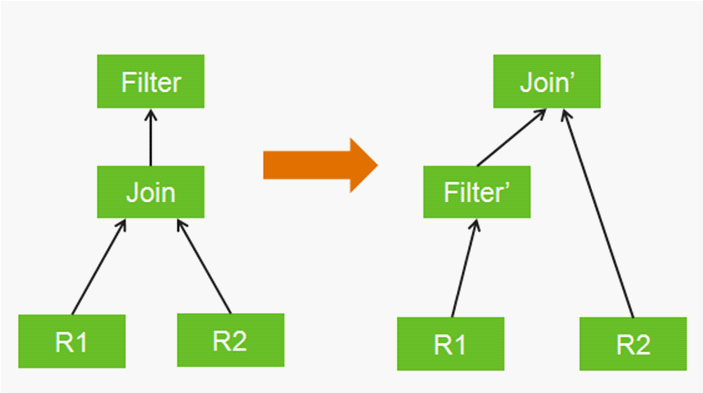

​		Calcite 提供了灵活的机制，可以根据需要，自定义关系运算符、规划规则、成本模型和相关的统计，从而进行不同的取舍，适应于各种场景，这也是Calcite作为框架的初衷。

## Flink与Calcite关系

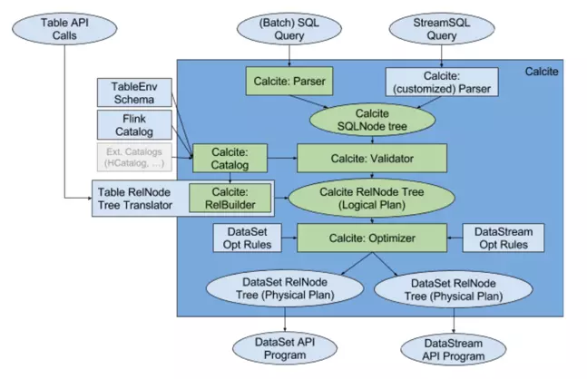

Table API与Batch&StreamingSQL（以下简称Sql）在底层的处理上是相同的，差别在与上层的处理过程，Table API利用了Calcite RelBuilder直接生成了Calcite的Logical Plan Tree，Sql的方式则是通过

​		**SqlParse解析**-->**生成Calcite SqlNode Tree**-->**validator校验sql语法**-->**生成Calcite Logical Plan**

至此Table API和Sql完成了统一，表达形式为Table。

> **Calcite Catalog**
>
> catalog存储表的元信息，包含表名、字段、字段类型以及其他信息。Flink的Table API和SQL校验的时候回根据元信息进行校验，例如在sql或者Table API中使用的表、列名是否是存在的。
>
> **Calcite Optimizer**
>
> 在Flink中调用了**StreamTableEnvironment**中的**optimize**方法用来进行优化

### 从Logical Plan到 DataStream&DataSet程序

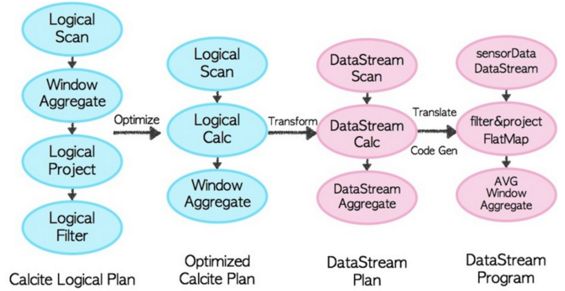

调用Table API 实际上是创建了很多 Table API 的 LogicalNode，创建的过程中对会对整个query进行validate。比如table是CalalogNode，window groupBy之后在select时会创建WindowAggregate和Project，where对应Filter。然后用RelBuilder翻译成Calcite LogicalPlan。如果是SQL API将直接用Calcite的Parser进行解释然后validate生成Calcite LogicalPlan。

利用Calcite内置的一些rule来优化LogicalPlan，也可以自己添加或者覆盖这些rule。转换成Optimized Calcite Plan后，仍然是Calcite的内部表示方式，现在需要transform成DataStream Plan，对应上图第三列的类，里面封装了如何translate成普通的DataStream或DataSet程序。随后调用相应的tanslateToPlan方法转换和利用CodeGen元编程成Flink的各种算子。现在就相当于我们直接利用Flink的DataSet或DataStream API开发的程序。

### SQL Query的执行过程

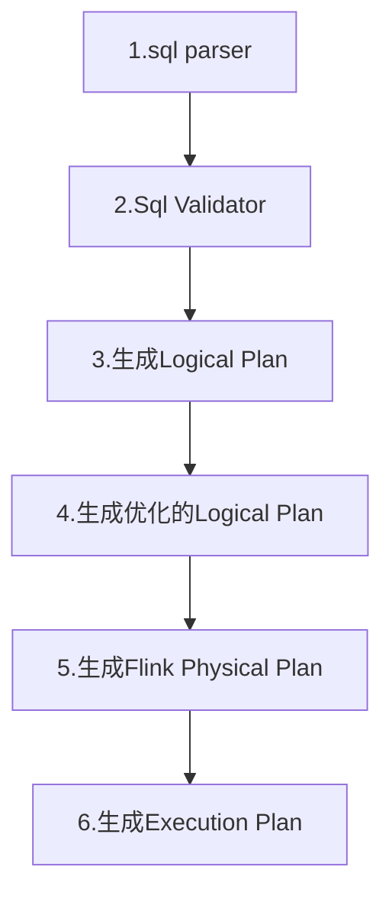


# Flink背压


# Flink部署

## 单机部署
## StandAlone模式
## Yarn模式
## K8s模式
